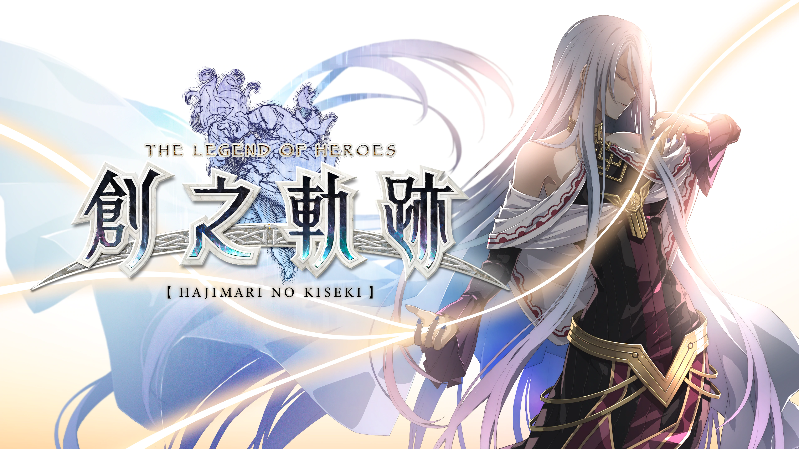

# 创之轨迹

---

- [序章「克洛斯贝尔解放作战」](/game/TheLegendOfHeroes/HajimariNoKiseki/chapters/chapter_0/README.md#序章克洛斯贝尔解放作战)
- [第一章](/game/TheLegendOfHeroes/HajimariNoKiseki/chapters/chapter_1/README.md#第一章)
  - [第一章 罗伊德线「再独立之日」](/game/TheLegendOfHeroes/HajimariNoKiseki/chapters/chapter_0/Lloyd.md#第一章-罗伊德线再独立之日)
  - [第一章 黎恩线 「雪融时的归乡」](/game/TheLegendOfHeroes/HajimariNoKiseki/chapters/chapter_0/Rean.md#第一章-黎恩线-雪融时的归乡)
  - [第一章 《C》线 「邂逅之夜」](/game/TheLegendOfHeroes/HajimariNoKiseki/chapters/chapter_0/C.md#第一章-c线-邂逅之夜)
- [第二章](/game/TheLegendOfHeroes/HajimariNoKiseki/chapters/chapter_2/README.md#第二章)
  - [第二章 《C》线 「黑暗蠢动」 上](/game/TheLegendOfHeroes/HajimariNoKiseki/chapters/chapter_2/C_1.md#第二章-c线-黑暗蠢动-上)
  - [第二章 黎恩线 「绯红之都的影子」 上](/game/TheLegendOfHeroes/HajimariNoKiseki/chapters/chapter_2/Rean_1.md#第二章-黎恩线-绯红之都的影子-上)
  - [第二章 罗伊德线 「失落之魂」 上](/game/TheLegendOfHeroes/HajimariNoKiseki/chapters/chapter_2/Lloyd_1.md#第二章-罗伊德线-失落之魂-上)
  - [第二章 梦幻回廊](/game/TheLegendOfHeroes/HajimariNoKiseki/chapters/chapter_2/EX.md#梦幻回廊)
  - [第二章 《C》线 「黑暗蠢动」 下](/game/TheLegendOfHeroes/HajimariNoKiseki/chapters/chapter_2/C_2.md#第二章-c线-黑暗蠢动-下)
  - [第二章 黎恩线 「绯红之都的影子」 下](/game/TheLegendOfHeroes/HajimariNoKiseki/chapters/chapter_2/Rean_2.md#第二章-黎恩线-绯红之都的影子-下)
  - [第二章 罗伊德线 「失落之魂」 下](/game/TheLegendOfHeroes/HajimariNoKiseki/chapters/chapter_2/Lloyd_2.md#第二章-罗伊德线-失落之魂-下)
- [第三章](/game/TheLegendOfHeroes/HajimariNoKiseki/chapters/chapter_3/README.md#第三章)
  - [第三章 《C》线 「追忆~抓住的光辉」 上](/game/TheLegendOfHeroes/HajimariNoKiseki/chapters/chapter_3/C_1.md#第三章-c线-追忆抓住的光辉-上)
  - [第三章 黎恩线 「被揭露的苍穹」 上](/game/TheLegendOfHeroes/HajimariNoKiseki/chapters/chapter_3/Rean_1.md#第三章-黎恩线-被揭露的苍穹-上)
  - [第三章 罗伊德线 「超越幻想」 上](/game/TheLegendOfHeroes/HajimariNoKiseki/chapters/chapter_3/Lloyd_1.md#第三章-罗伊德线-超越幻想-上)
  - [第三章 梦幻回廊](/game/TheLegendOfHeroes/HajimariNoKiseki/chapters/chapter_3/EX.md#第三章-梦幻回廊)
  - [第三章 《C》线 「追忆~抓住的光辉」 下](/game/TheLegendOfHeroes/HajimariNoKiseki/chapters/chapter_3/C_2.md#第三章-c线-追忆抓住的光辉-下)
  - [第三章 黎恩线 「被揭露的苍穹」 下](/game/TheLegendOfHeroes/HajimariNoKiseki/chapters/chapter_3/Rean_2.md#第三章-黎恩线-被揭露的苍穹-下)
  - [第三章 罗伊德线 「超越幻想」 下](/game/TheLegendOfHeroes/HajimariNoKiseki/chapters/chapter_3/Lloyd_2.md#第三章-罗伊德线-超越幻想-下)
- [第四章](/game/TheLegendOfHeroes/HajimariNoKiseki/chapters/chapter_4/README.md#第四章)
  - [第四章 《C》线 「极乐世界」 上](/game/TheLegendOfHeroes/HajimariNoKiseki/chapters/chapter_4/C_1.md#第四章-c线-极乐世界-上)
  - [第四章 黎恩线 「零之邂逅」 上](/game/TheLegendOfHeroes/HajimariNoKiseki/chapters/chapter_4/Rean_1.md#第四章-黎恩线-零之邂逅-上)
  - [第四章 罗伊德线 「苏醒的意志一黑色包围战」 上](/game/TheLegendOfHeroes/HajimariNoKiseki/chapters/chapter_4/Lloyd_1.md#第一章-罗伊德线再独立之日)
  - [第四章 梦幻回廊](/game/TheLegendOfHeroes/HajimariNoKiseki/chapters/chapter_4/EX.md#第四章-梦幻回廊)
  - [第四章 《C》线 「极乐世界」 下](/game/TheLegendOfHeroes/HajimariNoKiseki/chapters/chapter_4/C_2.md#第四章-c线-极乐世界-下)
  - [第四章 黎恩线 「零之邂逅」 下](/game/TheLegendOfHeroes/HajimariNoKiseki/chapters/chapter_4/Rean_2.md#第四章-黎恩线-零之邂逅-下)
  - [第四章 罗伊德线 「苏醒的意志一黑色包围战」 下](/game/TheLegendOfHeroes/HajimariNoKiseki/chapters/chapter_4/Lloyd_2.md#第一章-罗伊德线再独立之日)
- [最终章](/game/TheLegendOfHeroes/HajimariNoKiseki/chapters/chapter_final/README.md#最终章)
  - [最终章 「终焉，以及创始」 上](/game/TheLegendOfHeroes/HajimariNoKiseki/chapters/chapter_final/Final_1.md#最终章-终焉以及创始-上)
  - [最终章 梦幻回廊](/game/TheLegendOfHeroes/HajimariNoKiseki/chapters/chapter_final/EX.md#最终章-梦幻回廊)
  - [最终章 「终焉，以及创始」 下](/game/TheLegendOfHeroes/HajimariNoKiseki/chapters/chapter_final/Final_2.md#最终章-终焉以及创始-下)
- [EX: 梦幻的彼方](/game/TheLegendOfHeroes/HajimariNoKiseki/chapters/chapter_ex/README.md#ex-梦幻的彼方)