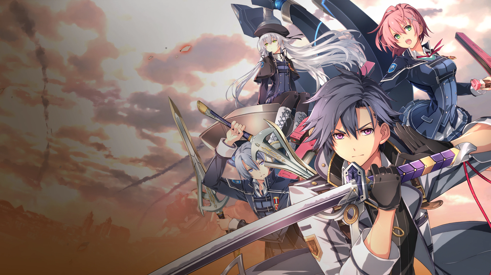
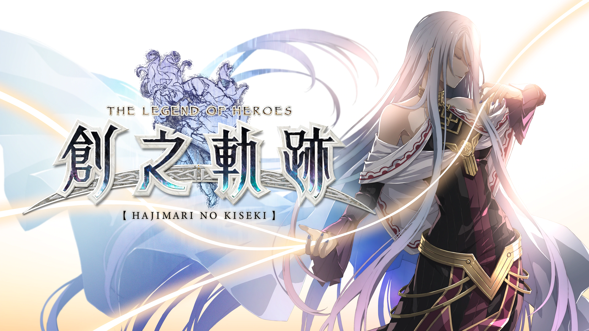

# 英雄传说系列

---

- [序章 托尔兹士官学院](/game/TheLegendOfHeroes/SenNoKiseki/chapters/chapter_0/README.md#序章-托尔兹士官学院)
  - [倒叙](/game/TheLegendOfHeroes/SenNoKiseki/chapters/chapter_0/README.md#倒叙)
  - [3/31](/game/TheLegendOfHeroes/SenNoKiseki/chapters/chapter_0/README.md#_331)
- [第一章 新学期 \~初次实习\~](/game/TheLegendOfHeroes/SenNoKiseki/chapters/chapter_1/README.md#第一章-新学期-初次实习)
  - [4/17](/game/TheLegendOfHeroes/SenNoKiseki/chapters/chapter_1/README.md#_417)
  - [4/18](/game/TheLegendOfHeroes/SenNoKiseki/chapters/chapter_1/README.md#_418)
  - [4/18夕](/game/TheLegendOfHeroes/SenNoKiseki/chapters/chapter_1/README.md#_418夕)
  - [4/21](/game/TheLegendOfHeroes/SenNoKiseki/chapters/chapter_1/README.md#_421)
  - [4/24](/game/TheLegendOfHeroes/SenNoKiseki/chapters/chapter_1/README.md#_424)
  - [4/25](/game/TheLegendOfHeroes/SenNoKiseki/chapters/chapter_1/README.md#_425)
- [第二章 美丽的翡翠公都](/game/TheLegendOfHeroes/SenNoKiseki/chapters/chapter_2/README.md#第二章-美丽的翡翠公都)
  - [5/22](/game/TheLegendOfHeroes/SenNoKiseki/chapters/chapter_2/README.md#_522)
  - [5/23](/game/TheLegendOfHeroes/SenNoKiseki/chapters/chapter_2/README.md#_523)
  - [5/23夕](/game/TheLegendOfHeroes/SenNoKiseki/chapters/chapter_2/README.md#_523夕)
  - [5/26](/game/TheLegendOfHeroes/SenNoKiseki/chapters/chapter_2/README.md#_526)
  - [5/29](/game/TheLegendOfHeroes/SenNoKiseki/chapters/chapter_2/README.md#_529)
  - [5/30](/game/TheLegendOfHeroes/SenNoKiseki/chapters/chapter_2/README.md#_530)
- [第三章 横跨铁路 \~苍穹的大地\~](/game/TheLegendOfHeroes/SenNoKiseki/chapters/chapter_3/README.md#第三章-横跨铁路-苍穹的大地)
  - [6/15](/game/TheLegendOfHeroes/SenNoKiseki/chapters/chapter_3/README.md#_615)
  - [6/16~6/19](/game/TheLegendOfHeroes/SenNoKiseki/chapters/chapter_3/README.md#_616619)
  - [6/20](/game/TheLegendOfHeroes/SenNoKiseki/chapters/chapter_3/README.md#_620)
  - [6/20夕](/game/TheLegendOfHeroes/SenNoKiseki/chapters/chapter_3/README.md#_620夕)
  - [6/23](/game/TheLegendOfHeroes/SenNoKiseki/chapters/chapter_3/README.md#_623)
  - [6/26](/game/TheLegendOfHeroes/SenNoKiseki/chapters/chapter_3/README.md#_626)
  - [6/27](/game/TheLegendOfHeroes/SenNoKiseki/chapters/chapter_3/README.md#_627)
  - [6/27午后](/game/TheLegendOfHeroes/SenNoKiseki/chapters/chapter_3/README.md#_627午后)
  - [6/28](/game/TheLegendOfHeroes/SenNoKiseki/chapters/chapter_3/README.md#_628)
- [第四章 绯之帝都 \~仲夏祭\~](/game/TheLegendOfHeroes/SenNoKiseki/chapters/chapter_4/README.md#第四章-绯之帝都-仲夏祭)
  - [7/17](/game/TheLegendOfHeroes/SenNoKiseki/chapters/chapter_4/README.md#_717)
  - [7/18](/game/TheLegendOfHeroes/SenNoKiseki/chapters/chapter_4/README.md#_718)
  - [7/18夕](/game/TheLegendOfHeroes/SenNoKiseki/chapters/chapter_4/README.md#_718夕)
  - [7/21](/game/TheLegendOfHeroes/SenNoKiseki/chapters/chapter_4/README.md#_721)
  - [7/24](/game/TheLegendOfHeroes/SenNoKiseki/chapters/chapter_4/README.md#_724)
  - [7/25](/game/TheLegendOfHeroes/SenNoKiseki/chapters/chapter_4/README.md#_725)
  - [7/26](/game/TheLegendOfHeroes/SenNoKiseki/chapters/chapter_4/README.md#_726)
- [第五章 开始行动的意志](/game/TheLegendOfHeroes/SenNoKiseki/chapters/chapter_5/README.md#第五章-开始行动的意志)
  - [8/18](/game/TheLegendOfHeroes/SenNoKiseki/chapters/chapter_5/README.md#_818)
  - [8/21](/game/TheLegendOfHeroes/SenNoKiseki/chapters/chapter_5/README.md#_821)
  - [8/22](/game/TheLegendOfHeroes/SenNoKiseki/chapters/chapter_5/README.md#_822)
  - [8/22夕](/game/TheLegendOfHeroes/SenNoKiseki/chapters/chapter_5/README.md#_822夕)
  - [8/25](/game/TheLegendOfHeroes/SenNoKiseki/chapters/chapter_5/README.md#_825)
  - [8/28](/game/TheLegendOfHeroes/SenNoKiseki/chapters/chapter_5/README.md#_828)
  - [8/29](/game/TheLegendOfHeroes/SenNoKiseki/chapters/chapter_5/README.md#_829)
  - [8/30](/game/TheLegendOfHeroes/SenNoKiseki/chapters/chapter_5/README.md#_830)
- [第六章 黑与银 \~钢都动乱\~](/game/TheLegendOfHeroes/SenNoKiseki/chapters/chapter_6/README.md#第六章-黑与银-钢都动乱)
  - [9/15](/game/TheLegendOfHeroes/SenNoKiseki/chapters/chapter_6/README.md#_915)
  - [9/18](/game/TheLegendOfHeroes/SenNoKiseki/chapters/chapter_6/README.md#_918)
  - [9/19](/game/TheLegendOfHeroes/SenNoKiseki/chapters/chapter_6/README.md#_919)
  - [9/19夕](/game/TheLegendOfHeroes/SenNoKiseki/chapters/chapter_6/README.md#_919夕)
  - [9/20](/game/TheLegendOfHeroes/SenNoKiseki/chapters/chapter_6/README.md#_920)
  - [9/22](/game/TheLegendOfHeroes/SenNoKiseki/chapters/chapter_6/README.md#_922)
  - [9/25](/game/TheLegendOfHeroes/SenNoKiseki/chapters/chapter_6/README.md#_925)
  - [9/25夜](/game/TheLegendOfHeroes/SenNoKiseki/chapters/chapter_6/README.md#_925夜)
  - [9/26](/game/TheLegendOfHeroes/SenNoKiseki/chapters/chapter_6/README.md#_926)
- [终章 士官学院祭、然后——](/game/TheLegendOfHeroes/SenNoKiseki/chapters/chapter_final/README.md#终章-士官学院祭然后)
  - [10/21](/game/TheLegendOfHeroes/SenNoKiseki/chapters/chapter_final/README.md#_1021)
  - [10/22](/game/TheLegendOfHeroes/SenNoKiseki/chapters/chapter_final/README.md#_1022)
  - [10/23](/game/TheLegendOfHeroes/SenNoKiseki/chapters/chapter_final/README.md#_1023)
  - [10/23上午](/game/TheLegendOfHeroes/SenNoKiseki/chapters/chapter_final/README.md#_1023上午)
  - [10/23下午](/game/TheLegendOfHeroes/SenNoKiseki/chapters/chapter_final/README.md#_1023下午)
  - [10/23黄昏(票用完前)](/game/TheLegendOfHeroes/SenNoKiseki/chapters/chapter_final/README.md#_1023黄昏票用完前)
  - [10/23黄昏(票用完后)](/game/TheLegendOfHeroes/SenNoKiseki/chapters/chapter_final/README.md#_1023黄昏票用完后)
  - [10/24](/game/TheLegendOfHeroes/SenNoKiseki/chapters/chapter_final/README.md#_1024)
  - [10/30](/game/TheLegendOfHeroes/SenNoKiseki/chapters/chapter_final/README.md#_1030)
- [附录](/game/TheLegendOfHeroes/SenNoKiseki/附录.md#附录)
  - [人物信息](/game/TheLegendOfHeroes/SenNoKiseki/characters/README.md#人物信息)
  - [书籍信息](/game/TheLegendOfHeroes/SenNoKiseki/books/README.md#书籍信息)
  - [钓鱼笔记](/game/TheLegendOfHeroes/SenNoKiseki/fish/README.md#钓鱼笔记)
  - [食谱](/game/TheLegendOfHeroes/SenNoKiseki/recipes/README.md#食谱)
  - [任务](/game/TheLegendOfHeroes/SenNoKiseki/quests/README.md#任务)
  - [核心回路](/game/TheLegendOfHeroes/SenNoKiseki/quartz/README.md#核心回路)

---

- [序章 归乡 ~ 失意的尽头](/game/TheLegendOfHeroes/SenNoKiseki2/chapters/chapter_0/README.md#序章-归乡--失意的尽头)
  - [11/29](/game/TheLegendOfHeroes/SenNoKiseki2/chapters/chapter_0/README.md#_1129)
  - [11/30](/game/TheLegendOfHeroes/SenNoKiseki2/chapters/chapter_0/README.md#_1130)
- [第一章 灰色战记](/game/TheLegendOfHeroes/SenNoKiseki2/chapters/chapter_1/README.md#第一章-灰色战记)
  - [12/1](/game/TheLegendOfHeroes/SenNoKiseki2/chapters/chapter_1/README.md#_121)
  - [12/4](/game/TheLegendOfHeroes/SenNoKiseki2/chapters/chapter_1/README.md#_124)
  - [12/5](/game/TheLegendOfHeroes/SenNoKiseki2/chapters/chapter_1/README.md#_125)
  - [12/8](/game/TheLegendOfHeroes/SenNoKiseki2/chapters/chapter_1/README.md#_128)
  - [12/9](/game/TheLegendOfHeroes/SenNoKiseki2/chapters/chapter_1/README.md#_129)
  - [12/12](/game/TheLegendOfHeroes/SenNoKiseki2/chapters/chapter_1/README.md#_1212)
- [幕章 白银巨船](/game/TheLegendOfHeroes/SenNoKiseki2/chapters/chapter_2/README.md#幕章-白银巨船)
  - [12/13](/game/TheLegendOfHeroes/SenNoKiseki2/chapters/chapter_2/README.md#_1213)
- [第二章 红翼 ~ 苏醒的狮子们](/game/TheLegendOfHeroes/SenNoKiseki2/chapters/chapter_3/README.md#第二章-红翼--苏醒的狮子们)
  - [12/15](/game/TheLegendOfHeroes/SenNoKiseki2/chapters/chapter_3/README.md#_1215)
  - [12/17](/game/TheLegendOfHeroes/SenNoKiseki2/chapters/chapter_3/README.md#_1217)
  - [12/18](/game/TheLegendOfHeroes/SenNoKiseki2/chapters/chapter_3/README.md#_1218)
  - [12/19](/game/TheLegendOfHeroes/SenNoKiseki2/chapters/chapter_3/README.md#_1219)
  - [12/20](/game/TheLegendOfHeroes/SenNoKiseki2/chapters/chapter_3/README.md#_1220)
  - [12/22](/game/TheLegendOfHeroes/SenNoKiseki2/chapters/chapter_3/README.md#_1222)
  - [12/23](/game/TheLegendOfHeroes/SenNoKiseki2/chapters/chapter_3/README.md#_1223)
  - [12/24](/game/TheLegendOfHeroes/SenNoKiseki2/chapters/chapter_3/README.md#_1224)
  - [12/25](/game/TheLegendOfHeroes/SenNoKiseki2/chapters/chapter_3/README.md#_1225)
  - [12/26](/game/TheLegendOfHeroes/SenNoKiseki2/chapters/chapter_3/README.md#_1226)
  - [12/27](/game/TheLegendOfHeroes/SenNoKiseki2/chapters/chapter_3/README.md#_1227)
  - [12/30](/game/TheLegendOfHeroes/SenNoKiseki2/chapters/chapter_3/README.md#_1230)
- [终章 只管不断向前](/game/TheLegendOfHeroes/SenNoKiseki2/chapters/chapter_final/README.md#终章-只管不断向前)
  - [12/30](/game/TheLegendOfHeroes/SenNoKiseki2/chapters/chapter_final/README.md#_1230)
  - [12/31](/game/TheLegendOfHeroes/SenNoKiseki2/chapters/chapter_final/README.md#_1231)
- [外传 占领下的克洛斯贝尔](/game/TheLegendOfHeroes/SenNoKiseki2/chapters/chapter_ex/README.md#外传-占领下的克洛斯贝尔)
  - [3/9](/game/TheLegendOfHeroes/SenNoKiseki2/chapters/chapter_ex/README.md#_39)
- [后日谈 冬日的尾声](/game/TheLegendOfHeroes/SenNoKiseki2/chapters/chapter_after/README.md#后日谈-冬日的尾声)
  - [3/12](/game/TheLegendOfHeroes/SenNoKiseki2/chapters/chapter_after/README.md#_312)
  - [3/13](/game/TheLegendOfHeroes/SenNoKiseki2/chapters/chapter_after/README.md#_313)

---

- [序章 春日再临](/game/TheLegendOfHeroes/SenNoKiseki3/chapters/chapter_0/README.md#序章-春日再临)
  - [6/19](/game/TheLegendOfHeroes/SenNoKiseki3/chapters/chapter_0/README.md#_619)
  - [4/1](/game/TheLegendOfHeroes/SenNoKiseki3/chapters/chapter_0/README.md#_41)
- [第一章 重逢~白垩旧都](/game/TheLegendOfHeroes/SenNoKiseki3/chapters/chapter_1/README.md#第一章-重逢白垩旧都)
  - [4/15 放学后](/game/TheLegendOfHeroes/SenNoKiseki3/chapters/chapter_1/README.md#_415-放学后)
  - [4/15 夜](/game/TheLegendOfHeroes/SenNoKiseki3/chapters/chapter_1/README.md#_415-夜)
  - [4/16](/game/TheLegendOfHeroes/SenNoKiseki3/chapters/chapter_1/README.md#_416)
  - [4/16 傍晚](/game/TheLegendOfHeroes/SenNoKiseki3/chapters/chapter_1/README.md#_416-傍晚)
  - [4/17](/game/TheLegendOfHeroes/SenNoKiseki3/chapters/chapter_1/README.md#_417)
  - [4/21 夜](/game/TheLegendOfHeroes/SenNoKiseki3/chapters/chapter_1/README.md#_421-夜)
  - [4/22](/game/TheLegendOfHeroes/SenNoKiseki3/chapters/chapter_1/README.md#_422)
  - [4/22 午后](/game/TheLegendOfHeroes/SenNoKiseki3/chapters/chapter_1/README.md#_422-午后)
  - [4/23](/game/TheLegendOfHeroes/SenNoKiseki3/chapters/chapter_1/README.md#_423)
- [第二章 矛盾交织的克洛斯贝尔](/game/TheLegendOfHeroes/SenNoKiseki3/chapters/chapter_2/README.md#第二章-矛盾交织的克洛斯贝尔)
  - [5/13 傍晚](/game/TheLegendOfHeroes/SenNoKiseki3/chapters/chapter_2/README.md#_513-傍晚)
  - [5/13 夜](/game/TheLegendOfHeroes/SenNoKiseki3/chapters/chapter_2/README.md#_513-夜)
  - [5/14](/game/TheLegendOfHeroes/SenNoKiseki3/chapters/chapter_2/README.md#_514)
  - [5/14 傍晚](/game/TheLegendOfHeroes/SenNoKiseki3/chapters/chapter_2/README.md#_514-傍晚)
  - [5/15](/game/TheLegendOfHeroes/SenNoKiseki3/chapters/chapter_2/README.md#_515)
  - [5/19 夜](/game/TheLegendOfHeroes/SenNoKiseki3/chapters/chapter_2/README.md#_519-夜)
  - [5/20](/game/TheLegendOfHeroes/SenNoKiseki3/chapters/chapter_2/README.md#_520)
  - [5/21](/game/TheLegendOfHeroes/SenNoKiseki3/chapters/chapter_2/README.md#_521)
- [第三章 钢之鼓动 海都缭乱](/game/TheLegendOfHeroes/SenNoKiseki3/chapters/chapter_3/README.md#第三章-钢之鼓动-海都缭乱)
  - [6/10 放学后](/game/TheLegendOfHeroes/SenNoKiseki3/chapters/chapter_3/README.md#_610-放学后)
  - [6/10 傍晚](/game/TheLegendOfHeroes/SenNoKiseki3/chapters/chapter_3/README.md#_610-傍晚)
  - [6/11](/game/TheLegendOfHeroes/SenNoKiseki3/chapters/chapter_3/README.md#_611)
  - [6/11 傍晚](/game/TheLegendOfHeroes/SenNoKiseki3/chapters/chapter_3/README.md#_611-傍晚)
  - [6/12](/game/TheLegendOfHeroes/SenNoKiseki3/chapters/chapter_3/README.md#_612)
  - [6/16 夜](/game/TheLegendOfHeroes/SenNoKiseki3/chapters/chapter_3/README.md#_616-夜)
  - [6/17](/game/TheLegendOfHeroes/SenNoKiseki3/chapters/chapter_3/README.md#_617)
  - [6/17 午后](/game/TheLegendOfHeroes/SenNoKiseki3/chapters/chapter_3/README.md#_617-午后)
  - [6/17 夜](/game/TheLegendOfHeroes/SenNoKiseki3/chapters/chapter_3/README.md#_617-夜)
  - [6/18 上午](/game/TheLegendOfHeroes/SenNoKiseki3/chapters/chapter_3/README.md#_618-上午)
  - [6/18 夜](/game/TheLegendOfHeroes/SenNoKiseki3/chapters/chapter_3/README.md#_618-夜)
  - [6/19](/game/TheLegendOfHeroes/SenNoKiseki3/chapters/chapter_3/README.md#_619)
- [第四章 光辉灿烂的海姆达尔](/game/TheLegendOfHeroes/SenNoKiseki3/chapters/chapter_4/README.md#第四章-光辉灿烂的海姆达尔)
  - [7/4](/game/TheLegendOfHeroes/SenNoKiseki3/chapters/chapter_4/README.md#_74)
  - [7/5~7/8](/game/TheLegendOfHeroes/SenNoKiseki3/chapters/chapter_4/README.md#_7578)
  - [7/8 夜](/game/TheLegendOfHeroes/SenNoKiseki3/chapters/chapter_4/README.md#_78-夜)
  - [7/9](/game/TheLegendOfHeroes/SenNoKiseki3/chapters/chapter_4/README.md#_79)
  - [7/9 傍晚](/game/TheLegendOfHeroes/SenNoKiseki3/chapters/chapter_4/README.md#_79-傍晚)
  - [7/12](/game/TheLegendOfHeroes/SenNoKiseki3/chapters/chapter_4/README.md#_712)
  - [7/15](/game/TheLegendOfHeroes/SenNoKiseki3/chapters/chapter_4/README.md#_715)
  - [7/15 下午](/game/TheLegendOfHeroes/SenNoKiseki3/chapters/chapter_4/README.md#_715-下午)
  - [7/16](/game/TheLegendOfHeroes/SenNoKiseki3/chapters/chapter_4/README.md#_716)
  - [7/17](/game/TheLegendOfHeroes/SenNoKiseki3/chapters/chapter_4/README.md#_717)
- [终章 钟为谁鸣](/game/TheLegendOfHeroes/SenNoKiseki3/chapters/chapter_final/README.md#终章-钟为谁鸣)
  - [7/18](/game/TheLegendOfHeroes/SenNoKiseki3/chapters/chapter_final/README.md#_718)

---

- [序章 变化的世界 来自黑暗的深渊](/game/TheLegendOfHeroes/SenNoKiseki4/chapters/chapter_0/README.md#序章-变化的世界-来自黑暗的深渊)
  - [8/1 克洛斯贝尔方面](/game/TheLegendOfHeroes/SenNoKiseki4/chapters/chapter_0/README.md#_81-克洛斯贝尔方面)
  - [8/1 隐密村·霭灵](/game/TheLegendOfHeroes/SenNoKiseki4/chapters/chapter_0/README.md#_81-隐密村霭灵)
- [第一章 VII班的考验](/game/TheLegendOfHeroes/SenNoKiseki4/chapters/chapter_1/README.md#第一章-vii班的考验)
  - [8/2](/game/TheLegendOfHeroes/SenNoKiseki4/chapters/chapter_1/README.md#_82)
  - [8/7](/game/TheLegendOfHeroes/SenNoKiseki4/chapters/chapter_1/README.md#_87)
  - [8/9](/game/TheLegendOfHeroes/SenNoKiseki4/chapters/chapter_1/README.md#_89)
  - [8/10](/game/TheLegendOfHeroes/SenNoKiseki4/chapters/chapter_1/README.md#_810)
  - [8/13](/game/TheLegendOfHeroes/SenNoKiseki4/chapters/chapter_1/README.md#_813)
  - [8/14](/game/TheLegendOfHeroes/SenNoKiseki4/chapters/chapter_1/README.md#_814)
  - [8/15](/game/TheLegendOfHeroes/SenNoKiseki4/chapters/chapter_1/README.md#_815)
  - [8/15 下午](/game/TheLegendOfHeroes/SenNoKiseki4/chapters/chapter_1/README.md#_815-下午)
- [断章 剑断之后——](/game/TheLegendOfHeroes/SenNoKiseki4/chapters/chapter_2/README.md#断章-剑断之后)
  - [8/17](/game/TheLegendOfHeroes/SenNoKiseki4/chapters/chapter_2/README.md#_817)
- [第二章 宿命的繁星](/game/TheLegendOfHeroes/SenNoKiseki4/chapters/chapter_3/README.md#第二章-宿命的繁星)
  - [8/19](/game/TheLegendOfHeroes/SenNoKiseki4/chapters/chapter_3/README.md#_819)
  - [8/20](/game/TheLegendOfHeroes/SenNoKiseki4/chapters/chapter_3/README.md#_829)
  - [8/21](/game/TheLegendOfHeroes/SenNoKiseki4/chapters/chapter_3/README.md#_821)
  - [8/22](/game/TheLegendOfHeroes/SenNoKiseki4/chapters/chapter_3/README.md#_822)
  - [8/23](/game/TheLegendOfHeroes/SenNoKiseki4/chapters/chapter_3/README.md#_823)
  - [8/24](/game/TheLegendOfHeroes/SenNoKiseki4/chapters/chapter_3/README.md#_824)
  - [8/25](/game/TheLegendOfHeroes/SenNoKiseki4/chapters/chapter_3/README.md#_825)
  - [8/26](/game/TheLegendOfHeroes/SenNoKiseki4/chapters/chapter_3/README.md#_826)
- [第三章 狮子时刻 闪光的行踪](/game/TheLegendOfHeroes/SenNoKiseki4/chapters/chapter_4/README.md#第三章-狮子时刻-闪光的行踪)
  - [8/27](/game/TheLegendOfHeroes/SenNoKiseki4/chapters/chapter_4/README.md#_827)
  - [8/28](/game/TheLegendOfHeroes/SenNoKiseki4/chapters/chapter_4/README.md#_828)
  - [8/29](/game/TheLegendOfHeroes/SenNoKiseki4/chapters/chapter_4/README.md#_829)
  - [8/30](/game/TheLegendOfHeroes/SenNoKiseki4/chapters/chapter_4/README.md#_830)
- [前日谈 至少对这个夜晚发誓](/game/TheLegendOfHeroes/SenNoKiseki4/chapters/chapter_5/README.md#前日谈-至少对这个夜晚发誓)
  - [8/31](/game/TheLegendOfHeroes/SenNoKiseki4/chapters/chapter_5/README.md#_831)
- [最终幕 花逝于火焰彼方](/game/TheLegendOfHeroes/SenNoKiseki4/chapters/chapter_6/README.md#最终幕-花逝于火焰彼方)
  - [9/1](/game/TheLegendOfHeroes/SenNoKiseki4/chapters/chapter_6/README.md#_91)
- [最终战](/game/TheLegendOfHeroes/SenNoKiseki4/chapters/chapter_7/README.md#最终战)

---

- [序章「克洛斯贝尔解放作战」](/game/TheLegendOfHeroes/HajimariNoKiseki/chapters/chapter_0/README.md#序章克洛斯贝尔解放作战)
- [第一章](/game/TheLegendOfHeroes/HajimariNoKiseki/chapters/chapter_1/README.md#第一章)
  - [第一章 罗伊德线「再独立之日」](/game/TheLegendOfHeroes/HajimariNoKiseki/chapters/chapter_0/Lloyd.md#第一章-罗伊德线再独立之日)
  - [第一章 黎恩线 「雪融时的归乡」](/game/TheLegendOfHeroes/HajimariNoKiseki/chapters/chapter_0/Rean.md#第一章-黎恩线-雪融时的归乡)
  - [第一章 《C》线 「邂逅之夜」](/game/TheLegendOfHeroes/HajimariNoKiseki/chapters/chapter_0/C.md#第一章-c线-邂逅之夜)
- [第二章](/game/TheLegendOfHeroes/HajimariNoKiseki/chapters/chapter_2/README.md#第二章)
  - [第二章 《C》线 「黑暗蠢动」 上](/game/TheLegendOfHeroes/HajimariNoKiseki/chapters/chapter_2/C_1.md#第二章-c线-黑暗蠢动-上)
  - [第二章 黎恩线 「绯红之都的影子」 上](/game/TheLegendOfHeroes/HajimariNoKiseki/chapters/chapter_2/Rean_1.md#第二章-黎恩线-绯红之都的影子-上)
  - [第二章 罗伊德线 「失落之魂」 上](/game/TheLegendOfHeroes/HajimariNoKiseki/chapters/chapter_2/Lloyd_1.md#第二章-罗伊德线-失落之魂-上)
  - [第二章 梦幻回廊](/game/TheLegendOfHeroes/HajimariNoKiseki/chapters/chapter_2/EX.md#梦幻回廊)
  - [第二章 《C》线 「黑暗蠢动」 下](/game/TheLegendOfHeroes/HajimariNoKiseki/chapters/chapter_2/C_2.md#第二章-c线-黑暗蠢动-下)
  - [第二章 黎恩线 「绯红之都的影子」 下](/game/TheLegendOfHeroes/HajimariNoKiseki/chapters/chapter_2/Rean_2.md#第二章-黎恩线-绯红之都的影子-下)
  - [第二章 罗伊德线 「失落之魂」 下](/game/TheLegendOfHeroes/HajimariNoKiseki/chapters/chapter_2/Lloyd_2.md#第二章-罗伊德线-失落之魂-下)
- [第三章](/game/TheLegendOfHeroes/HajimariNoKiseki/chapters/chapter_3/README.md#第三章)
  - [第三章 《C》线 「追忆~抓住的光辉」 上](/game/TheLegendOfHeroes/HajimariNoKiseki/chapters/chapter_3/C_1.md#第三章-c线-追忆抓住的光辉-上)
  - [第三章 黎恩线 「被揭露的苍穹」 上](/game/TheLegendOfHeroes/HajimariNoKiseki/chapters/chapter_3/Rean_1.md#第三章-黎恩线-被揭露的苍穹-上)
  - [第三章 罗伊德线 「超越幻想」 上](/game/TheLegendOfHeroes/HajimariNoKiseki/chapters/chapter_3/Lloyd_1.md#第三章-罗伊德线-超越幻想-上)
  - [第三章 梦幻回廊](/game/TheLegendOfHeroes/HajimariNoKiseki/chapters/chapter_3/EX.md#第三章-梦幻回廊)
  - [第三章 《C》线 「追忆~抓住的光辉」 下](/game/TheLegendOfHeroes/HajimariNoKiseki/chapters/chapter_3/C_2.md#第三章-c线-追忆抓住的光辉-下)
  - [第三章 黎恩线 「被揭露的苍穹」 下](/game/TheLegendOfHeroes/HajimariNoKiseki/chapters/chapter_3/Rean_2.md#第三章-黎恩线-被揭露的苍穹-下)
  - [第三章 罗伊德线 「超越幻想」 下](/game/TheLegendOfHeroes/HajimariNoKiseki/chapters/chapter_3/Lloyd_2.md#第三章-罗伊德线-超越幻想-下)
- [第四章](/game/TheLegendOfHeroes/HajimariNoKiseki/chapters/chapter_4/README.md#第四章)
  - [第四章 《C》线 「极乐世界」 上](/game/TheLegendOfHeroes/HajimariNoKiseki/chapters/chapter_4/C_1.md#第四章-c线-极乐世界-上)
  - [第四章 黎恩线 「零之邂逅」 上](/game/TheLegendOfHeroes/HajimariNoKiseki/chapters/chapter_4/Rean_1.md#第四章-黎恩线-零之邂逅-上)
  - [第四章 罗伊德线 「苏醒的意志一黑色包围战」 上](/game/TheLegendOfHeroes/HajimariNoKiseki/chapters/chapter_4/Lloyd_1.md#第一章-罗伊德线再独立之日)
  - [第四章 梦幻回廊](/game/TheLegendOfHeroes/HajimariNoKiseki/chapters/chapter_4/EX.md#第四章-梦幻回廊)
  - [第四章 《C》线 「极乐世界」 下](/game/TheLegendOfHeroes/HajimariNoKiseki/chapters/chapter_4/C_2.md#第四章-c线-极乐世界-下)
  - [第四章 黎恩线 「零之邂逅」 下](/game/TheLegendOfHeroes/HajimariNoKiseki/chapters/chapter_4/Rean_2.md#第四章-黎恩线-零之邂逅-下)
  - [第四章 罗伊德线 「苏醒的意志一黑色包围战」 下](/game/TheLegendOfHeroes/HajimariNoKiseki/chapters/chapter_4/Lloyd_2.md#第一章-罗伊德线再独立之日)
- [最终章](/game/TheLegendOfHeroes/HajimariNoKiseki/chapters/chapter_final/README.md#最终章)
  - [最终章 「终焉，以及创始」 上](/game/TheLegendOfHeroes/HajimariNoKiseki/chapters/chapter_final/Final_1.md#最终章-终焉以及创始-上)
  - [最终章 梦幻回廊](/game/TheLegendOfHeroes/HajimariNoKiseki/chapters/chapter_final/EX.md#最终章-梦幻回廊)
  - [最终章 「终焉，以及创始」 下](/game/TheLegendOfHeroes/HajimariNoKiseki/chapters/chapter_final/Final_2.md#最终章-终焉以及创始-下)
- [EX: 梦幻的彼方](/game/TheLegendOfHeroes/HajimariNoKiseki/chapters/chapter_ex/README.md#ex-梦幻的彼方)

---

