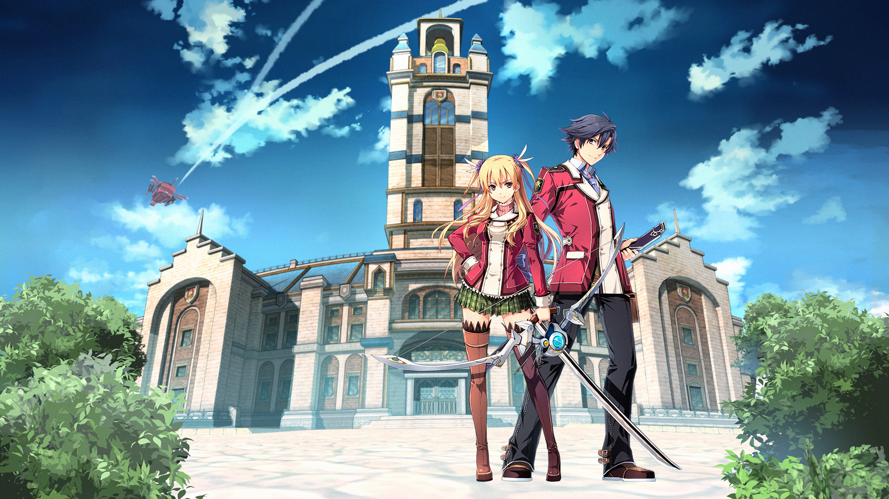

# 英雄传说系列

---

- [闪之轨迹](/game/TheLegendOfHeroes/SenNoKiseki/README.md#闪之轨迹)
    - [序章 托尔兹士官学院](/game/TheLegendOfHeroes/SenNoKiseki/chapters/chapter_0/README.md#序章-托尔兹士官学院)
    - [第一章 新学期 \~初次实习\~](/game/TheLegendOfHeroes/SenNoKiseki/chapters/chapter_1/README.md#第一章-新学期-初次实习)
    - [第二章 美丽的翡翠公都](/game/TheLegendOfHeroes/SenNoKiseki/chapters/chapter_2/README.md#第二章-美丽的翡翠公都)
    - [第三章 横跨铁路 \~苍穹的大地\~](/game/TheLegendOfHeroes/SenNoKiseki/chapters/chapter_3/README.md#第三章-横跨铁路-苍穹的大地)
    - [第四章 绯之帝都 \~仲夏祭\~](/game/TheLegendOfHeroes/SenNoKiseki/chapters/chapter_4/README.md#第四章-绯之帝都-仲夏祭)
    - [第五章 开始行动的意志](/game/TheLegendOfHeroes/SenNoKiseki/chapters/chapter_5/README.md#第五章-开始行动的意志)
    - [第六章 黑与银 \~钢都动乱\~](/game/TheLegendOfHeroes/SenNoKiseki/chapters/chapter_6/README.md#第六章-黑与银-钢都动乱)
    - [终章 士官学院祭、然后——](/game/TheLegendOfHeroes/SenNoKiseki/chapters/chapter_final/README.md#终章-士官学院祭然后)
    - [附录](/game/TheLegendOfHeroes/SenNoKiseki/附录.md#附录)
        - [人物信息](/game/TheLegendOfHeroes/SenNoKiseki/characters/README.md#人物信息)
        - [书籍信息](/game/TheLegendOfHeroes/SenNoKiseki/books/README.md#书籍信息)
        - [钓鱼笔记](/game/TheLegendOfHeroes/SenNoKiseki/fish/README.md#钓鱼笔记)
        - [食谱](/game/TheLegendOfHeroes/SenNoKiseki/recipes/食谱.md#食谱)
        - [任务](/game/TheLegendOfHeroes/SenNoKiseki/quests/任务.md#任务)
        - [核心回路](/game/TheLegendOfHeroes/SenNoKiseki/quartz/README.md#核心回路)

---

- [闪之轨迹II](/game/TheLegendOfHeroes/SenNoKiseki2/README.md#闪之轨迹ii)
    - [序章 归乡 ~ 失意的尽头](/game/TheLegendOfHeroes/SenNoKiseki2/chapters/chapter_0/README.md#序章-归乡--失意的尽头)
    - [第一章 灰色战记](/game/TheLegendOfHeroes/SenNoKiseki2/chapters/chapter_1/README.md#第一章-灰色战记)
    - [幕章 白银巨船](/game/TheLegendOfHeroes/SenNoKiseki2/chapters/chapter_2/README.md#幕章-白银巨船)
    - [第二章 红翼 ~ 苏醒的狮子们](/game/TheLegendOfHeroes/SenNoKiseki2/chapters/chapter_3/README.md#第二章-红翼--苏醒的狮子们)
    - [终章 只管不断向前](/game/TheLegendOfHeroes/SenNoKiseki2/chapters/chapter_final/README.md#终章-只管不断向前)
    - [外传 占领下的克洛斯贝尔](/game/TheLegendOfHeroes/SenNoKiseki2/chapters/chapter_ex/README.md#外传-占领下的克洛斯贝尔)
    - [后日谈 冬日的尾声](/game/TheLegendOfHeroes/SenNoKiseki2/chapters/chapter_after/README.md#后日谈-冬日的尾声)

---

- [闪之轨迹III](/game/TheLegendOfHeroes/SenNoKiseki3/README.md#闪之轨迹iii)
    - [序章 春日再临](/game/TheLegendOfHeroes/SenNoKiseki3/chapters/chapter_0/README.md#序章-春日再临)
    - [第一章 重逢~白垩旧都](/game/TheLegendOfHeroes/SenNoKiseki3/chapters/chapter_1/README.md#第一章-重逢白垩旧都)
    - [第二章 矛盾交织的克洛斯贝尔](/game/TheLegendOfHeroes/SenNoKiseki3/chapters/chapter_2/README.md#第二章-矛盾交织的克洛斯贝尔)
    - [第三章 钢之鼓动 海都缭乱](/game/TheLegendOfHeroes/SenNoKiseki3/chapters/chapter_3/README.md#第三章-钢之鼓动-海都缭乱)
    - [第四章 光辉灿烂的海姆达尔](/game/TheLegendOfHeroes/SenNoKiseki3/chapters/chapter_4/README.md#第四章-光辉灿烂的海姆达尔)
    - [终章 钟为谁鸣](/game/TheLegendOfHeroes/SenNoKiseki3/chapters/chapter_final/README.md#终章-钟为谁鸣)

---

- [闪之轨迹IV](/game/TheLegendOfHeroes/SenNoKiseki4/README.md#闪之轨迹iv)
    - [序章 变化的世界 来自黑暗的深渊](/game/TheLegendOfHeroes/SenNoKiseki4/chapters/chapter_0/README.md#序章-变化的世界-来自黑暗的深渊)
    - [第一章 VII班的考验](/game/TheLegendOfHeroes/SenNoKiseki4/chapters/chapter_1/README.md#第一章-vii班的考验)
    - [断章 剑断之后——](/game/TheLegendOfHeroes/SenNoKiseki4/chapters/chapter_2/README.md#断章-剑断之后)
    - [第二章 宿命的繁星](/game/TheLegendOfHeroes/SenNoKiseki4/chapters/chapter_3/README.md#第二章-宿命的繁星)
    - [第三章 狮子时刻 闪光的行踪](/game/TheLegendOfHeroes/SenNoKiseki4/chapters/chapter_4/README.md#第三章-狮子时刻-闪光的行踪)
    - [前日谈 至少对这个夜晚发誓](/game/TheLegendOfHeroes/SenNoKiseki4/chapters/chapter_5/README.md#前日谈-至少对这个夜晚发誓)
    - [最终幕 花逝于火焰彼方](/game/TheLegendOfHeroes/SenNoKiseki4/chapters/chapter_6/README.md#最终幕-花逝于火焰彼方)
    - [最终战](/game/TheLegendOfHeroes/SenNoKiseki4/chapters/chapter_7/README.md#最终战)

---

- [创之轨迹](/game/TheLegendOfHeroes/HajimariNoKiseki/README.md#创之轨迹)
    - [序章「克洛斯贝尔解放作战」](/game/TheLegendOfHeroes/HajimariNoKiseki/chapters/chapter_0/README.md#序章克洛斯贝尔解放作战)
    - [第一章](/game/TheLegendOfHeroes/HajimariNoKiseki/chapters/chapter_1/README.md#第一章)
        - [第一章 罗伊德线「再独立之日」](/game/TheLegendOfHeroes/HajimariNoKiseki/chapters/chapter_0/Lloyd.md#第一章-罗伊德线再独立之日)
        - [第一章 黎恩线 「雪融时的归乡」](/game/TheLegendOfHeroes/HajimariNoKiseki/chapters/chapter_0/Rean.md#第一章-黎恩线-雪融时的归乡)
        - [第一章 《C》线 「邂逅之夜」](/game/TheLegendOfHeroes/HajimariNoKiseki/chapters/chapter_0/C.md#第一章-c线-邂逅之夜)
    - [第二章](/game/TheLegendOfHeroes/HajimariNoKiseki/chapters/chapter_2/README.md#第二章)
        - [第二章 《C》线 「黑暗蠢动」 上](/game/TheLegendOfHeroes/HajimariNoKiseki/chapters/chapter_2/C_1.md#第二章-c线-黑暗蠢动-上)
        - [第二章 黎恩线 「绯红之都的影子」 上](/game/TheLegendOfHeroes/HajimariNoKiseki/chapters/chapter_2/Rean_1.md#第二章-黎恩线-绯红之都的影子-上)
        - [第二章 罗伊德线 「失落之魂」 上](/game/TheLegendOfHeroes/HajimariNoKiseki/chapters/chapter_2/Lloyd_1.md#第二章-罗伊德线-失落之魂-上)
        - [第二章 梦幻回廊](/game/TheLegendOfHeroes/HajimariNoKiseki/chapters/chapter_2/EX.md#梦幻回廊)
        - [第二章 《C》线 「黑暗蠢动」 下](/game/TheLegendOfHeroes/HajimariNoKiseki/chapters/chapter_2/C_2.md#第二章-c线-黑暗蠢动-下)
        - [第二章 黎恩线 「绯红之都的影子」 下](/game/TheLegendOfHeroes/HajimariNoKiseki/chapters/chapter_2/Rean_2.md#第二章-黎恩线-绯红之都的影子-下)
        - [第二章 罗伊德线 「失落之魂」 下](/game/TheLegendOfHeroes/HajimariNoKiseki/chapters/chapter_2/Lloyd_2.md#第二章-罗伊德线-失落之魂-下)
    - [第三章](/game/TheLegendOfHeroes/HajimariNoKiseki/chapters/chapter_3/README.md#第三章)
        - [第三章 《C》线 「追忆~抓住的光辉」 上](/game/TheLegendOfHeroes/HajimariNoKiseki/chapters/chapter_3/C_1.md#第三章-c线-追忆抓住的光辉-上)
        - [第三章 黎恩线 「被揭露的苍穹」 上](/game/TheLegendOfHeroes/HajimariNoKiseki/chapters/chapter_3/Rean_1.md#第三章-黎恩线-被揭露的苍穹-上)
        - [第三章 罗伊德线 「超越幻想」 上](/game/TheLegendOfHeroes/HajimariNoKiseki/chapters/chapter_3/Lloyd_1.md#第三章-罗伊德线-超越幻想-上)
        - [第三章 梦幻回廊](/game/TheLegendOfHeroes/HajimariNoKiseki/chapters/chapter_3/EX.md#第三章-梦幻回廊)
        - [第三章 《C》线 「追忆~抓住的光辉」 下](/game/TheLegendOfHeroes/HajimariNoKiseki/chapters/chapter_3/C_2.md#第三章-c线-追忆抓住的光辉-下)
        - [第三章 黎恩线 「被揭露的苍穹」 下](/game/TheLegendOfHeroes/HajimariNoKiseki/chapters/chapter_3/Rean_2.md#第三章-黎恩线-被揭露的苍穹-下)
        - [第三章 罗伊德线 「超越幻想」 下](/game/TheLegendOfHeroes/HajimariNoKiseki/chapters/chapter_3/Lloyd_2.md#第三章-罗伊德线-超越幻想-下)
    - [第四章](/game/TheLegendOfHeroes/HajimariNoKiseki/chapters/chapter_4/README.md#第四章)
        - [第四章 《C》线 「极乐世界」 上](/game/TheLegendOfHeroes/HajimariNoKiseki/chapters/chapter_4/C_1.md#第四章-c线-极乐世界-上)
        - [第四章 黎恩线 「零之邂逅」 上](/game/TheLegendOfHeroes/HajimariNoKiseki/chapters/chapter_4/Rean_1.md#第四章-黎恩线-零之邂逅-上)
        - [第四章 罗伊德线 「苏醒的意志一黑色包围战」 上](/game/TheLegendOfHeroes/HajimariNoKiseki/chapters/chapter_4/Lloyd_1.md#第一章-罗伊德线再独立之日)
        - [第四章 梦幻回廊](/game/TheLegendOfHeroes/HajimariNoKiseki/chapters/chapter_4/EX.md#第四章-梦幻回廊)
        - [第四章 《C》线 「极乐世界」 下](/game/TheLegendOfHeroes/HajimariNoKiseki/chapters/chapter_4/C_2.md#第四章-c线-极乐世界-下)
        - [第四章 黎恩线 「零之邂逅」 下](/game/TheLegendOfHeroes/HajimariNoKiseki/chapters/chapter_4/Rean_2.md#第四章-黎恩线-零之邂逅-下)
        - [第四章 罗伊德线 「苏醒的意志一黑色包围战」 下](/game/TheLegendOfHeroes/HajimariNoKiseki/chapters/chapter_4/Lloyd_2.md#第一章-罗伊德线再独立之日)
    - [最终章](/game/TheLegendOfHeroes/HajimariNoKiseki/chapters/chapter_final/README.md#最终章)
        - [最终章 「终焉，以及创始」 上](/game/TheLegendOfHeroes/HajimariNoKiseki/chapters/chapter_final/Final_1.md#最终章-终焉以及创始-上)
        - [最终章 梦幻回廊](/game/TheLegendOfHeroes/HajimariNoKiseki/chapters/chapter_final/EX.md#最终章-梦幻回廊)
        - [最终章 「终焉，以及创始」 下](/game/TheLegendOfHeroes/HajimariNoKiseki/chapters/chapter_final/Final_2.md#最终章-终焉以及创始-下)
    - [EX: 梦幻的彼方](/game/TheLegendOfHeroes/HajimariNoKiseki/chapters/chapter_ex/README.md#ex-梦幻的彼方)

---

