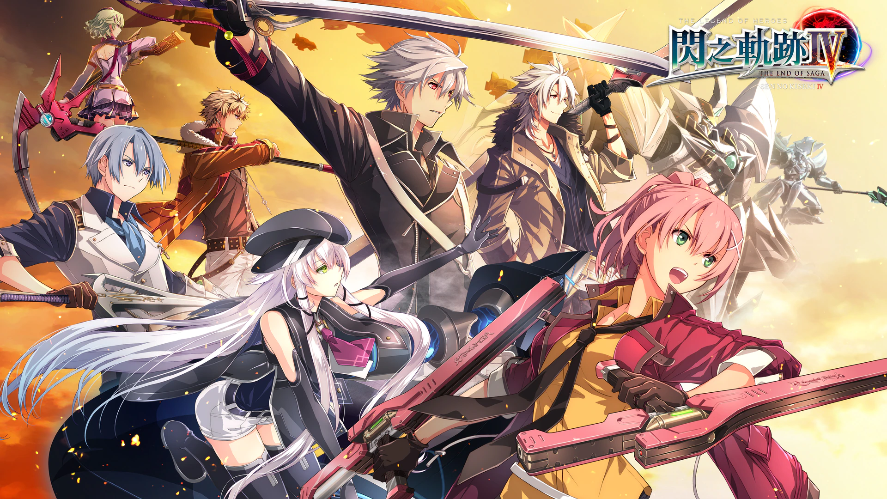

# 英雄传说系列

---

- [闪之轨迹](/game/TheLegendOfHeroes/SenNoKiseki/README.md#闪之轨迹)
    - [序章 托尔兹士官学院](/game/TheLegendOfHeroes/SenNoKiseki/chapters/chapter_0/README.md#序章-托尔兹士官学院)
    - [第一章 新学期 \~初次实习\~](/game/TheLegendOfHeroes/SenNoKiseki/chapters/chapter_1/README.md#第一章-新学期-初次实习)
    - [第二章 美丽的翡翠公都](/game/TheLegendOfHeroes/SenNoKiseki/chapters/chapter_2/README.md#第二章-美丽的翡翠公都)
    - [第三章 横跨铁路 \~苍穹的大地\~](/game/TheLegendOfHeroes/SenNoKiseki/chapters/chapter_3/README.md#第三章-横跨铁路-苍穹的大地)
    - [第四章 绯之帝都 \~仲夏祭\~](/game/TheLegendOfHeroes/SenNoKiseki/chapters/chapter_4/README.md#第四章-绯之帝都-仲夏祭)
    - [第五章 开始行动的意志](/game/TheLegendOfHeroes/SenNoKiseki/chapters/chapter_5/README.md#第五章-开始行动的意志)
    - [第六章 黑与银 \~钢都动乱\~](/game/TheLegendOfHeroes/SenNoKiseki/chapters/chapter_6/README.md#第六章-黑与银-钢都动乱)
    - [终章 士官学院祭、然后——](/game/TheLegendOfHeroes/SenNoKiseki/chapters/chapter_final/README.md#终章-士官学院祭然后)

- [闪之轨迹II](/game/TheLegendOfHeroes/SenNoKiseki2/README.md#闪之轨迹ii)

- [闪之轨迹III](/game/TheLegendOfHeroes/SenNoKiseki3/README.md#闪之轨迹iii)

- [闪之轨迹IV](/game/TheLegendOfHeroes/SenNoKiseki4/README.md#闪之轨迹iv)

- [创之轨迹](/game/TheLegendOfHeroes/HajimariNoKiseki/README.md#创之轨迹)
