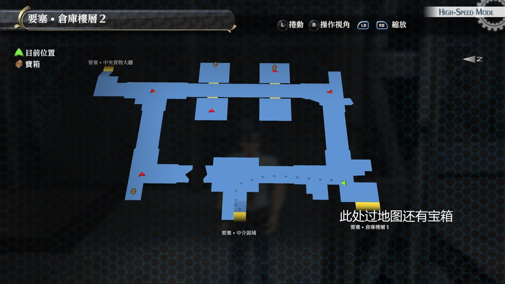

# 加雷利亚要塞

---

## 加雷利亚要塞 士兵宿舍区域

### 宝箱

- [ ]  精神3
- [ ]  星燃爆裂（从仓库另一侧回到宿舍区域时可获得）

## 加雷利亚要塞 仓库楼层1

### 宝箱

- [ ]  还魂粉
- [ ]  行动力3
- [ ]  业火(怪物宝箱, 走进仓库楼层2，先往南拐弯到仓库楼层1, *玉帘* Boss 战后可到达)

## 加雷利亚要塞 中介区域

### 宝箱

- [ ]  消失之刃
- [ ]  大回复药(*玉帘* Boss 战后可到达)
- [ ]  深邃之黄(怪物宝箱, *玉帘* Boss 战后可到达)
- [ ]  七耀晶石x300(*玉帘* Boss 战后可到达)
- [ ]  橘色斗篷(*玉帘* Boss 战后可到达)

## 加雷利亚要塞 仓库楼层2

### 宝箱

- [ ]  圣灵药·改
- [ ]  EP填充剂III
- [ ]  霸道(怪物宝箱）

## 加雷利亚要塞 中央货物大厅

### 宝箱

- [ ] 魔防3

## 战斗笔记

- [ ]  三位一体攻击者R2
- [ ]  三位一体攻击者HG
- [ ]  方阵兵J9
- [ ]  玉帘
- [ ]  帝国解放战线·剑
- [ ]  帝国解放战线·步枪
- [ ]  R·玉帘
- [ ]  S-斯卡蕾特

## Boss

*玉帘*x2

很简单。有莎拉教官在，轻松解决

*帝国解放战线·剑*×2, *帝国解放战线·步枪*×2, *三位一体攻击者R2*, *三位一体攻击者HG*

剑枪需分开调查

意思意思打一下就好。CP留着下一战

*S-斯卡蕾特*, *R·玉帘*×2

Boss吃大部分状态。注意下她的S技就行了。两杂兵攻击带炎伤和降低攻击，并且会大范围魔法，打断就行