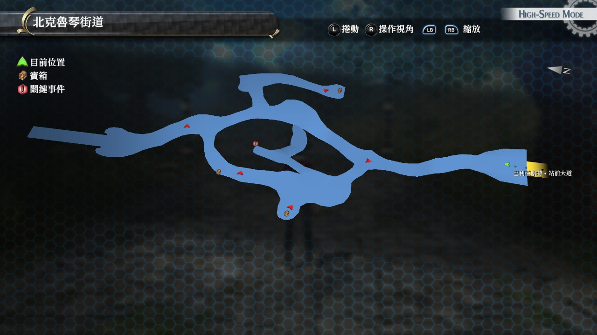

# 北克鲁琴街道

---

## 宝箱

- [ ]  七耀晶石x150
- [ ]  复活药
- [ ]  大治愈术

## 战斗笔记

- [ ]  颠茄兽
- [ ]  蛋蛇

> 战斗中有几率遇到 *电熊*, 为 [奥洛克斯峡谷道](/game/TheLegendOfHeroes/SenNoKiseki/locations/奥洛克斯峡谷道.md#奥洛克斯峡谷道) 的战斗笔记

## 钓鱼笔记

最北部桥有钓鱼点

- 岩穴鱼