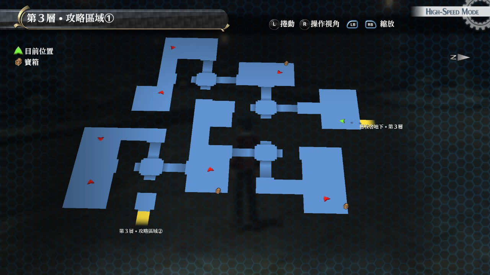
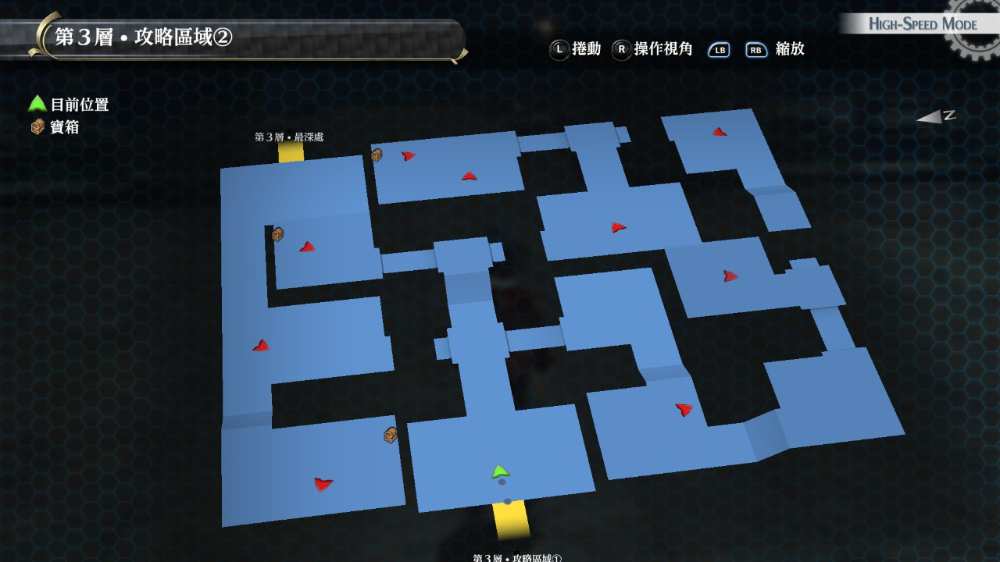

# 旧校舍地下·第3层

---

## 旧校舍地下·第3层1

### 宝箱

- [ ]  EP填充剂II
- [ ]  神圣之链
- [ ]  七属性耀晶石x200

## 旧校舍地下·第3层2

### 宝箱

- [ ]  黑色手镯
- [ ]  [白羊](/game/TheLegendOfHeroes/SenNoKiseki/quartz/白羊.md#白羊)(怪物宝箱)
- [ ]  诱饵

## 战斗笔记

- [ ]  地狱兔
- [ ]  狂怒方尖碑
- [ ]  伸缩蜗兽
- [ ]  深渊恶魔

## 钓鱼笔记

旧校舍地下·第3层1 中途有个钓鱼点

- [ ] 亚诺鲁鲫鱼

## Boss

*深渊恶魔*x3

调查情报后，优先用S技解决一个

慢慢磨即可，注意BOSS的攻击带有炎伤，困难难度的话要注意恢复