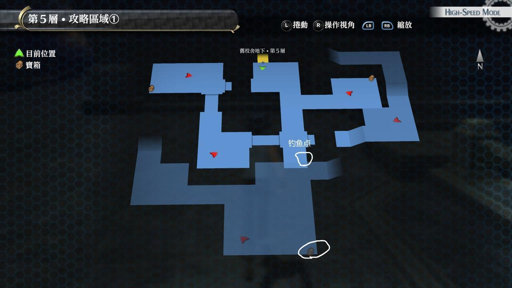
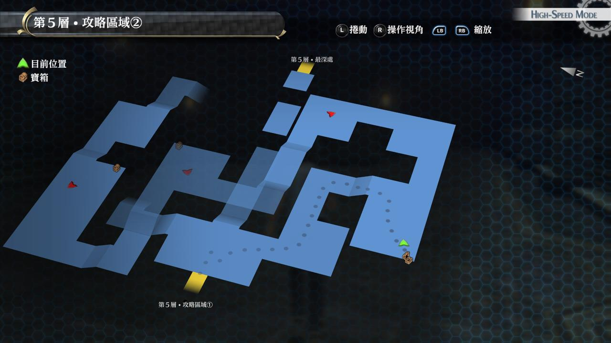

# 旧校舍地下·第五层

---

## 旧校舍地下·第五层1

### 宝箱

- [ ]  世界之树
- [ ]  七耀晶石x300
- [ ]  红色坠饰

## 旧校舍地下·第五层2

### 宝箱

- [ ]  冰冻之刃
- [ ]  防御3
- [ ]  圣灵药

## 战斗笔记

- [ ]  膨大聚合体
- [ ]  硬化巨龟
- [ ]  欺瞒冰霜兽
- [ ]  安斯尔特

## Boss

*安斯尔特*

建议装备抗冰冻饰品。攻击范围并带冰冻，而且水系魔法几乎是瞬发。建议队伍配置是一位奶妈（班长或者艾略特），一位支援（建议马奇亚斯），

因为马奇亚斯可以解驱动，恢复奶妈的EP，而且站位远，不会被波及。