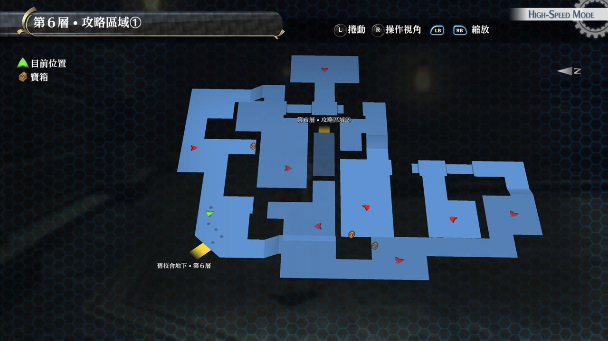
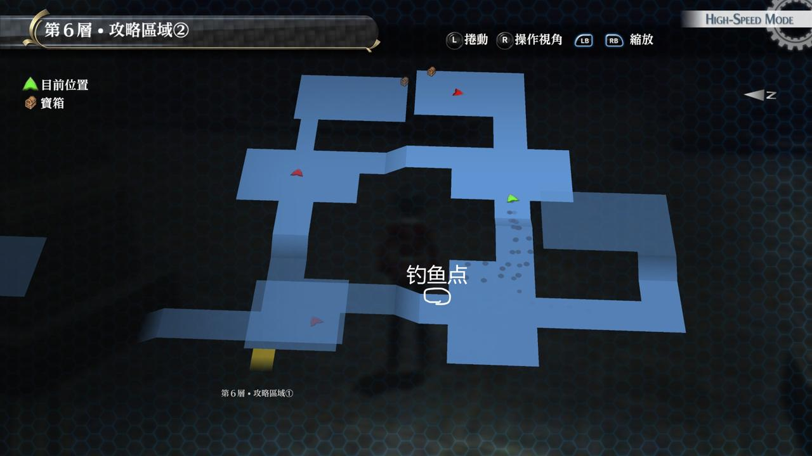
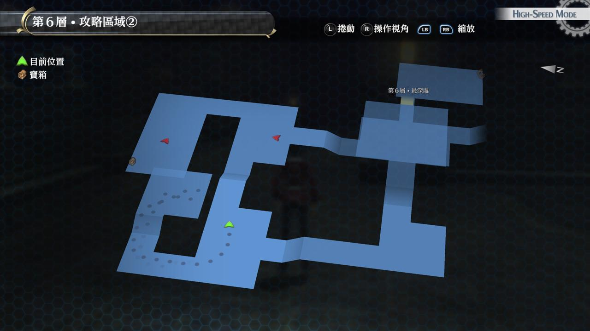

# 旧校舍地下・第6层

---

## 旧校舍地下・第6层1

### 宝箱

- [ ]  [小丑](/game/TheLegendOfHeroes/SenNoKiseki/quartz/小丑.md#小丑)（怪物宝箱）
- [ ]  圣灵之息
- [ ]  七耀晶石x350

## 旧校舍地下・第6层2

### 宝箱

- [ ]  EP填充剂III
- [ ]  金刚盾（怪物宝箱）
- [ ]  暗影裁决

## 战斗笔记

- [ ]  紫泥
- [ ]  幽怨之魂
- [ ]  斯塔拉姆达
- [ ]  艾尔维利亚

## 钓鱼笔记

区域2下台阶处有钓鱼点
- [] 大山椒鱼

## Boss

*艾尔维利亚*x2

虽然都有范围攻击，但伤害不怎样，中途会忽然信春哥，防御大增，但用魔法和S技一样轻松解决