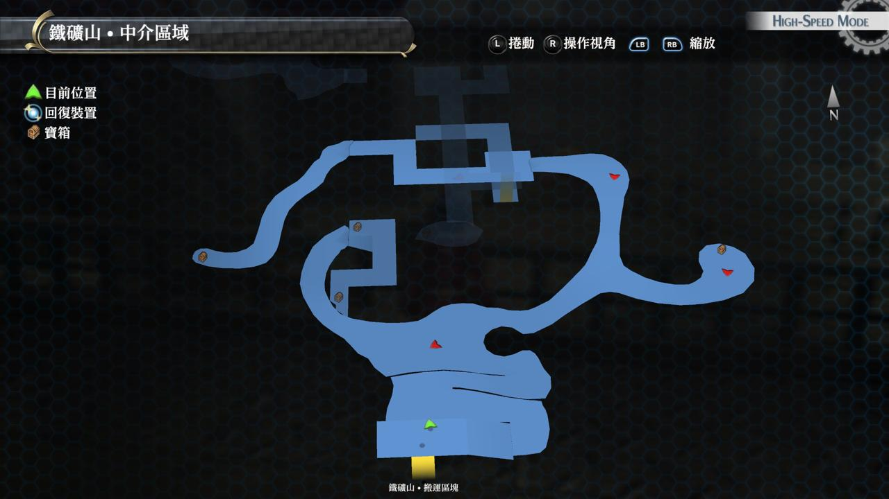
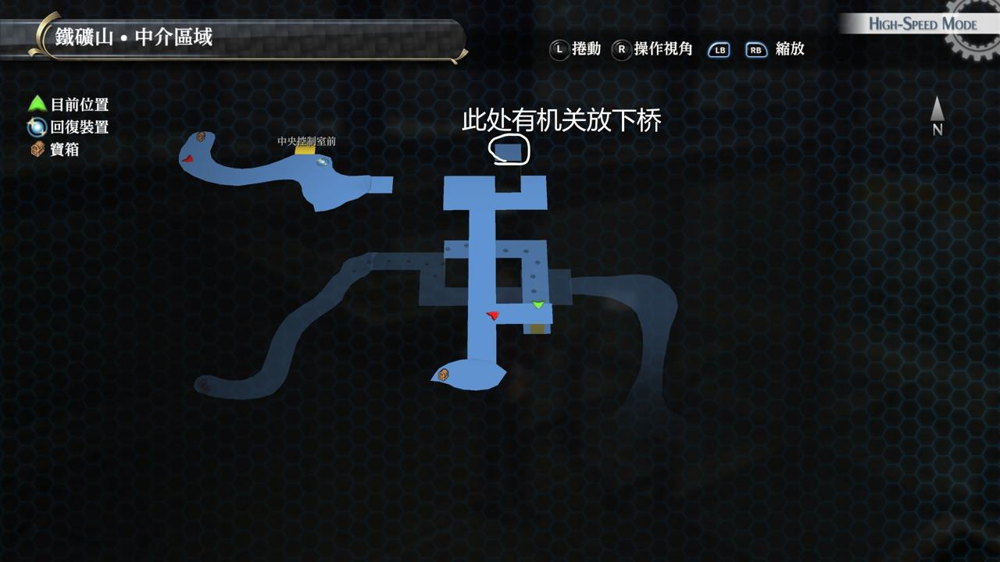

# 札克森铁矿山·中介区域

---

## 宝箱

- [ ]  七耀晶石x350
- [ ]  圣灵术
- [ ]  莱恩福尔特奖牌
- [ ]  圣灵药·改
- [ ]  涡旋激流（怪物宝箱）
- [ ]  还魂粉

## 战斗笔记

- [ ]  岩浆软体兽
- [ ]  警备猎犬G

## Boss

*V-伏尔坎*, *帝国解放战线·剑*, *帝国解放战线·步枪*×2

杂兵吃很多状态，不用太在意，有范围技顺便清除吧。同志V的攻击力高，自身有强化技。中途还会放S技，不过范围很小（亏你还拿炮）。注意别站得太接近就行了

*《C》*, *G・玉帘*×2

这场战斗百合学姐几乎是逆天，气绝战技对同志C有效

配合马奇亚斯的提速，亚莉莎的回CP，基本百合学姐就能干掉同志C，其他人解决杂兵就可

同志C会召唤炸弹，次回合引爆，只是炸弹们距离都很接近，马奇亚斯装个攻击3普攻都能打掉

中途C还是会放S技。但整体因为百合学姐问题不大

> 注：同志C的炸弹也需要调查，注意别坑了