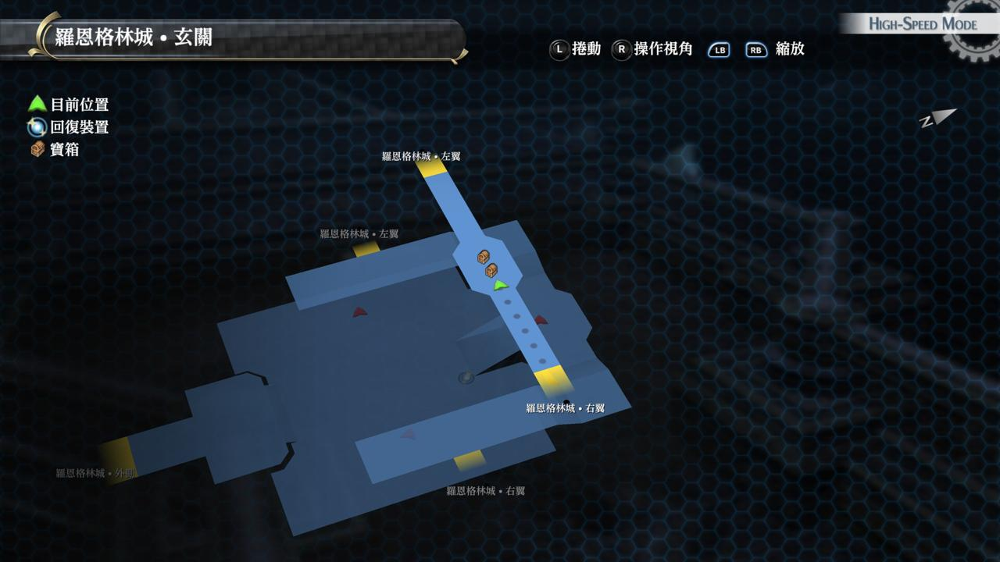

# 罗恩格林城

---

!> 注意, 此迷宫共有8个宝箱, 容易出现遗漏, 影响全宝箱收集成就奖杯的获取!!

## 罗恩格林城 左翼

### 宝箱

- [ ]  EP填充剂III
- [ ]  月之长袍

## 罗恩格林城 右翼

### 宝箱

- [ ]  七耀晶石x300
- [ ]  火言铃

## 罗恩格林城 玄关

### 宝箱

- [ ]  [灵猫](/game/TheLegendOfHeroes/SenNoKiseki/quartz/灵猫.md#灵猫)（怪物宝箱）
- [ ]  圣灵药(从左翼绕回拿取)

## 罗恩格林城 外回廊

### 宝箱

- [ ] 裁决雷光

## 罗恩格林城 阶梯房间

### 宝箱

- [ ] 罗刹牙

## 战斗笔记

- [ ]  暗影灵体
- [ ]  奇迹甲胄
- [ ]  奇迹长剑
- [ ]  暗夜野犬
- [ ]  死亡重击者
- [ ]  诺斯菲尔杜

## Boss

*诺斯菲尔杜*, *暗影灵体*x4

这个BOSS会无限召唤杂兵，杂兵会混乱、噩梦、中毒等多种状态攻击，非常难打，见到杂兵都凑在一起，赶紧用S技灭了吧

而且BOSS还会全屏的噩梦攻击，还有一种类似吸魂的攻击，被吸魂的角色不能动弹，每回合扣血

攻击一定伤害就能释放。这一战恢复比较关键。奶妈角色一定要装备好抗这些状态的饰品