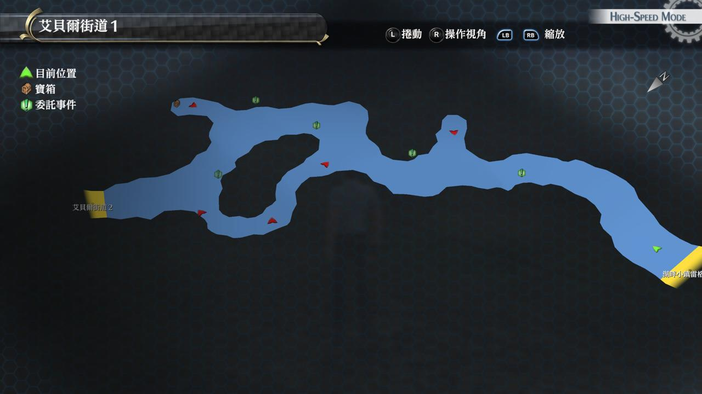
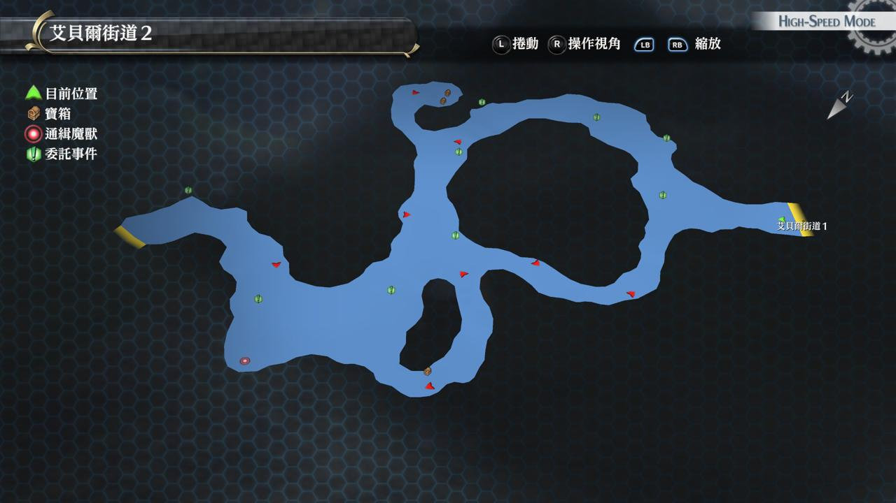

# 艾贝尔街道

---

## 艾贝尔街道1

### 宝箱

- [ ]  炎伤之刃
- [ ]  七耀晶石×300（第二天才可获得）
- [ ]  晓雾腿甲（第二天才可获得）
- [ ]  EP填充剂III（第二天才可获得）

## 艾贝尔街道2

### 宝箱

- [ ]  诱饵
- [ ]  深渊之影（怪物宝箱）
- [ ]  大回复药
- [ ]  闪耀天启（第二天才可获得）

## 战斗笔记

- [ ]  果冻菇
- [ ]  嫩芽波姆
- [ ]  强壮大嘴猩
- [ ]  贪婪收割者
- [ ]  黄金犀兽
- [ ]  椰子竹叶猫
- [ ]  鲨鳄
- [ ]  方阵兵J9(第二天才可获得)

## Boss

*鲨鳄*x2

无难度

*方阵兵J9*

飞弹攻击带炎伤，其他问题不大，刚属性对它有成效