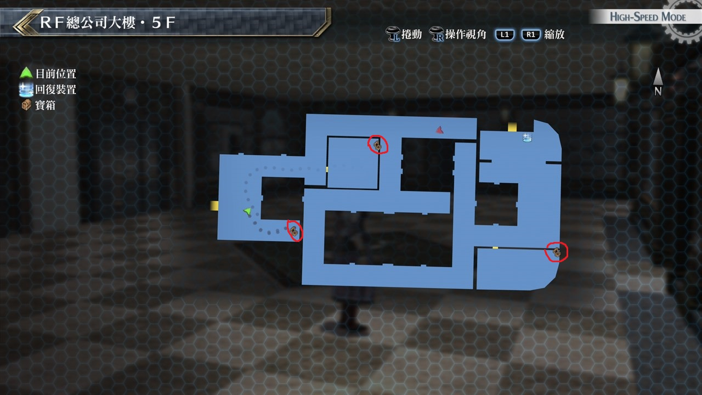
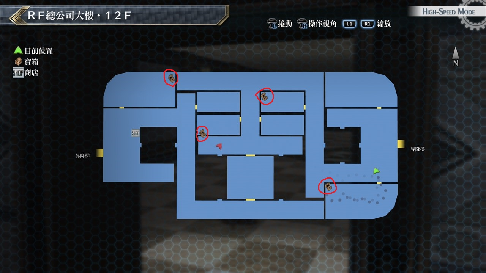
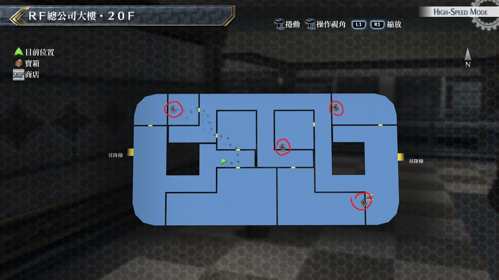

# RF总公司大楼

---

## RF总公司大楼‧5F

### 宝箱

- [ ]  圣灵药
- [ ]  耀晶石块×600
- [ ]  龙皮连身服

## RF总公司大楼‧12F

### 宝箱

- [ ]  秽翼魇蝶
- [ ]  EP填充剂III
- [ ]  痊愈之药
- [ ]  黑色坠饰

## RF总公司大楼‧20F

### 宝箱

- [ ]  七属性耀晶石×200
- [ ]  大回复药
- [ ]  黑言铃
- [ ]  [灵猫](/game/TheLegendOfHeroes/SenNoKiseki2/quartz/灵猫.md#灵猫)(需要开启机关)

## 考验宝箱

无

## 战斗笔记

- [ ] 哨兵XX
- [ ] 警示搜索者III
- [ ] 方阵兵J9
- [ ] 玉帘
- [ ] 时雨
- [ ] 莱杰尼克夫零式

## 钓鱼笔记

无

## Boss

*莱杰尼克夫零式*, *时雨*×4

装备防混乱饰品。先说时雨会使用范围攻击且带封魔

并且会使用支援功能，建议开场调查完就开一发增幅强化并搭配爆裂猛攻打倒所有时雨

而莱杰尼克夫零式搭载了八叶一刀流的招式，不过能力降低有效率是200

所以就针对这个弱点来攻击，另外零式延迟有效率有50，也可利用

*巨人*

弱点如下
- 一般状态：L手臂。
- 拳头张开的蓄力状态(霸王重压)：L手臂
- 机关炮瞄准的蓄力状态(无畏级破坏砲)：R手臂
- 拳头握拳的蓄力状态(毁灭烈焰)：身体