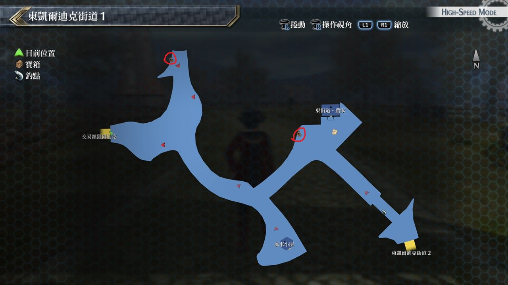
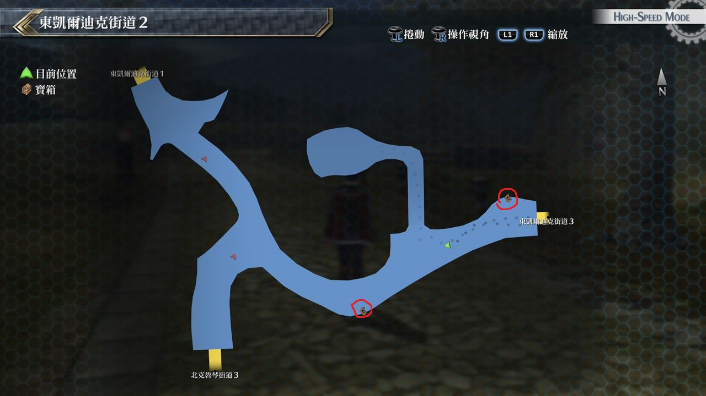

# 东凯尔迪克街道

---

## 东凯尔迪克街道1

### 宝箱

- [ ]  银耳环
- [ ]  中回复药

## 东凯尔迪克街道2

### 宝箱

- [ ]  U物质x3
- [ ]  封魔之刃

## 东凯尔迪克街道3

### 宝箱

- [ ]  耀晶石块×100
- [ ]  圣灵药
- [ ]  羽毛长靴
- [ ]  珊瑚戒指

## 考验宝箱

### 限定角色

- 马奇亚斯
- 艾略特

### 怪物

- *父熊兽*, *小熊兽x*

### 攻略

建议事前装备防昏厥的饰品, 有艾略特的共鸣节奏（3回合自动回复）无太大难度

## 战斗笔记

- [ ] 刃尾松鼠
- [ ] 大王蜻蜓
- [ ] 死亡蜗牛
- [ ] 巨喙乌鸦
- [ ] 田地破坏者
- [ ] 啃咬狼
- [ ] 苦西红柿人
- [ ] 幻灯虫
- [ ] 跳跳猫
- [ ] 独立斧鸟
- [ ] 人面鸟
- [ ] 小熊兽
- [ ] 大田地破坏者
- [ ] 恐怖蜥龙
- [ ] 黒猿羊
- [ ] 耶梦加得

## 钓鱼笔记

东凯尔迪克街道3有钓鱼点

- 鳌虾
- 花蟹

## Boss

*大田地破坏者*

建议一开始就先来一发S战技解决大部分的小兵, 接著再来个增幅强化, 应该会只剩下boss, 后续慢慢打就行了, 注意boss的气绝攻击, 