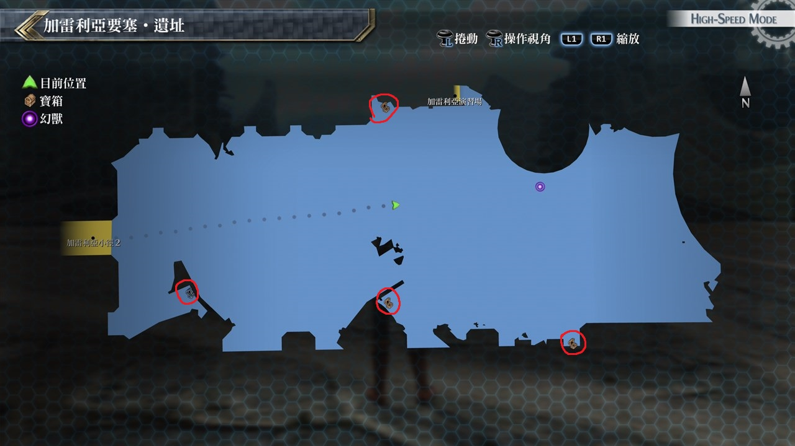

# 加雷利亚要塞‧遗址

---

## 宝箱

- [ ]  水流轰击
- [ ]  耀晶石块×400
- [ ]  坚韧守护

## 考验宝箱

### 限定角色

- 菲
- 莎拉

### 怪物

- 庞然巨鼠
- 肮脏老鼠 ×7

### 攻略

敌人很多, 而且会使用带延迟的攻击, 建议两人都装备防延迟饰品

## 战斗笔记

- [ ] 罪恶掷枪
- [ ] 龙人・刀
- [ ] 陷阱师杰诺
- [ ] 龙人・枪
- [ ] 破坏兽雷欧尼达斯
- [ ] 瓦尔古利夫

## 钓鱼笔记

无

## Boss

*瓦尔古利夫*

目前难度打有点困难, 此Boss多为魔法攻击, 就算目前最强大的装备也扛不了几下

所以艾玛和亚莉莎必上, 还要给她们带上斗魂装备, 条件允许的话再带一个艾略特回血

回完血马上换人, 亚莉莎主要堆CP, 艾玛放魔反, 考虑艾玛速度很慢, 可适当叠一下她的SPD