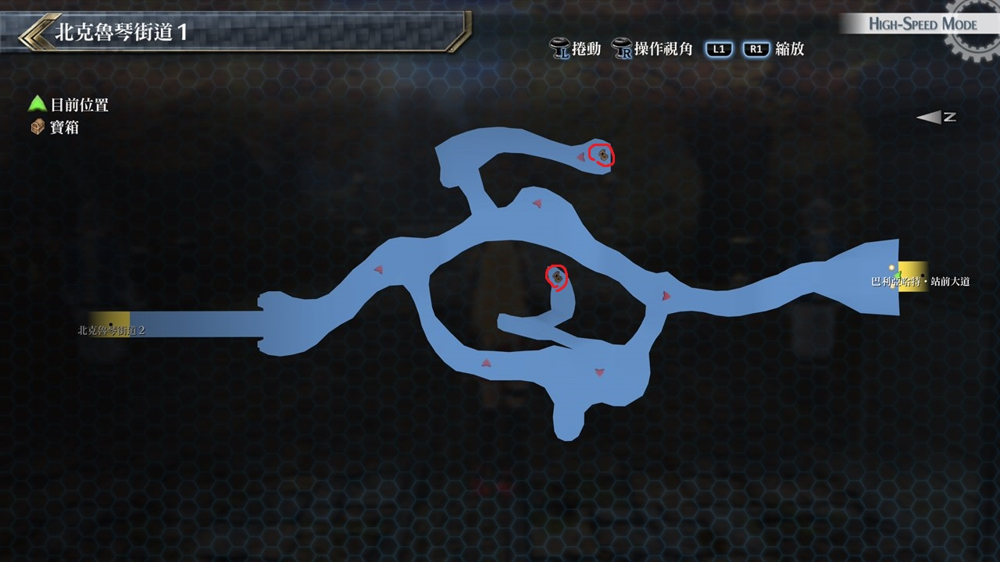

# 北克鲁琴街道

---

## 北克鲁琴街道1

### 宝箱

- [ ]  U物质x5
- [ ]  石化之刃

## 北克鲁琴街道2

### 宝箱

- [ ]  U物质×8 (12/27)
- [ ]  金言铃(12/27)
- [ ]  青龙刃(12/27)

## 北克鲁琴街道3

### 宝箱

- [ ]  EP填充剂III
- [ ]  裁决雷光

## 考验宝箱

### 限定角色

- 米莉亚姆
- 尤西斯

### 怪物

- 坚忍神猪
- 坚忍野猪×2

### 攻略

敌人攻击力不俗, 但能力低下有效率是100%

可以利用米莉亚姆镇暴光线来降低敌人的STR, 也建议我方两人都配出范围回复HP的魔法

---

### 限定角色

- 亚莉莎
- 艾略特
- 劳拉
- 尤西斯(12/27)

### 怪物

- 国王蛾兽×2
- 衣冠蛾兽×4

### 攻略

敌人的速度很快, 会优先于我们行动, 还好我方刚好都是有优秀战技的人员

一开始把队伍都排在最后两排增加一些缓和空间, 在上完各种BUFF后就可以展开攻势

建议以风属性魔法作为主要攻击手段

## 战斗笔记

- [ ] 颠茄兽
- [ ] 蛋蛇
- [ ] 三头颠茄兽
- [ ] 宝石老鼠
- [ ] 蜜桃波姆
- [ ] 白跳跳猫
- [ ] 坚忍野猪
- [ ] 贝亚顿
- [ ] 疯狂野草
- [ ] 猛蛇
- [ ] 衣冠蛾兽
- [ ] 瓦斯玫瑰

## 钓鱼笔记

北克鲁琴街道1尽头的桥边有钓鱼点(12/27)

- 巨鲶

北克鲁琴街道2拿U物质×8的宝箱附近河边有钓鱼点(12/27)

- 金鲑

## Boss

*贝亚顿*

难度不高, 主要是攻击有吸收CP的效果, 另外要注意带昏厥的范围攻击