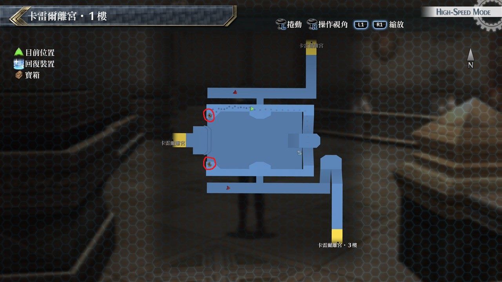
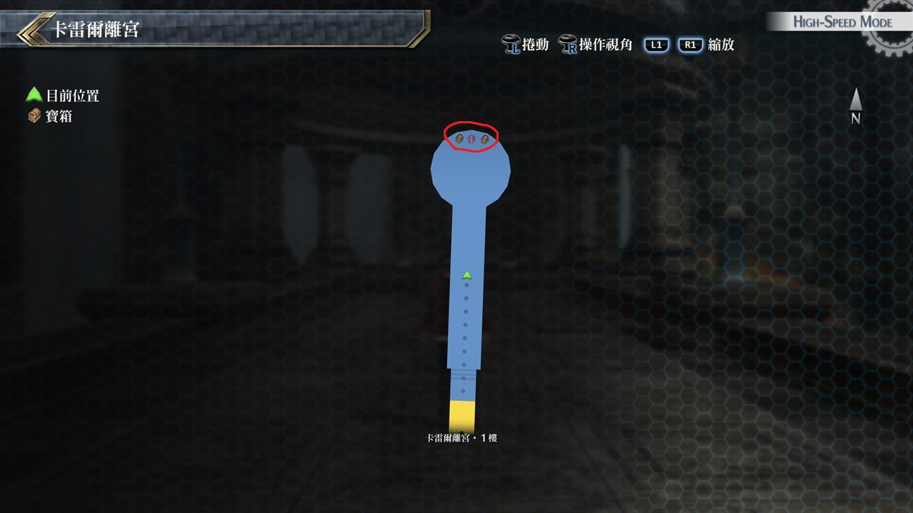

# 卡雷尔离宫

---

## 卡雷尔离宫·1F

### 宝箱

- [ ]  天使圣环
- [ ]  凝光幻剑

## 卡雷尔离宫·外侧凉亭

### 宝箱

- [ ]  U物质x10
- [ ]  全回复药
- [ ]  金耀石之钥(任务物品)

## 考验宝箱

无

## 战斗笔记

- [ ] 警备猎犬G
- [ ] 近卫兵
- [ ] 斯雷普尼尔
- [ ] 近卫兵军官
- [ ] G・玉帘
- [ ] 黒兎亚尔缇娜

## 钓鱼笔记

无

## Boss

*黑兔*, *G·玉帘*×2

G‧玉帘不强, 能力降低, 冻结, 混乱有效率都是100%, 建议针对这些弱点优先解决

而黑兔会使用物理反弹, 最好先用普通攻击破解, 受到的反弹伤害也比较少

基本上就是把我方STR, DEF, SPD都加+50%后再来集中攻击黑兔, 比较需要注意是黑兔会使用S战技

最好就是用坚韧守护来防御