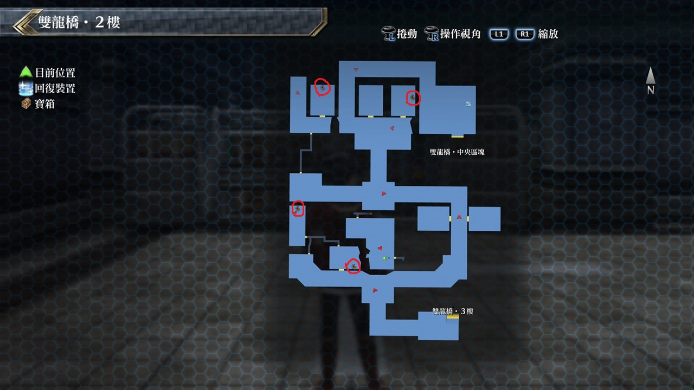

# 双龙桥

---

## 双龙桥·凯尔迪克端

### 宝箱

- [ ]  必胜扎头巾

## 双龙桥·2F

### 宝箱

- [ ]  EP填充剂III
- [ ]  泛滥
- [ ]  痊愈之药
- [ ]  象牙长靴

## 双龙桥·3F

### 宝箱

- [ ]  大回复药
- [ ]  世界之树
- [ ]  象牙背心

## 双龙桥·最上层

### 宝箱

- [ ]  七属性耀晶片×200

## 双龙桥·中央区块

### 宝箱

- [ ]  星燃爆裂(12/20)

## 双龙桥‧加雷利亚要塞端

### 宝箱

- [ ]  黄色坠饰(12/20)
- [ ]  耀晶石块×500(12/20)

## 考验宝箱

TODO (12/20)

### 限定角色

- 劳拉
- 马奇亚斯
- 盖乌斯
- 莎拉

### 怪物

- 巨马粪波姆×2
- 马粪波姆×6

### 攻略

敌人攻击有吸收CP的效果, 推荐一开场就用S战技来清除小怪

不然CP也是被吸光, 而巨马粪波姆HP并不算高, S战技放完应该差不多了, 再补上几刀就OK啦

## 战斗笔记

- [ ] 龙人・槌
- [ ] 勇士
- [ ] 明镜・长枪
- [ ] 领邦军兵士
- [ ] 帝王猎犬
- [ ] 哨兵XX
- [ ] 警示搜索者III
- [ ] 领邦军军官
- [ ] 皇帝猎犬R
- [ ] 皇帝猎犬B
- [ ] 明镜・剑

## 钓鱼笔记

双龙桥·凯尔迪克端桥上有钓鱼点

- 虹鳟鱼(12/20)

双龙桥·加雷利亚端靠近中央区块入口的桥上有钓鱼点

- 金龙鱼(12/20)

## Boss

*皇帝猎犬B*, *皇帝猎犬R*

BOSS能力低下的有效率有50%, 莎拉的鸣神‧改(LV78鸣神升级)带有SPD-50%可以多加利用

另外要注意BOSS会一次招换3隻小兵, 在攻击时耀一併用范围战技清掉

有两次增幅强化跟黎恩的BUG技神气合一, 整体来说并不难打