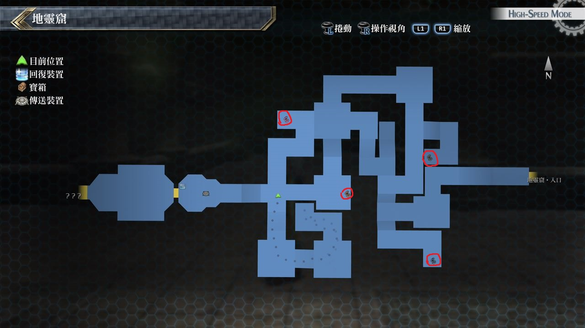
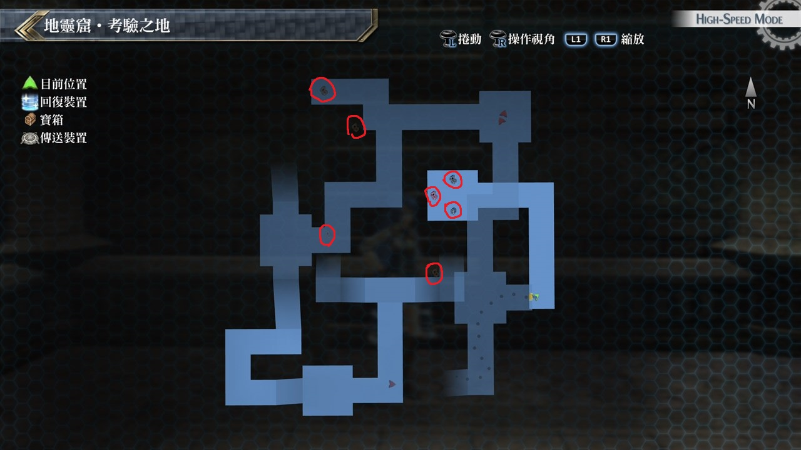

# 地灵窟

---

## 地灵窟

### 宝箱

- [ ]  封技之刃
- [ ]  大回复药
- [ ]  耀脉

## 地灵窟·考验之地

### 宝箱

- [ ]  地之耀晶片×1000
- [ ]  远古石碑
- [ ]  全回复药
- [ ]  地言铃
- [ ]  玄武刃

## 考验宝箱

### 限定角色

- 马奇亚斯
- 菲

### 怪物

- 巨型软黏兽
- 卑劣软黏兽 

### 攻略

这次没有艾略特, 可以让马奇亚斯装备法则充当回复角色, 可以使用菲的即死攻击, 或火属性魔法

---

### 限定角色

- 亚莉莎
- 菲

### 怪物

- 米诺斯之王
- 米诺斯恶魔×2

### 攻略

此战以菲站前线, 亚莉莎当后卫, 菲装备以回避为主, 上了天堂赠礼后基本上敌人摸不到, 亚莉莎没事时就使用空属性魔法攻击

---

### 限定角色

- 马奇亚斯
- 米莉亚姆

### 怪物

- 动力海蛞蝓
- 溶解海蛞蝓×5

### 攻略

建议一开始就用大范围战技清掉小兵, 剩下大只的蛞蝓后, 用水属性魔法当主攻

马奇亚斯HP较高可以站前线吸引火力, 基本上敌人没什麽特别的攻击招式

## 战斗笔记

- [ ] 硬币甲壳虫
- [ ] 街灯多足兽
- [ ] 卑劣软黏兽
- [ ] 金块甲壳虫
- [ ] 天界判官・地母
- [ ] 狂怒方尖碑
- [ ] 溶解海蛞蝓
- [ ] 黑暗魅蝶
- [ ] 米诺斯恶魔
- [ ] 天界判官・地母

## 钓鱼笔记

无 

## Boss

*天界判官・地母*×3

BOSS会使用全体攻击虚假言灵, 会有中毒的异常状态

攻击力普通不过三只连著放伤害也挺高的, 另外会施放真实言灵来回复我方HP与异常状态

但HP回复幅度很小, 战略以艾略特专心回复, 托瓦尔主以魔法为攻击手段(空、时、幻皆很有效)

黎恩与菲为攻击手