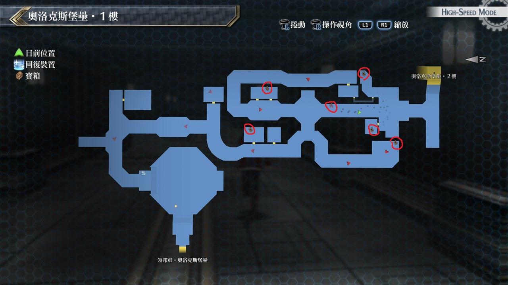
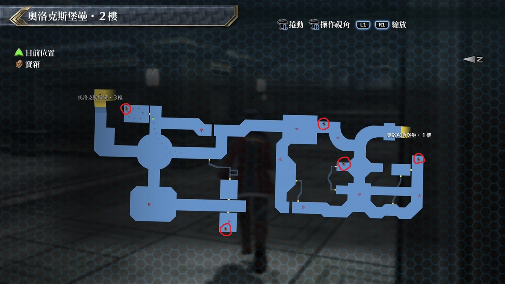

# 奥洛克斯堡垒

---

## 奥洛克斯堡垒·1楼

### 宝箱

- [ ]  痊愈之药
- [ ]  驱动2
- [ ]  圣灵药·改
- [ ]  全回复药
- [ ]  七属性耀晶片×200
- [ ]  业火

## 奥洛克斯堡垒·2楼

### 宝箱

- [ ]  时间爆发
- [ ]  大回复术
- [ ]  HP2
- [ ]  EP填充剂IV
- [ ]  U物质×8

## 考验宝箱

### 限定角色

无

## 战斗笔记

- [ ] 利刃狮犬
- [ ] 警示搜索者III
- [ ] 哨兵XX
- [ ] 北方猎兵・机枪
- [ ] 北方猎兵・大剑
- [ ] 领邦军兵士
- [ ] 方阵兵J9
- [ ] 鹰隼
- [ ] 警备猎犬G
- [ ] 斯雷普尼尔
- [ ] 领邦军士官
- [ ] B・玉帘
- [ ] 神速杜芭莉

## 钓鱼笔记

无

## Boss

*北方猎兵・机枪*×3, *北方猎兵・大剑*×2, *利刃狮犬*×3

莎拉教官的个人战, 莎拉雷神功常驻状态

并学习到S战技北之极致, 如果有好好提升回避率的话

敌人几乎摸不到莎拉, 但是敌人攻击力都满高的, 战斗后莎拉教官暂离开队伍

获得莎拉教官人物情报: *「北方猎兵」*

*神速杜芭莉*, *斯雷普尼尔*×2

一开始的攻击目标以两台斯雷普尼尔为优先, 建议在开场没多久时

我方全体都有完全物理防御的状态下, 黎恩先开神气合一+增幅强化先至少打掉一个小怪

而要有完全物理防御是因为神速在一个小怪爆掉时, 有非常高机率使用S战技虹彩剑

接著就尽快解决另一只小怪, 专心对付神速杜巴莉