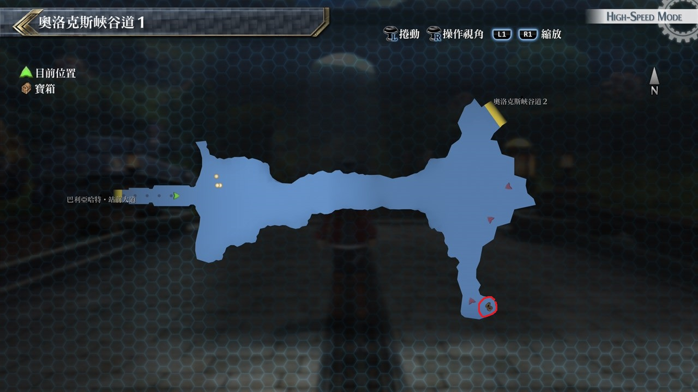
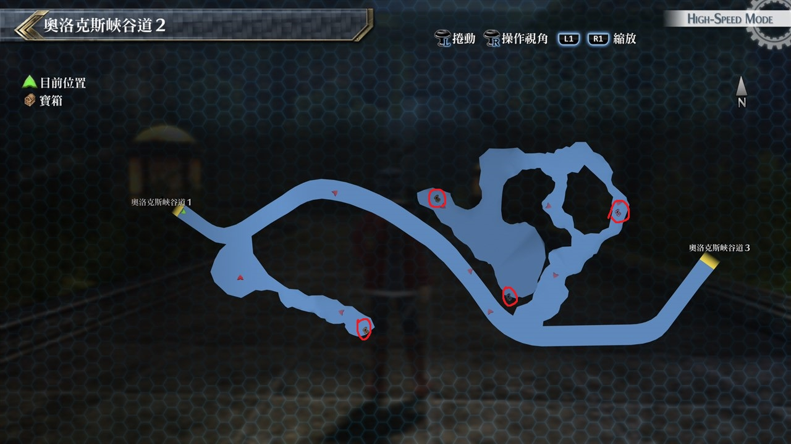
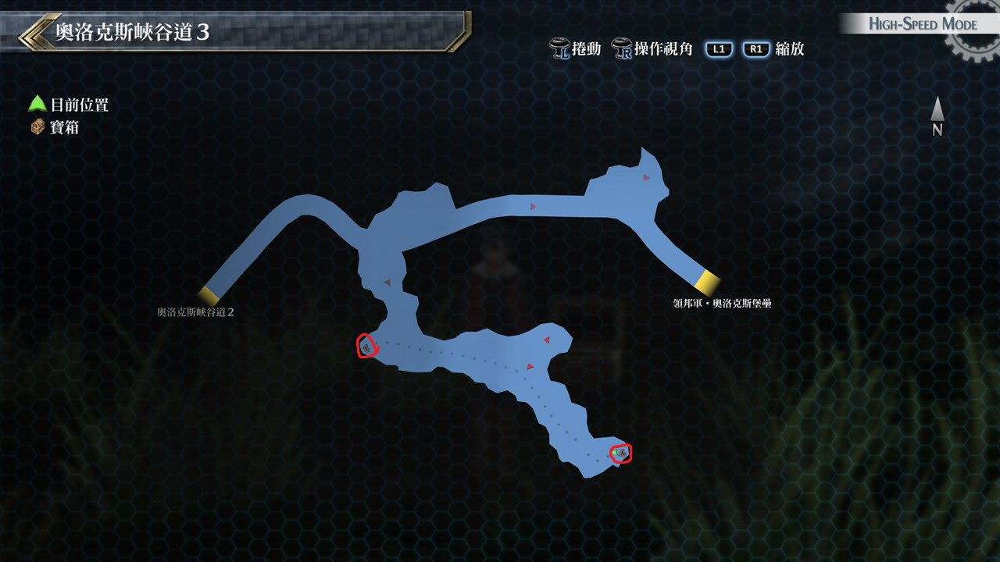

# 奥洛克斯峡谷道

---

## 奥洛克斯峡谷道1

### 宝箱

- [ ]  七属性耀晶片×200

## 奥洛克斯峡谷道2

### 宝箱

- [ ]  圣灵药·改
- [ ]  麒麟牙
- [ ]  妨害2

## 奥洛克斯峡谷道3

### 宝箱

- [ ]  耀晶石块×700
- [ ]  暗影裁决

## 考验宝箱

### 限定角色

- 马奇亚斯
- 尤西斯

### 怪物

- 老者螳螂
- 巨大螳螂×4

### 攻略

事前需装备防即死的饰品，由马奇亚斯担任前卫作为肉盾

尤西斯担任后卫，以尤西斯魔法为主攻，魔法银夜之棘带有混乱对敌人非常有效

注意一下我方HP量即可

## 战斗笔记

- [ ] 尤西斯
- [ ] 勇士
- [ ] 装甲车NP-II
- [ ] 神速杜芭莉
- [ ] 劫炎马克邦
- [ ] 小恶龟
- [ ] 巨大螳螂
- [ ] 幼生双角兽
- [ ] 攻击野犬
- [ ] 电熊
- [ ] 双角兽
- [ ] 人面鸟
- [ ] 赤硬化巨龟

## 钓鱼笔记

奥洛克斯峡谷道出门有钓鱼点

- 大山椒鱼

## Boss