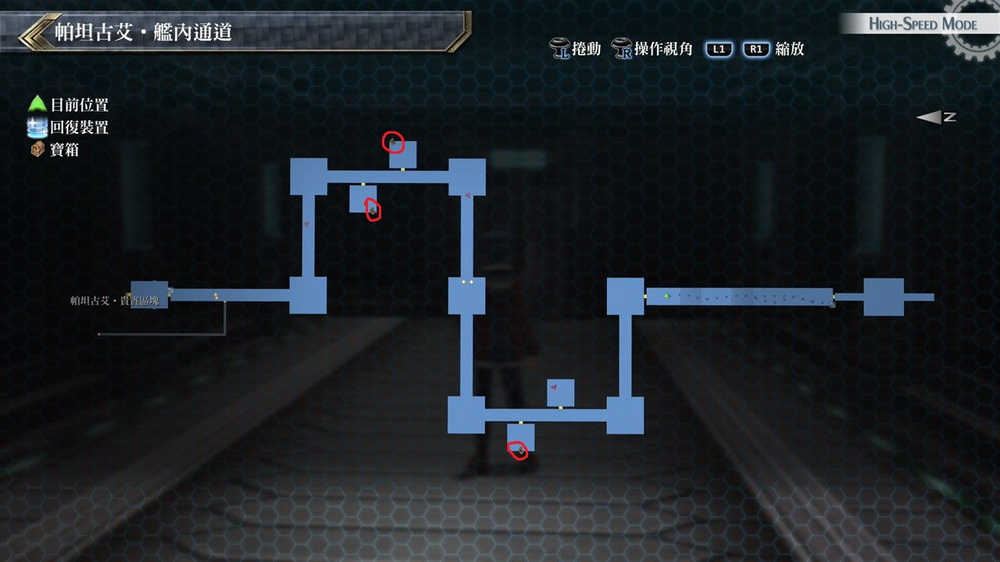

# 帕坦古艾‧舰内通道

---

## 宝箱

- [ ]  圣灵药
- [ ]  橘色斗篷
- [ ]  大回复药

## 考验宝箱

无

## 战斗笔记

- [ ] 三位一体攻击者HG
- [ ] 三位一体攻击者R2
- [ ] 帝王猎犬
- [ ] 领邦军士兵
- [ ] 方阵兵J9
- [ ] 怪盗布卢布兰
- [ ] 神速杜芭莉
- [ ] 克洛

## 钓鱼笔记

无

## Boss

*神速杜芭莉*, *怪盗布卢布兰*

一开始黎恩就是使用神气合一，STR、DEF、SPD提升50%且为「觉醒」状态(异常全免疫)

此时战技会全部改变，伤害也都提高许多，尤其是里疾风与灭‧业炎击都有上万的伤害

而艾尔芬皇女会退出战斗，虽然黎恩是在神气合一的状态，但并非无敌

最好还是装备中回复术之类可以回复HP的迴路，但大致上应该没什麽问题

把BOSS的HP削减一定程度后自动结束战斗

*克洛*

黎恩仍然保持神气合一状态，可以免疫所有异常。直接放技能，怕CP不足的可以放个振奋之激