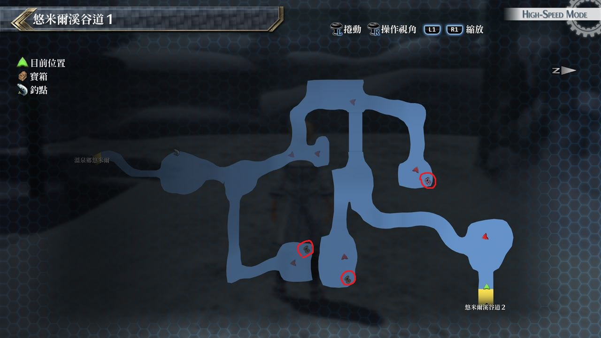
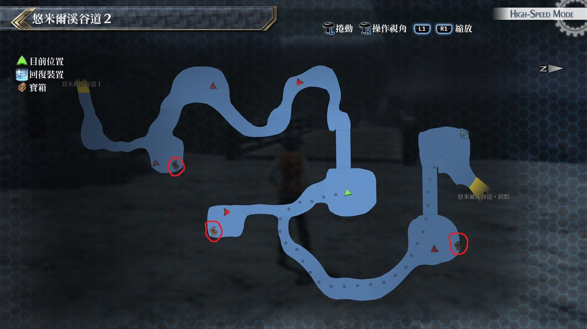

# 悠米尔渓谷道

---

## 悠米尔渓谷道1

### 宝箱

- [ ]  打火机
- [ ]  还魂粉
- [ ]  U物质x3

## 悠米尔渓谷道2

### 宝箱

- [ ]  大回复药
- [ ]  毒之刃
- [ ]  七属性耀晶石×50

## 考验宝箱

无

## 战斗笔记

- [ ] 小雪精
- [ ] 冰冻菌
- [ ] 雪跳跳猫
- [ ] 冰柱裸海蝶
- [ ] 魔煌兵原乡种
- [ ] 魔煌兵原乡种
- [ ] 欺瞒冰霜兽
- [ ] 蕨类可爱猿
- [ ] 白雪拟鼠者
- [ ] 冰柱企鹅
- [ ] 雪裂蛙
- [ ] 大脚野人

## 钓鱼笔记

无

## Boss

*魔煌兵原乡种*

由于现在有三个人, 难度降低, 托瓦尔的战技「加速打击」有三回合失衡增加的效果
几乎能够让我方攻击每一击都造成失衡但战斗后期魔煌兵不时会回复HP,增加STR
此時头目的伤害几乎为原来两倍, 所以CP满了就S技轰下去吧, 
胜利后开启骑神战, 弱点如下: 
- 站立时: 头部
- 蓄力时: 手臂