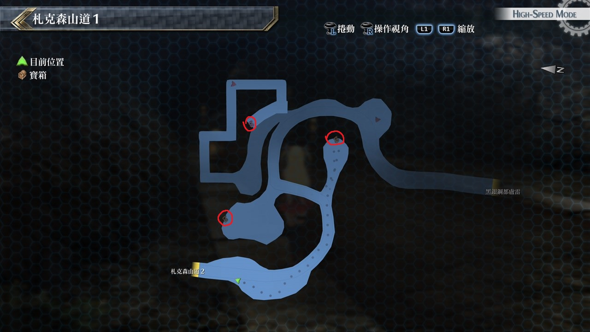
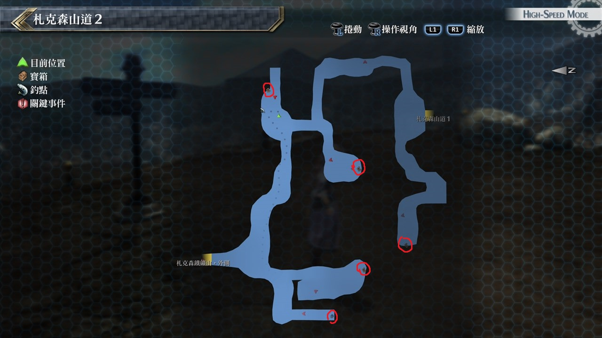

# 札克森山道

---

## 札克森山道1

### 宝箱

- [ ]  朱雀刃
- [ ]  圣灵药
- [ ]  红色坠饰

## 札克森山道2

### 宝箱

- [ ]  龙皮之靴
- [ ]  破邪之印
- [ ]  大回复药
- [ ]  U物质x7

## 考验宝箱

(暂无法开启)

### 限定角色

- 艾略特
- 盖乌斯

### 怪物

- 大师裸海蝶
- 幼小裸海蝶×7

### 攻略

敌人都是物防很高的魔兽，而且会使用高阶水属性魔法

由于我们只有盖乌斯一人有解除驱动的战技，这场要速战速决

一开场就先用盖乌斯S战技，这时敌人应只剩巨大裸海蝶，接著则以火属性魔法来攻击

## 战斗笔记

- [ ] 幼小裸海蝶
- [ ] 炸弹蜘蛛
- [ ] 死亡镰刀手
- [ ] 跳舞猫头鹰
- [ ] 大鹏鸟
- [ ] 型态兵器

## 钓鱼笔记

札克森山道2瀑布处有钓鱼点

- 鳗鱼

## Boss