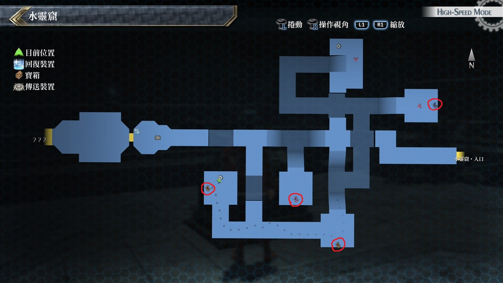
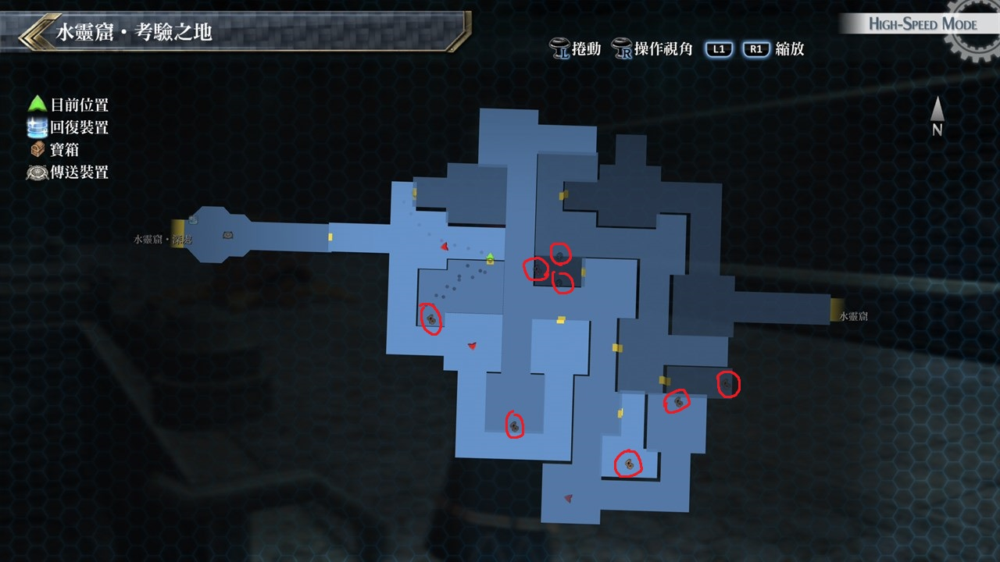

# 水灵窟

---

## 水灵窟

### 宝箱

- [ ]  苍麟之靴
- [ ]  EP填充剂II
- [ ]  美臭

## 水灵窟·考验之地

### 宝箱

- [ ]  涡旋激流
- [ ]  EP填充剂Ⅳ
- [ ]  夜叉
- [ ]  痊愈之药
- [ ]  水言铃
- [ ]  水之耀晶片×1000

## 考验宝箱

### 限定角色

- 艾玛
- 劳拉

### 怪物

- 国王结晶兽
- 结晶兽×4

### 攻略

敌人攻击会施放水属性魔法，范围技也是属于魔法攻击

事前装备魔防1, 魔防2会比较好打(魔防现在有提供魔法回避率)

而刚好劳拉71级会学到炽洸剑，封魔机率90%，可先施放先将小兵封魔

推荐再用艾玛的苍紫之焰机率性让小兵混乱，好让劳拉深入敌营

要注意国王结晶兽水属性魔法攻击力约有5000，使用新月护罩能增加DEF+50%与魔法反弹

亦可使用虚界之剑降低敌人的ATS，不过还是要注意我方HP，等差不多时就S战技连放

---

### 限定角色

- 劳拉
- 米莉亚姆

### 怪物

- 巨大食尸鬼团
- 风暴食尸鬼团×4

### 攻略

开始应该两三下范围技就能把小兵打完，巨大食尸鬼团也没什麽强大的招式

但会使用SPD降低的攻击而且会使用超回复，不宜持久战，在敌人HP约2万时就要用S战技打倒

---

### 限定角色

- 亚莉莎
- 马奇亚斯

### 怪物

- 巨鳄头鱼

### 攻略

敌人只有一只，亚莉莎与马奇亚斯都装备防昏厥饰品

亚莉莎用完天堂赠礼后就用水属性魔法攻击，而马奇亚斯则是当前锋

并可以狂用战技破甲射击来降低敌人DEF，基本上亚莉莎与马奇亚斯都有补血战技

也不用担心HP问题

## 战斗笔记

- [ ] 冰晶软件兽
- [ ] 结晶兽
- [ ] 极寒神威
- [ ] 长印鳄
- [ ] 天界判官・冰河
- [ ] 风暴食尸鬼团
- [ ] 硬化巨龟
- [ ] 古尔冈斯
- [ ] 鳄头鱼王
- [ ] 天界判官・冰河

## 钓鱼笔记

无

## Boss

*天界判官・冰河*x3

魔法攻击有冻结的效果，攻略法一样