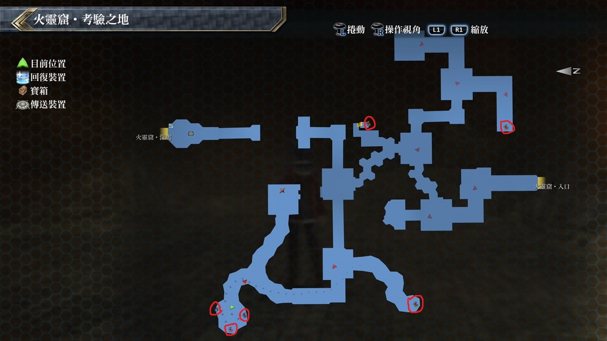

# 火灵窟

---

## 宝箱

- [ ]  火之耀晶片×1000
- [ ]  千阳新星
- [ ]  火言铃
- [ ]  修罗

## 考验宝箱

### 限定角色

- 马奇亚斯
- 艾玛

### 怪物

- 巨型骚魂
- 幽灵骚魂×4

### 攻略

敌人会使用高级魔法伤害很高，且普攻攻击带有恶梦跟混乱

建议装备绿色坠饰(或更高级的绿色徽记)，艾玛行动时先使用新月护罩

马奇亚斯行动则是先用S战技打掉大部份敌人，如敌人用魔法一定要解除驱动

艾玛则主使用水属性魔法攻击，危急时就再开艾玛S战技清除敌人

---

### 限定角色

- 亚莉莎
- 莎拉

### 怪物

- 烈焰之尊
- 火焰之尊×2

### 攻略

敌人一样会使用高级魔法且伤害很高，在莎拉使用雷神功之后马上用S战技打掉小怪

而烈焰之尊应该剩1/3的HP，亚莉莎则配出新月之镜以免在无法解除敌人驱动的情况下

来防范魔法伤害，而攻击还是以水属性魔法攻击为主，一样留亚莉莎S战技来当结束战斗的保险

## 战斗笔记

- [ ] 火焰之尊
- [ ] 幽灵骚魂
- [ ] 岩浆软件兽
- [ ] 史尔特尔
- [ ] 天界判官・火炎

## 钓鱼笔记

无

## Boss