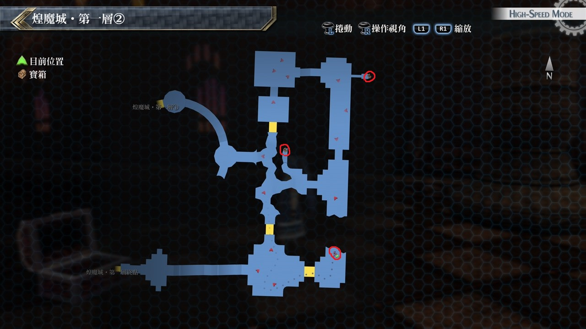

# 煌魔城·第一层

---

## 煌魔城·第一层1

- [ ]  全回复药
- [ ]  神靴处女座

## 煌魔城·第一层2

- [ ]  七属性耀晶片×500
- [ ]  天铠阿尔福利德
- [ ]  天帝珠

## 考验宝箱

无

## 战斗笔记

- [ ] 黑檀木士兵像
- [ ] 血腥魔剑
- [ ] 迪萨德审判
- [ ] 天界判官
- [ ] 涅比利姆
- [ ] 炽天使之门
- [ ] 无头守卫
- [ ] 均衡之冠
- [ ] 魔煌兵初生种
- [ ] 怪盗布卢布兰
- [ ] 神速杜芭莉

## 钓鱼笔记

无

## Boss

*神速杜芭莉*, *怪盗布卢布兰*, *均衡之冠*×2

第一目标是HP较少的神速杜巴莉, 建议一开始就集中火力

在攻击时可以顺便打到均衡之冠更好, 说到均衡之冠没什麽杀伤力, 但会帮敌人补HP

剩下怪盗布卢布兰后就没什麽大问题, 这时就可以比较轻松去调配人员

看是否要把物理攻击型角色调上来与黎恩连结, 而均衡之冠基本上不用特地去打

因为就算打倒了以后怪盗也会再召唤出来, 怪盗的S战技虽然完全无法防御

但为单体而且只会让HP剩1, 不过如果放完行动序是敌人优先就很危险要注意一下