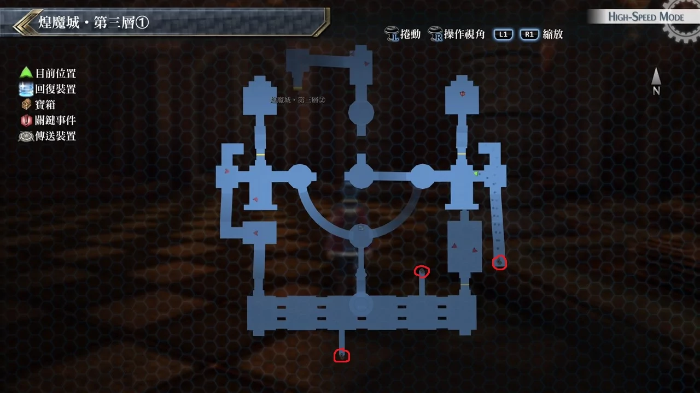
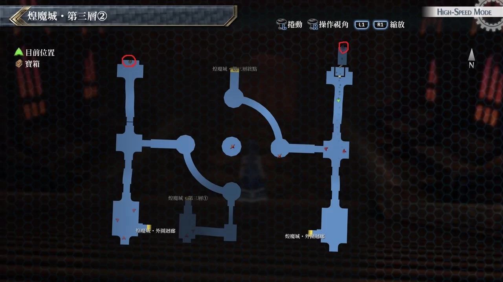
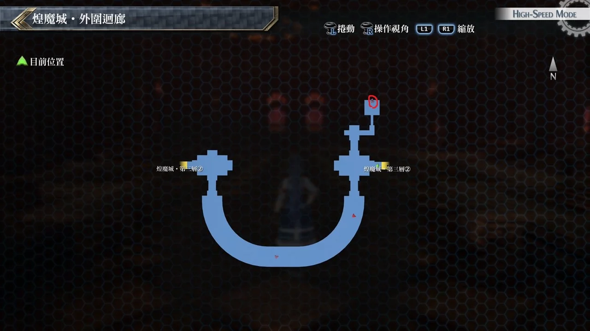

# 煌魔城·第三层

---

## 煌魔城·第三层1

- [ ]  EP填充剂IV
- [ ]  U物质x15
- [ ]  神铠瑟雷斯蒂亚

## 煌魔城·第三层2

- [ ]  魔王珠
- [ ]  影靴罗亚

## 煌魔城·外围回廊

- [ ]  武神珠

## 考验宝箱

无

## 战斗笔记

- [ ] 恶魔骑士
- [ ] 恶魔幻镜
- [ ] 黑色烂泥
- [ ] 深渊恶魔
- [ ] 亚德弗瑟
- [ ] 艾尔维利亚R
- [ ] 造物者恶魔
- [ ] 诺斯菲尔杜
- [ ] 劫炎马克邦

## 钓鱼笔记

无

## Boss

*劫炎马克邦*, *艾尔维利亚R*×2

开战前增幅强化与勇气点数都要满的

建议队伍: 黎恩, 亚莉莎, 尤西斯, 剩一人可选艾玛或艾略特

先打败小怪, 劫炎驱动魔法时一定要解除或反弹

最必须注意的是劫炎马克邦的S战技是完全无法防御(物理防御, 魔法反弹都无效)

而且会抵销我方所有BUFF, 另一个需要注意劫炎马克邦的战技有带特殊的炎伤状态

行动后受到伤害非常高, 有艾略特也能马上帮大家回复, 不过吃料理也是个很好的选择