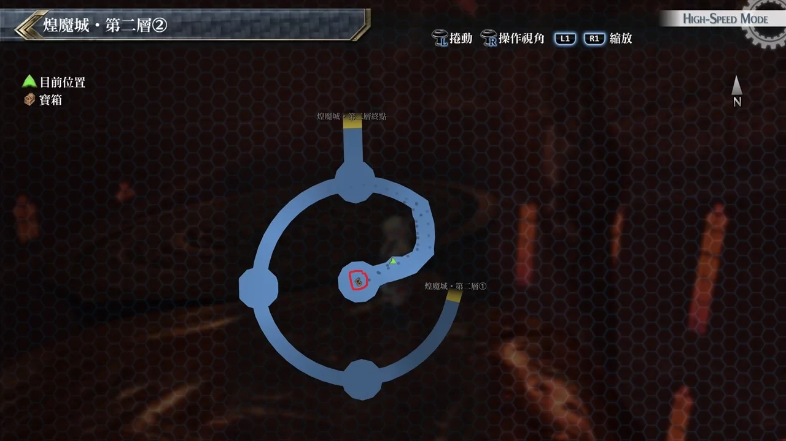

# 煌魔城·第二层

---

## 煌魔城·第二层1

- [ ]  天靴天狼星
- [ ]  耀晶石块×1000
- [ ]  圣灵药·改
- [ ]  梵天珠

## 煌魔城·第二层2

- [ ]  还魂粉

## 考验宝箱

无

## 战斗笔记

- [ ] 黑寡妇
- [ ] 熔岩蛇
- [ ] 暴君
- [ ] 炼狱兔
- [ ] 绯红・赛纳克
- [ ] 绯红鳄蜥
- [ ] 熔岩门犬
- [ ] 罪恶掷枪
- [ ] 破坏兽雷欧尼达斯
- [ ] 陷阱师杰诺
- [ ] 亚巴顿

## 钓鱼笔记

无

## Boss

*陷阱师杰诺*, *破坏兽雷欧尼达斯*

两人攻击模式没变，杰诺会丢三根罪恶掷枪(记得调查)，爆炸带有随机异常效果

中石化或混乱就惨了，要记得打掉，雷欧尼达斯则是攻击力高，且带有昏厥

而且两人受到一定伤害就很容易施放S战技，如果两人连放白金之盾无法挡住就很危险

所以攻击时尽量只打其中一人，而有SPD+50%的状态下，我方行动序还算满高的

其实连放机率不高, 解决其中一人之后就好打很多