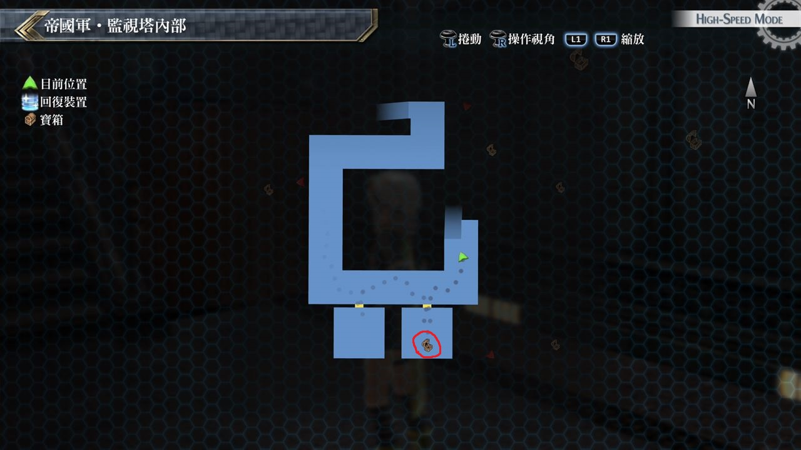

# 监视塔

---

## 监视塔·1F

### 宝箱

- [ ]  绿风之靴
- [ ]  强音之力·复

## 监视塔·2F

### 宝箱

- [ ] 七属性耀晶片×100

## 监视塔·3F

### 宝箱

- [ ]  攻击2(通风管道)

## 监视塔·4F

### 宝箱

- [ ]  EP填充剂II

## 考验宝箱

无

## 战斗笔记

- [ ] 三位一体攻击者R2
- [ ] 三位一体攻击者HG
- [ ] 贵族联盟士兵
- [ ] 盖伦狮犬
- [ ] 猎兵・大剑
- [ ] 猎兵・机枪
- [ ] 黒兔亚尔缇娜
- [ ] 怪盗布卢布兰
- [ ] 龙人・刀
- [ ] 龙人・枪
- [ ] 军用艇RF30
- [ ] 明镜・刀

## 钓鱼笔记

无

## Boss

*黒兔亚尔缇娜*, *怪盗布卢布兰*

!> 40回合内将两人打倒*AP+3*

两人的攻击力也算普通, 但怪盗·布卢布兰会使用全体的随机异常状态攻击

还会召唤杂兵出来, 因黑兔防御较低, 视为优先解决的对象, 

*明镜・刀*, *龙人・刀*, *龙人・枪*

集满五点勇气点数可以用协力必杀技, 每个人的协力技都不同

一开始会对付龙人‧枪与龙人‧剑, 打倒其中一台后

队长机明镜·剑会补上, 而上空还有飞行艇会攻击我们(飞行艇是无法攻击的)

三台机甲兵弱点如下
- 龙人‧剑
    - 一般状态: 身体
    - 蓄力状态: 头部

- 龙人‧枪
    - 一般状态: 头部
    - 蓄力状态: 身体

- 明镜‧剑
    - 一般状态: 身体
    - 蓄力状态: 身体