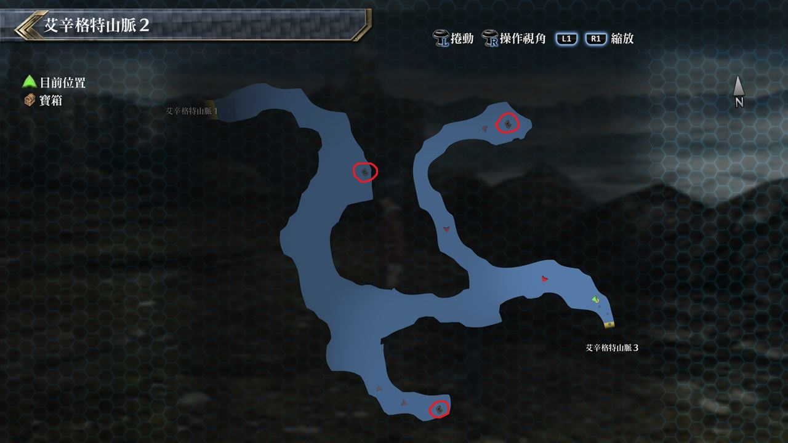
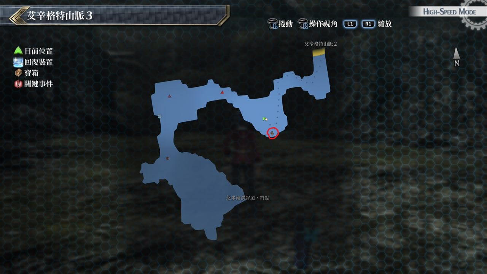

# 艾辛格特山脉

---

## 艾辛格特山脉2

### 宝箱

- [ ]  回复术
- [ ]  中回复药
- [ ]  替身傀儡

## 艾辛格特山脉3

### 宝箱

- [ ]  圣灵药

## 考验宝箱

### 限定角色

- 劳拉
- 菲

### 怪物

滚动巨石

### 攻略

敌人只有一个, 但对物理攻击抗性很高

建议劳拉用洸翼阵来增强STR并以劳拉为主攻, 菲则担任回复角色

如果可以配出魔法强音之力, 在提升自身STR后也可加入战局

## 战斗笔记

- [ ] 盔壳蝎
- [ ] 滚动石球
- [ ] 潜行蛙
- [ ] 魔煌兵原乡种
- [ ] 天空独目鸟
- [ ] 落魄猟兵
- [ ] 暗影舞者
- [ ] 剧毒恶魔
- [ ] 钢铁魔像
- [ ] 林顿邦姆

## 钓鱼笔记

无

## Boss

*魔煌兵原乡种*

第一次遇到的魔煌兵, 攻击到一定HP以下就会结束战斗, 但是在此之前要先存活下来
因为一周目开始时装备不强, 之前拿到的回路*回复术* 一定要装备, 作为回复HP的手段
魔煌兵原乡种几乎免疫所有异常状态, 可以使用战技「激励」增加自己攻击

*林顿邦姆* (幻兽, 12/23) 

基本上幻兽打法与人员配置也差不多定型了, 林顿邦姆较常用大范围物理性攻击
如一般攻击, 深渊波与跺脚, 伤害都满高的, 其中特别注意跺脚带延迟效果
中招将带给我方很大的伤害, 队伍推荐为黎恩, 亚莉莎, 艾玛, 尤西斯
因一开始通常都是敌人优先行动, 会先吃下一招伤害, 队伍要有即时提供回复的角色
艾玛要经常使用新月之镜, 防止魔法秒杀
掉落: *吼龙珠*