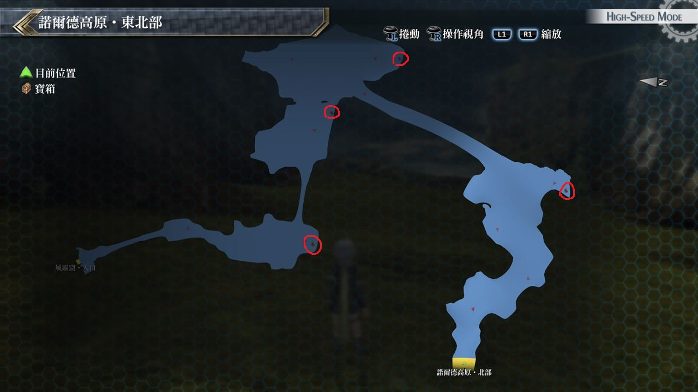

# 诺尔德高原・东北部

---

## 宝箱

- [ ]  花之瓶
- [ ]  丰饶(12/5初次到达时无法获取)
- [ ]  大回复药(12/5初次到达时无法获取)
- [ ]  U物质x4(12/5初次到达时无法获取)

## 考验宝箱

无

## 战斗笔记

- [ ] 黄金猫头鹰
- [ ] 无限深渊蛇
- [ ] 青草鼹鼠
- [ ] 石蛙
- [ ] 安斯尔特
- [ ] 岩石魔像
- [ ] 闪电震波鱼

## 钓鱼笔记

靠近风灵窟外地图有钓鱼点

- 鲤鱼

## Boss

*安斯尔特*

一开始亚莉莎与米莉亚姆会直接参战, 米莉亚姆和克蕾雅无需限制可以发动增幅强化

可以视情况换成原本队友, BOSS攻击带有冻结效果, 如果可以就装备防冻结饰品

不过因为BOSS的伤害跟行动力较低, 只要注意一下我方HP应该不成问题