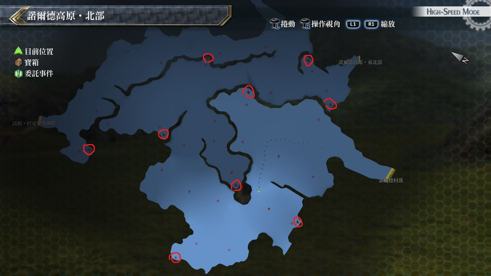

# 诺尔德高原・北部

---

## 宝箱

- [ ]  黑色手镯
- [ ]  七属性耀晶片×100
- [ ]  凉爽项链
- [ ]  痊愈之药
- [ ]  移动2
- [ ]  圣灵药(12/5初次到达时无法获取)
- [ ]  紫云羽衣(12/5初次到达时无法获取)
- [ ]  斗魂腰带(12/5初次到达时无法获取)

## 考验宝箱

(12/5初次到达时无法获取)

### 限定角色

- 亚莉莎
- 米利亚姆

### 怪物

- 暴王龙
- 幼拟龙×7

### 攻略

敌人很多而且要注意攻击都是远距离的, 会带有炎伤的效果

使用米利亚姆S技清场, 后用水属性魔法打Boss

## 战斗笔记

- [ ] 幼拟龙
- [ ] 猿羊
- [ ] 雪白獠牙
- [ ] 高原恶龟
- [ ] 盖伦狮犬
- [ ] 硬壳犀兽
- [ ] 骏鹰
- [ ] 魔煌兵原乡种

## 钓鱼笔记

石像处有钓鱼点

- 岩穴鱼

## Boss