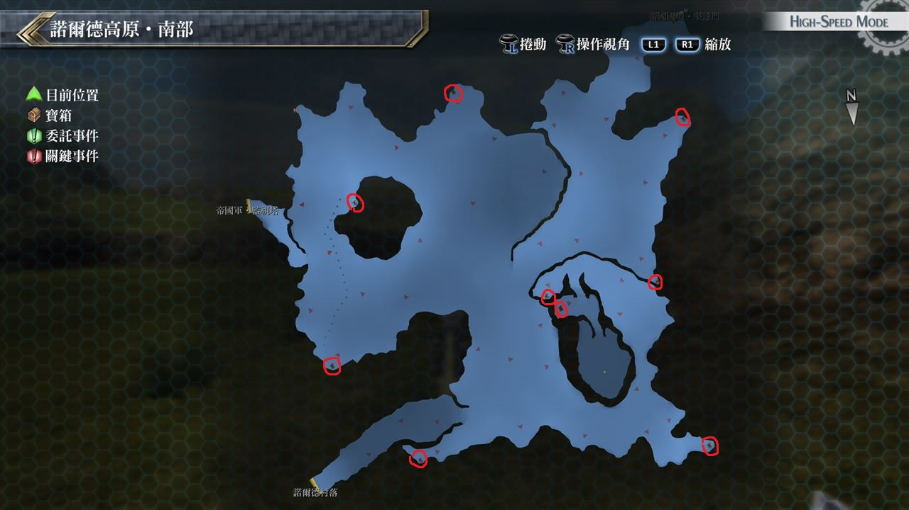

# 诺尔德高原・南部

---

## 宝箱

- [ ]  痊愈之药
- [ ]  大理石戒指
- [ ]  EP填充剂II
- [ ]  机功
- [ ]  中回复术
- [ ]  紫云之靴
- [ ]  绿风胴衣(12/5初次到达时无法获取)
- [ ]  耀晶石块×200(12/5初次到达时无法获取)

## 考验宝箱

(12/5初次到达时无法获取)

### 限定角色

- 盖乌斯
- 米利亚姆 

### 怪物

- 巨牛兽
- 蛮牛兽×2

### 攻略

我方没有回复者, 建议使用HP1等回路提高生命上限

开场我方行动完后, 盖乌斯就发动S技, 在盖乌斯心眼效果消失后

要自行施放闪耀天启来取回心眼, 米莉亚姆要专心回复盖乌斯的HP, 如有余力再加入攻击行列

## 战斗笔记

- [ ] 草地跳跃者
- [ ] 翼蛇
- [ ] 小牛兽
- [ ] 闪电鳅
- [ ] 花冠鸟
- [ ] 蛮牛兽
- [ ] 雷电震波鱼
- [ ] 涅瑞盖德

## 钓鱼笔记

无

## Boss

*涅瑞盖德*

涅瑞盖德会使用无情猛袭带石化效果, 事前装备防石化饰品就OK了

另外要注意经常使用无驱动时属性魔法暗影裁决, 对我方而言只挨得了一击

这时候艾玛的新月护罩又派上用场了, 如果受到攻击马上要回复HP, 所以能回复HP的角色以两名为佳

BOSS的空属性魔法有效率为150, 攻击时派两名以空魔法为主(艾玛和亚莉莎)

剩下两名则用延迟攻击, 如果已打倒「瓦尔古利夫」

那就用失落魔法月神之泪增加我方HP上限会安全许多, 但还是别忘记新月护罩要常驻

掉落: 煌星珠