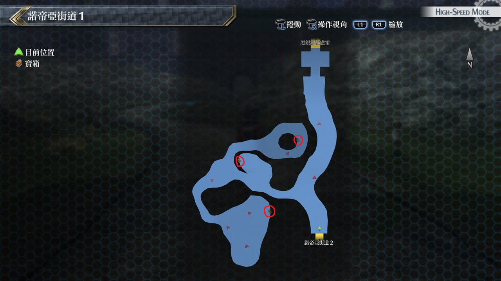
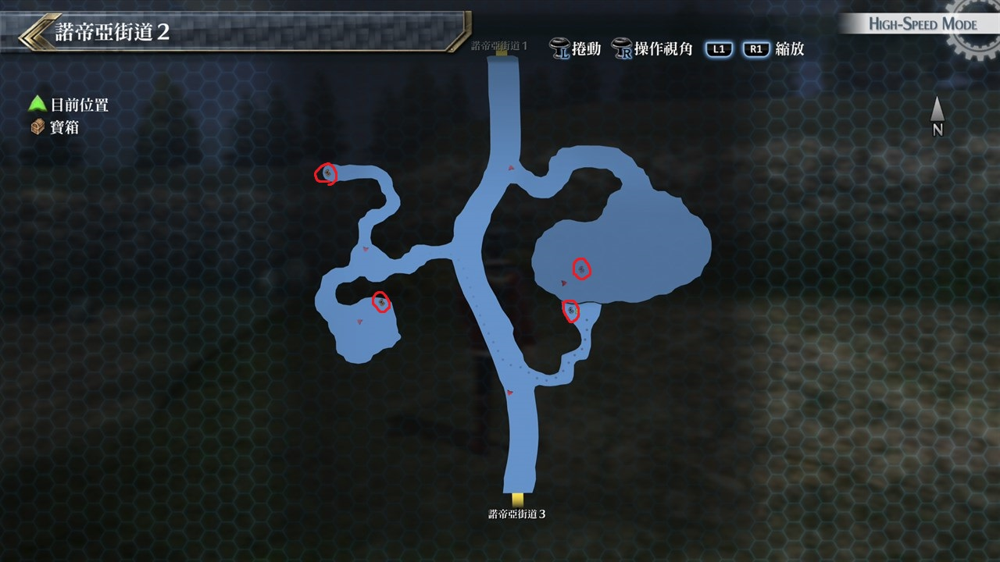
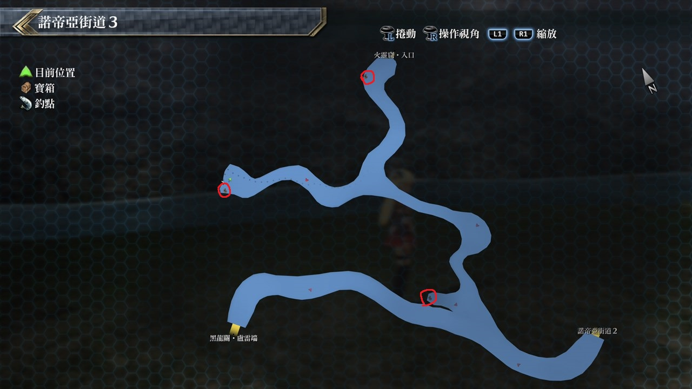

# 诺帝亚街道

---

## 诺帝亚街道1

### 宝箱

- [ ]  大回复药
- [ ]  七属性耀晶片×200
- [ ]  圣灵术

## 诺帝亚街道2

### 宝箱

- [ ]  [白羊](/game/TheLegendOfHeroes/SenNoKiseki2/quartz/白羊.md#白羊)
- [ ]  噩梦之刃
- [ ]  U物质x7

## 诺帝亚街道3

### 宝箱

- [ ]  EP填充剂III
- [ ]  鬼魅之影
- [ ]  省EP2

## 考验宝箱

### 限定角色

- 艾略特
- 艾玛
- 米莉亚姆
- 莎拉

### 怪物

- 肥胖企鹅×2
- 疯狂企鹅×6

### 攻略

敌人很多，我们人也很多，开场先用有全体范围的S战技(莎拉、米莉亚姆等)清完小怪，艾略特主用火属性魔法攻击，其他人则随意攻击即可

## 战斗笔记

- [ ] 疯狂企鹅
- [ ] 湛蓝福音
- [ ] 岩蛇
- [ ] 赤鬼蜻蜓
- [ ] 鳄头鱼
- [ ] 赤面松鼠
- [ ] 多头蛇
- [ ] 命运纺织者
- [ ] 巨人
- [ ] 亚格纳加恩

## 钓鱼笔记

诺帝亚街道3省EP2宝箱附近有钓鱼点，火灵窟暂时无法前往

- 角斗鱼(不好钓，建议存个档)

## Boss

*亚格纳加恩*

亚格纳加恩大致上用三招攻击，炼狱吐息为最常用攻击

为魔法属性带炎伤状态，最好装备防炎伤饰品

践踏则是范围物理攻击，较棘手还是无驱动时间的火属性魔法千阳新星

基本上攻略幻兽的第一步就是防范这些范围高阶魔法，所以人员配置也跟对付之前的幻兽差不多

掉落: 焦阳珠