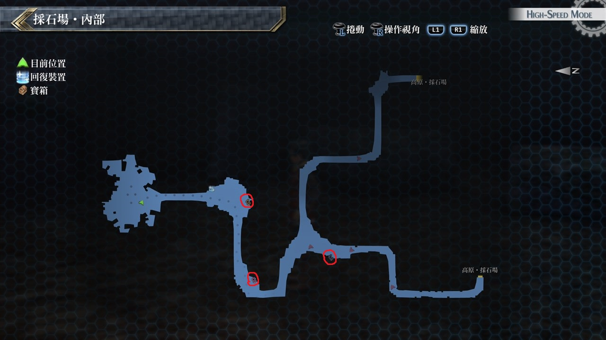
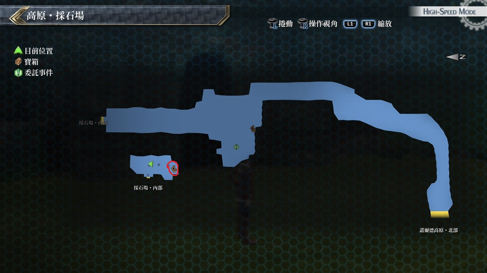

# 采石场

---

## 采石场・内部

### 宝箱

- [ ]  [宝盒](/game/TheLegendOfHeroes/SenNoKiseki2/quartz/宝盒.md#宝盒)
- [ ]  U物质x6

## 高原・采石场

## 宝箱

- [ ]  熔岩火雨

## 考验宝箱

### 限定角色

- 艾玛
- 尤西斯
- 菲
- 盖乌斯

### 怪物

- α迪格雷姆×2
- 迪格雷姆×4

### 攻略

要注意敌人的攻击都是带有能力下降，这时候尤西斯的贵族号令更显得重要，建议在尤西斯施放贵族号令时由艾玛担任回复角色

## 战斗笔记

- [ ] 吸血草
- [ ] 赛斯菲
- [ ] 迪格雷姆
- [ ] 基诺夏・赛纳克

## 钓鱼笔记

无

## Boss

*基诺夏・赛纳克*, *赛斯菲*x4

基诺夏‧赛纳克会很勤劳的招唤小兵，要用范围战技打掉

否则一多起来也是很棘手，而BOSS攻击是广范围并带有MOV下降

不过只要注意一下我方HP量就好了，如果中了MOV下降没办法移动

可改用魔法攻击也没问题