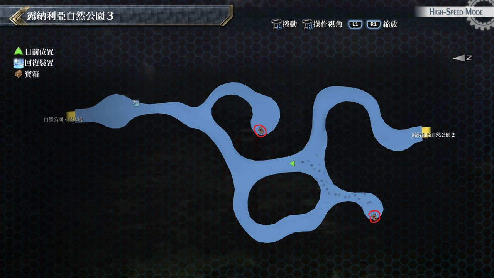
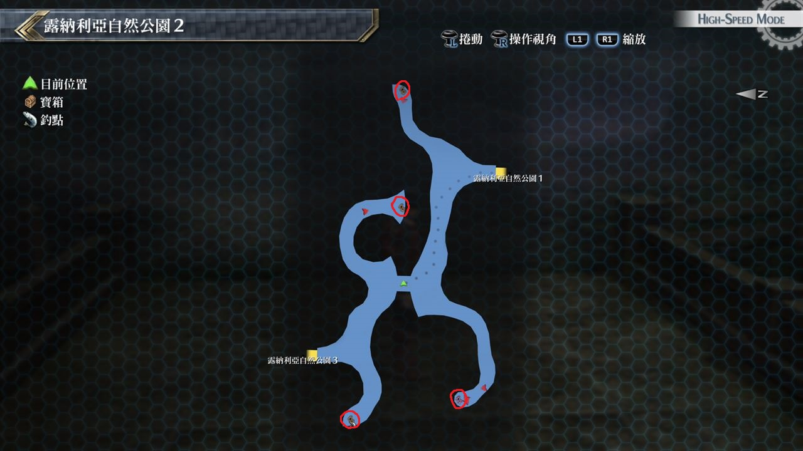
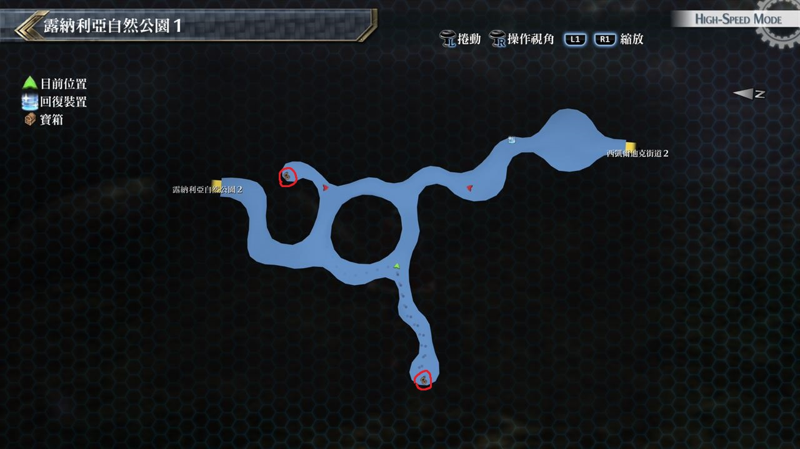

# 露纳利亚自然公园

---

## 露纳利亚自然公园3

### 宝箱

- [ ]  奇石胸针
- [ ]  耀晶石块×100

## 露纳利亚自然公园2

### 宝箱

- [ ]  中回复药
- [ ]  柑橘之瓶
- [ ]  EP填充剂I
- [ ]  [权杖](/game/TheLegendOfHeroes/SenNoKiseki2/quartz/权杖.md#权杖)

## 露纳利亚自然公园1

### 宝箱

- [ ]  HP1
- [ ]  七属性耀晶片×100

## 考验宝箱

无

## 战斗笔记

- [ ] 膨大聚合体
- [ ] 刀刃鱼虫
- [ ] 疾风竹叶猫
- [ ] 紫色烂泥
- [ ] 强壮巨骨猩
- [ ] 古尔诺加
- [ ] 海德伦

## 钓鱼笔记

露纳利亚自然公园2有钓鱼点

- 刃鱼
- 斗鱼
- 鳗鱼

## Boss

*古尔诺加*

战斗开始时学会「增幅强化」, 敌方会时常增加STR和DEF, 我方物理伤害会降低, 推荐使用火系魔法, 最后1万血左右时S技带走

*海德伦*

攻略重点为全员配戴防睡眠饰品, 海德伦会使用各种的异常攻击
其中怪音波是无伤害但有击退效果, 且带有睡眠
如无防备这招将会有致命伤, 另外其他招式较无威胁性
毒性胞子是魔法攻击带毒、拨沙带黑暗、踩踏带STR下降
养分吸收会范围的吸收HP, 量还满多的
建议带上艾玛和亚莉莎