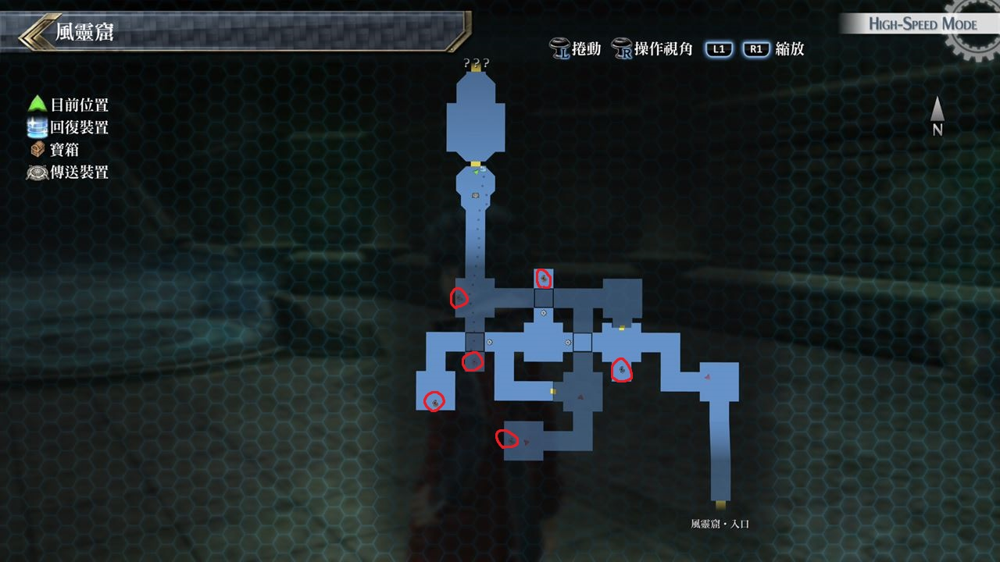

# 风灵窟

---

## 风灵窟

### 宝箱

- [ ]  风之领域
- [ ]  睡眠之刃
- [ ]  EP填充剂II
- [ ]  七属性耀晶片×200
- [ ]  [罪恶](/game/TheLegendOfHeroes/SenNoKiseki2/quartz/罪恶.md#罪恶)

## 风灵窟·考验之地

### 宝箱

- [ ]  末日旋风
- [ ]  雷神珠
- [ ]  风之耀晶片×1000
- [ ]  风言铃
- [ ]  圣灵药·改

## 考验宝箱

### 限定角色

- 菲
- 米莉亚姆

### 怪物

- 古人偶 Ω
- 古人偶×2

### 攻略

菲装备回避装放到前线, 但因敌人有时会使用无法回避的战技

故米莉亚姆要有回复HP的魔法, 另外敌人会用魔法大地之癒每回合回复HP20%

但也只是延长被打败的时间而已

---

### 限定角色

- 尤西斯
- 莎拉

### 怪物

- 沉重方石像
- 方石像×7

### 攻略

事前装备防昏厥饰品, 一开始莎拉就使用雷神功, 并在前方吸引敌人

莎拉火力也满猛的, 原始的核心回路雷神回复HP量很高, 不需要太担心

有三点士气就用连续猛攻, 尤西斯则于后方则偏辅助并使用魔法攻击

## 战斗笔记

- [ ] 元素烂泥
- [ ] 沉睡蜻蜓
- [ ] 霉菌水母
- [ ] 日蜂
- [ ] 天界判官・热风
- [ ] 斯塔拉姆达
- [ ] 古人偶
- [ ] 方石像
- [ ] 智天使之门
- [ ] 天界判官・热风

## 钓鱼笔记

无

## Boss

*天界判官・热风*x3

打法几乎与地灵窟的天界判官‧地母一模一样

由于有亚莉莎在, 施放天堂赠礼后就可以开始进攻

因不用太担心CP, 有延迟效果的战技就不要吝啬多多使用吧