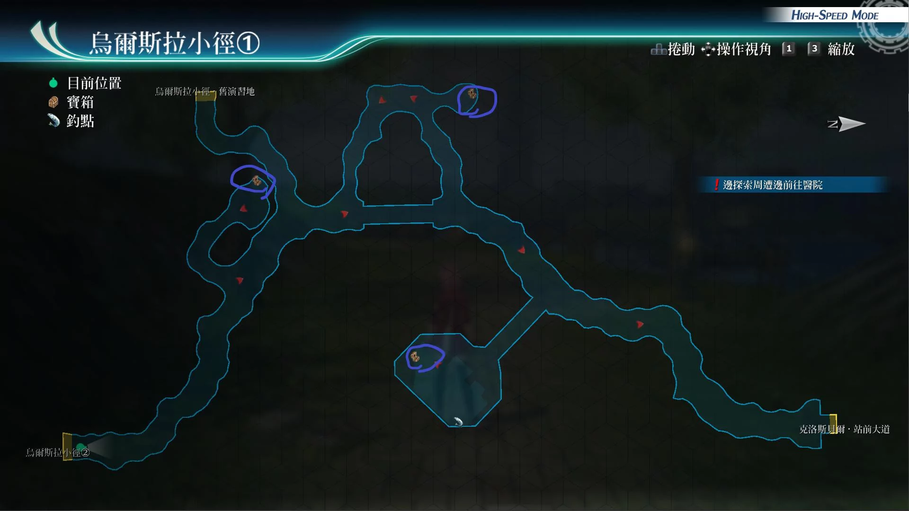
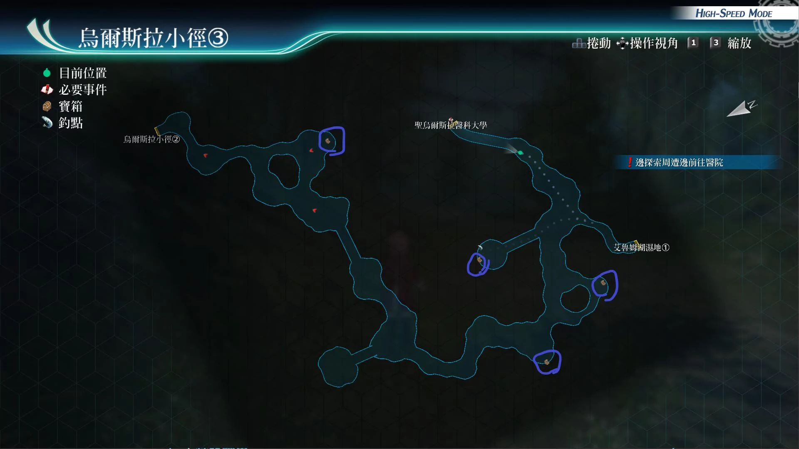

# 乌尔斯拉小径

---

## 乌尔斯拉小径1

- [ ] 睡眠之刃II
- [ ] 强音之力·复R
- [ ] 中回复药, EP填充剂II, 圣灵药 (需触发演习地剧情后才能获得)

## 乌尔斯拉小径2

?> 地图图片丢失...

- [ ] 星形莓果x5, 苦番茄x5, 蜂蜜糖浆x5
- [ ] 防御3
- [ ] 圣灵之息R
- [ ] 力量药水, 守护药水, 心灵药水

## 乌尔斯拉小径3

- [ ] 圣灵术R
- [ ] 粗碎岩盐x5, 千万五壳x5, 百万精酒x5
- [ ] 破剑之牙II
- [ ] U物质x5

## 战斗笔记

- [ ] 蕨类可爱猿
- [ ] 格斗猎蜂
- [ ] 塔黎波里
- [ ] 椰子竹叶猫
- [ ] 森林蜗兽
- [ ] 栗子双壳兽
- [ ] 极苦番茄人
- [ ] 黄金蝴蝶鸟
- [ ] 火焰甲壳虫
- [ ] 强壮巨骨猩
- [ ] 军舰虫
- [ ] 叹息之柩·贝沃

## 钓鱼笔记

乌尔斯拉小径1, 左侧桥处的，结缘之社，附近有钓鱼点, 但没有新品种

乌尔斯拉小径2, 沙滩有钓鱼点，但没有新品种

乌尔斯拉小径3, 有钓鱼点
- 森林鳃鱼

## Boss