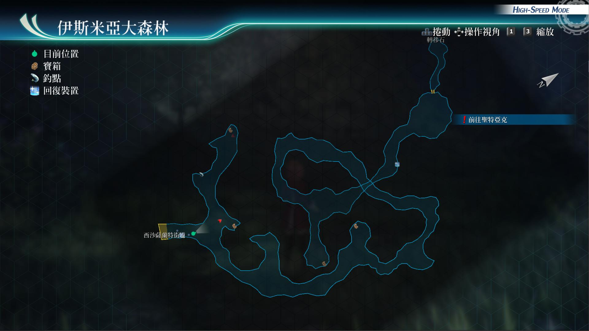

# 伊斯米亚大森林

---

## 宝箱

- [ ] 原力印记
- [ ] 新鲜的蛋x5, 鲜奶x5, 熟成乳酪x5
- [ ] U物质x5
- [ ] 治愈术R

## 战斗笔记

- [ ] 白银獠牙
- [ ] 叶蛙
- [ ] 磷光蝶
- [ ] 恶魔花
- [ ] 大眼妖
- [ ] 神密报丧女妖
- [ ] 玳蒂蛾
- [ ] 巨型邪眼魔
- [ ] 污浊甲壳虫
- [ ] 木乃伊犬
- [ ] 敏足蜘蛛
- [ ] 孚涅里亚斯

## 钓鱼笔记

伊斯米亚大森林有钓鱼点，但没有新品种的鱼

## Boss

*孚涅里亚斯*

攻击手段：

- 蓄力战技（毒性狂风）：直线范围加中毒
- 驱动魔法（钻石新星）：范围加冻结
- 蓄力战技（神隐）：小范围带消失
- 我方驱动魔法时，如果轮到它行动，会释放大地之嚎：范围带spd和mov下降中
- 半血后会使用大树觉醒：进入3回合亢奋状态和回血buff
- 会使用大地的气息：范围吸收hp，200ep，25cp。物理攻击
- 依旧会驱动钻石新星

建议打法：

前排配置菲和莎拉，两人站位散开，闪避尽量堆高，装备防消失和冻结

开场莎拉使用雷神功，之后使用魔导祝福。菲负责定期打断boss的蓄力使用技能和魔法

后排配置，亚尔缇娜使用神圣之力，给艾略特、菲上buff，不做输出给莎拉和菲回血回cp

如果自己血不多，记得也给自己回复。艾略特使用风之轮输出，并且定期给菲和莎拉回血

开闪耀天启套心眼，给前排两人。期间记得，艾略特的减伤阵不要断。

如果boss驱动危险技能，又没人能打断的场合，把后排悠娜替换上来，开菲指令

然后悠娜拉人即可，菲来打断，bp不够的话，64级的悠娜应该学会了烈焰之心

可以使用此战技回复bp,慢慢磨就能过了。

*大眼妖*, *巨型邪眼魔*

需调查：大眼妖、巨型邪眼魔

大眼妖攻击手段：

- 驱动魔法(心灵之霞)：单体带恶梦状态
- 蓄力战技(石化视线)：带石化
- 死之视线：带即死。

邪眼魔(幻魔)攻击手段：

- 普通攻击(啃咬)：范围攻击。
- 召唤使魔：召唤两只大眼妖。
- 失衡吸引：把任意成员带走，被带走的成员，不能进行链接，每回合不能行动，并且每回合伤血，只有对这怪物，打出一定的伤害，才会释放我方成员。
- 蓄力战技(腐食之眼)：直线伤血，加def和adf下降，再加中毒
- 睡眠堕波：直线伤血加str和ats下降，加一定概率的睡眠
- 特英级肉汁：范围攻击，伤血加延迟加速度下降
- 血量降低到3分之一后，会亢奋，之后释放全屏攻击：鲸饮净解，带消失异常

推荐打法：

一开始调查完小怪后最先动的角色用兰迪指令，然后兰迪爆S秒小怪

库尔特去配个时间驱动，给我方提升速度。悠娜上闪耀天启

亚尔缇娜负责用地魔法攻击，或者用回血战技辅助，52级以后

学会黑色屏障，可以用这战技，让自己隐匿刷链接攻击，连接最好默认兰迪

因为兰迪可以卖血爆S，算前期的主要输出了。之后兰迪强音之力，库尔特暴雨斩

boss亢奋后，BP充足的话，开亚尔缇娜指令，绝对反射即可