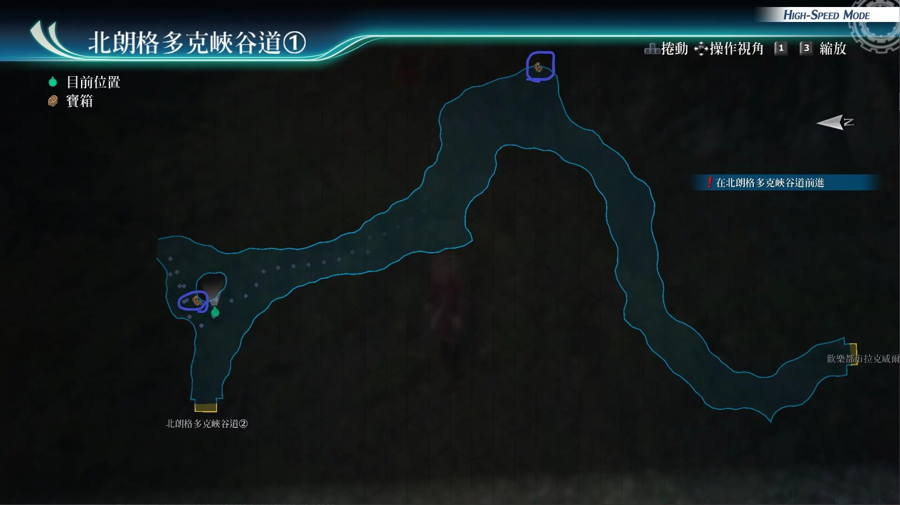
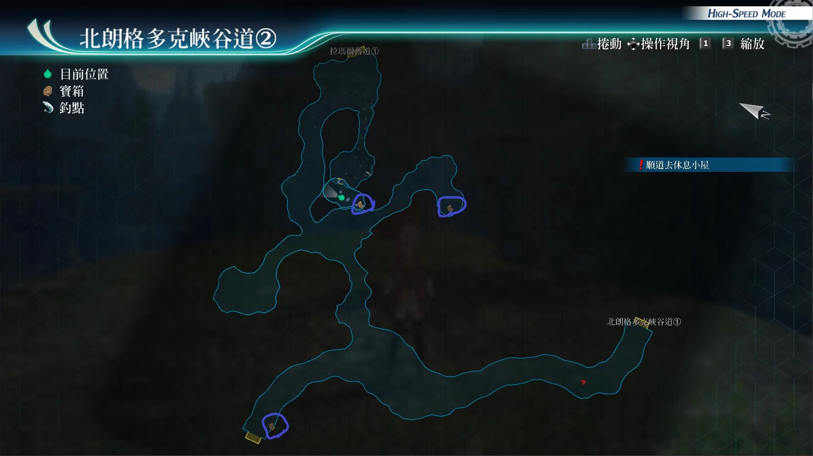

# 北朗格多克峡谷道

---

## 北朗格多克峡谷道1

- [ ] 中回复药, EP填充剂II, 圣灵药
- [ ] 中回复术R

## 北朗格多克峡谷道2

- [ ] 结晶防护·复R
- [ ] 七属性耀晶片x50
- [ ] [幻胧](/game/TheLegendOfHeroes/SenNoKiseki4/quartz/幻胧.md#幻胧)

## 战斗笔记

- [ ] 明星害虫
- [ ] 锯嘴兽
- [ ] 秽虎
- [ ] 跳舞猫头鹰
- [ ] 锯嘴兽母亲
- [ ] 巨鹏
- [ ] 深渊霸虫
- [ ] 血红獠牙
- [ ] 死臭之翼
- [ ] 黑暗寡妇
- [ ] 葉德蝠
- [ ] 异魔葉德

## 钓鱼笔记

北朗格多克峡谷道2有钓鱼点, 但没有新品种

## Boss

*深渊霸虫*

需调查：深渊霸虫

攻击手段
- 混沌的体液：范围攻击任意异常状态。需要注意即死
- 落雷：单体攻击带封技
- 并且受到伤害时，会使用来自深渊的激震带延迟

建议打法

装备防封技和即死饰品并且4个物流流选手，辅助核心都装备运转

然后库尔特时间驱动, 亚修强音之力·复，另一名物理型角色调查情报

之后悠娜开亚修指令，其他3人再爆S，之后悠娜再拉人，之后再爆S

换上替补成员再爆S。基本上就结束了