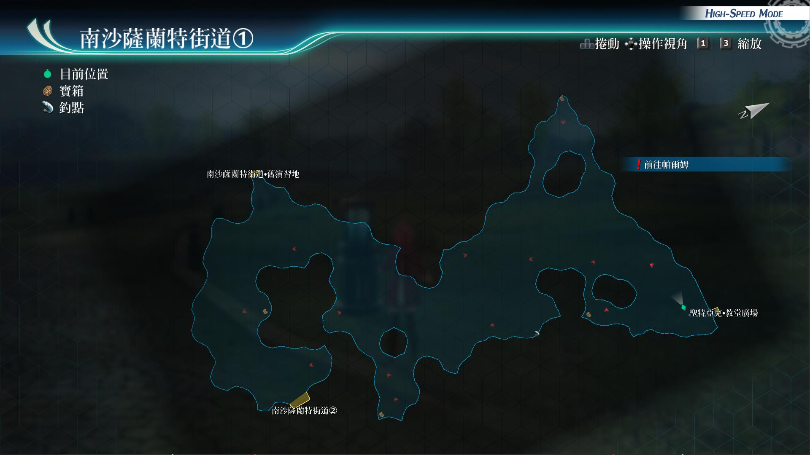
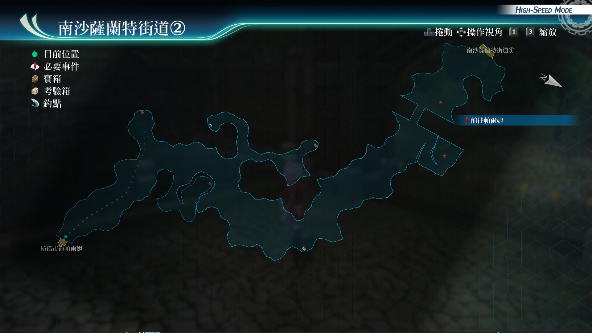

# 南沙萨兰特街道

---

## 南沙萨兰特街道1

- [ ] 新鲜香草x5, 爽口洋葱x5, 软绵绵马铃薯x5
- [ ] 生命之息R
- [ ] 火焰箭R
- [ ] U物质x5(打完boss才可以开)

## 南沙萨兰特街道2

- [ ] 大地之愈R
- [ ] 蓝色坠饰
- [ ] 七属性耀晶片x50

## 考验宝箱

[考验箱001](/game/TheLegendOfHeroes/SenNoKiseki4/ordeal/001.md)

## 战斗笔记

- [ ] 弹跳吸血虫
- [ ] 细羽鸟
- [ ] 波姆
- [ ] 赤面松鼠
- [ ] 新种螳螂
- [ ] 硬壳犀兽
- [ ] 魔煌兵优乡种

## 钓鱼笔记

- 南沙萨兰特街道1
  - 红鲈

- 南沙萨兰特街道2
  
  有钓鱼点, 但没有新品种

## Boss

*魔煌兵优乡种*

需调查：魔煌兵优乡种

攻击手段：

- 普通攻击(砍击)：范围攻击
- 蓄力技能(大刀直斩落)：直线带延迟
- 守护之嚎：范围攻击带ADF，DEF下降
- 血量减低到一定程度后，会进入亢奋状态
- 驱动魔法(黄金球)：非亢奋状态貌似不驱动
- 黑暗嘶吼：自身会恢复HP，并且同时STR，ATS，SPD上升

推荐打法：

装备好放延迟的饰品，接下来就毫无难度，让库尔特给我方

加好时间驱动，悠娜开闪耀天启，之后亚尔缇娜用弱点解析

然后开悠娜阵后，全员用战技攻击，刷连接攻击即可

兰迪强音之力，加卖血S技, 之后会进行2阶段战斗

选择战技：机甲兵召唤，即可结束战斗, 使用前需要驱动