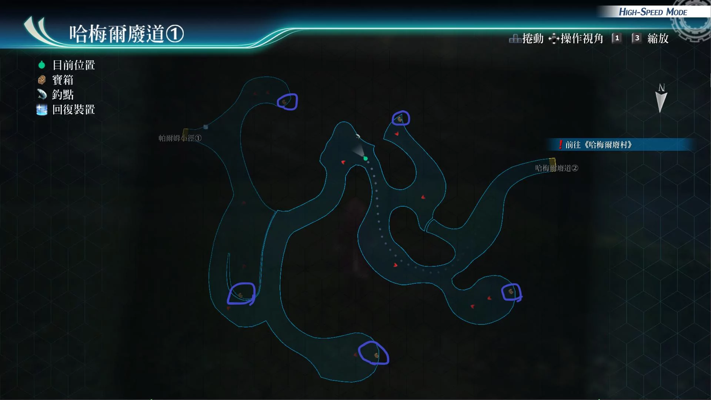
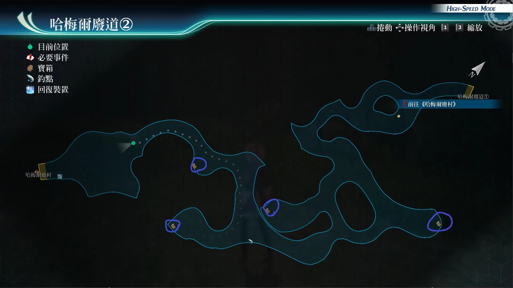

# 哈梅尔废道

---

## 哈梅尔废道1

- [ ] 妨碍1
- [ ] 勇气种子
- [ ] 橘色斗篷
- [ ] 精灵香
- [ ] 神圣之力R

## 哈梅尔废道2

- [ ] 修复石, 激发石, 勇气石, 复生石
- [ ] 七属性耀晶片x50
- [ ] 战意再起R
- [ ] 还魂粉

## 战斗笔记

- [ ] 炸弹草
- [ ] 食人植物
- [ ] 蜗兽王
- [ ] 触手布罗布
- [ ] 哈梅尔巨猿
- [ ] 利刃猎犬
- [ ] 食人植物王
- [ ] 强化猎兵(剑)
- [ ] 强化猎兵(枪)
- [ ] 基尔巴特
- [ ] 破坏兽雷欧尼达斯
- [ ] 陷阱师杰诺
- [ ] 猎兵王露嘉
- [ ] 魔煌兵优乡种
- [ ] 恶鬼亡尸
- [ ] 咒诅影
- [ ] 路西弗古斯
- [ ] 暴怒蛆
- [ ] 普路托斯·贝沃

## 钓鱼笔记

哈梅尔废道1, 有钓鱼点, 但没有新品种

## Boss

### 哈梅尔废道1

*魔煌兵优乡种*

第三章支线任务 [找寻药材](/game/TheLegendOfHeroes/SenNoKiseki4/quests/找寻药材.md#找寻药材)

!> 需要调查情报

攻击手段：

- 会蓄力使用：大地破坏者：直线延迟
- 战嚎：回复8540hp，str，ats，spd提升
- 守护者之嚎：范围解除驱动
- 半血后亢奋
- 驱动魔法：黄金球

建议打法：

带着艾玛，开她的指令即可，或者上新月镜，接着上好闪耀天启，开弱点解析，开亚修指令，就可以轻松获胜

### 哈梅尔废道2

*基尔巴特*, *利刃猎犬*, *强化猎兵(枪)*, *强化猎兵(剑)*

犬攻击手段
- 蓄力技能(风刃)：直线带延迟
- 蓄力技能(雷刃)：带封技
- 蓄力技能(死刃)：带既死

强化猎兵枪
- 机枪扫射：范围攻击
- 回复魔法：圣灵之息
- 破防射击：范围带def下降

强化猎兵剑
- 同样会圣灵之息
- 蓄力战技(破地斩)：直线带spd和mov下降

基尔巴特
- 开场就会使用战技：经济的一杯，效果给敌方全员回满hp，加str上升
- 最上级回复药，回复敌方全员12000hp
- 高级回复药，回复敌方全员6000hp
- 一般回复药，回复敌方全员3000hp
- 微妙的连接，回复敌方全员1000hp加10cp
- 蓄力战技(毒爆弹)：中毒
- 蓄力战技(杀戮扫射)：范围攻击
- 我们和好吧，伤我方4500hp，他自己伤4000到9000hp左右浮动
- 半血后会使用技能：还没有结束，进入亢奋状态，会提高使用我们和好吧的次数

建议打法

没必要装备防中毒饰品，记得给我方的，库尔特装备好，之前买的永恒回路

增强道具效果，很有用。如果悠娜第1个起手，使用战技，加速之星

把我方全员拉上来，然后调查除了基尔巴特以外的杂兵。再加上此战

开场默认是带上亚修的，而且亚修有侵蚀之怒，这个10cp换100cp加2回合的str技能

所以不用把他换下去

调查完情报后，开兰迪指令，兰迪释放200cpS技，亚修也释放S技，这时基本敌人

估计就只剩下基尔巴特1个人，如果还不行，再放1个库尔特的S

悠娜保存cp，接下来就是打1个像血牛一样的基尔巴特就好多了，悠娜释放闪耀天启

库尔特放时间驱动，亚修用10cp换100cp，之后用普攻，有多余cp可以使用第1个战技

兰迪卖血回满cp。库尔特给他回血即可，然后不停开悠娜指令，慢慢打崩基尔巴特

之后太刀风，顺便还可以刷刷，连接攻击有关的战评。如果中了毒爆弹

装备永恒回路的库尔特给中毒的伙伴，回血和异常状态，还可以刷道具爱好者战评

然后记得打败基尔巴特前，慢慢回满全员200cp，hp以及ep。以备战第2战boss

不然隐藏ap就比较难拿了

*陷阱师杰诺*, *破坏兽雷欧尼达斯*, *猎兵王露嘉*

?> 胜利条件：活到最后，35回合内自动结束

!> 隐藏AP：35个回合内，将敌方血量降低一定程度(红线下)，让敌方全员撤退 *AP+5*

陷阱师杰诺攻击手段
- 普通攻击：带连结攻击
- 杀戮射击：直线带即死
- 风暴扫射：范围攻击带黑暗
- 此战他不会扔三叉戟，所以调查数量只有3个

雷欧尼达斯攻击手段
- 普通攻击：带连接攻击
- 霸王之刺：直线范围带str下降
- 全力回旋，范围攻击带晕厥
- 破地强击，直线范围带mov下降

路嘉攻击手段
- 爆击风暴：范围ADF/SPD下降
- 蓄力战技(末日驱动者)：小范围带晕厥
- 蓄力战技(雷神之锤)：范围延迟加封技

建议打法：推荐带上防晕厥装备。一开场，3个回合都是被西风三人拿走的

加上调查情报还要3个回合，基本就已经只有29个回合了

剩下的回合内，看我方谁先动，兰迪先的话，吃个加str的料理和力量药水

或者上强音之力，之后开兰迪指令加200cp的S技。亚修先的话同样200cp , s技

悠娜先的话，先开兰迪指令，让其他三个男角色爆200cp的S技

之后她用加速战技把另外3人拉上来。然后再调查敌方3人情报

之后开亚尔缇娜指令，在反射敌方伤害的同时。库尔特再用时间驱动

亚修用10CP换100CP战技，兰迪用100cp的还魂粉

轮到悠娜行动放闪耀天启，或者继续拉人，她的定位就是这样

库尔特给兰迪送另1个还魂粉，爆S记得开兰迪指令

悠娜如果CP不够了，就换亚尔缇娜上场,然后她再爆S

*紫之骑神塞克托*

骑神战

胜利条件：将塞克托的HP降低至50%

攻击弱点，调查情报

弱点
- 普通状态：身体
- 右手把剑向后，水平拿直的架势(末日驱动者：单体带封技，概率带链接攻击)：手臂
- 剑和枪合二为一的状态，(爆击风暴：全体攻击加def下降)：头部

建议打法

悠娜带上亚尔缇娜，亚修带库尔特，之后亚尔缇娜扔降spd魔法

悠娜再用2bp自己的技能，也可以降低敌方spd，只要紫骑进入SPD下降大之后就没什么难点了

库尔特给亚修加buff，亚修记得普通攻击即可

*暴怒蛆*, *普路托斯·贝沃*

终章支线任务 [哈梅尔的异界化](/game/TheLegendOfHeroes/SenNoKiseki4/quests/哈梅尔的异界化.md#哈梅尔的异界化)

小怪攻击手段
- 流体射击：带spd和mov下降

boss攻击手段
- 普通攻击：范围攻击
- 贪欲的闪光：范围吸收25cp加hp，必中
- 驱动魔法（盖伦堡垒）：直线任意能力下降
- 污秽溃烂：范围攻击带def和adf下降。必中
- 外部灵置：范围攻击加恶梦
- 冥界波：全体攻击加混乱，必中
- 蓄力战技（地狱门）：小范围攻击加消失
- 召唤使魔：召唤两只暴怒蛆

建议打法

我方有时间爆发的，直接道具调查小怪，之后开缇妲指令，黎恩鬼气S技，亚修S技，缇妲S技，3个s扔下去，再来个阿加特S技，即可结束战斗