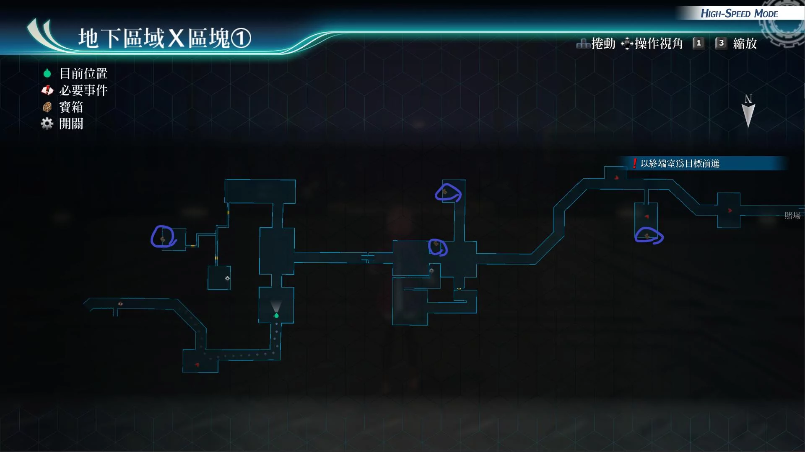
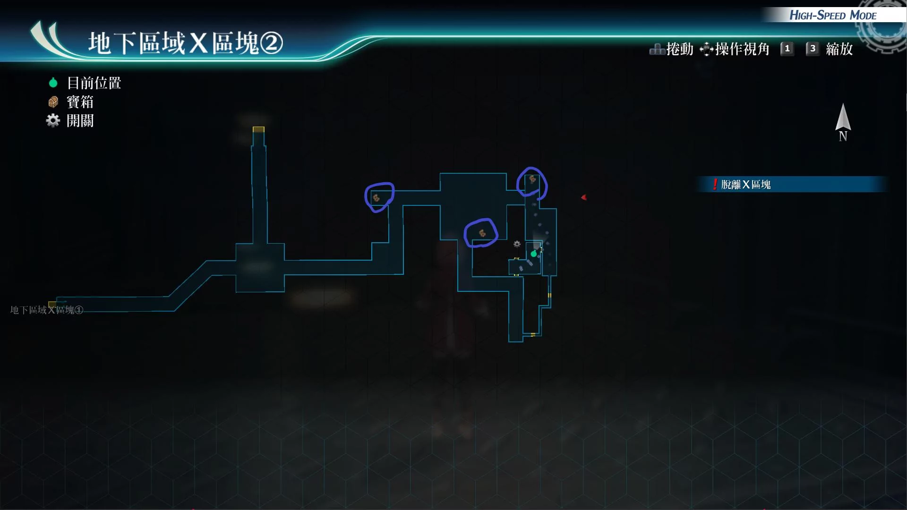

# 地下区域X区块

---

## 地下区域X区块1

- [ ] 晕厥之刃II
- [ ] 痊愈之药x5, S-药片x5
- [ ] 坚韧守护R
- [ ] 精灵香

## 地下区域X区块2

- [ ] 七属性耀晶片x50
- [ ] U物质x5
- [ ] 水蓝轰炸R

## 战斗笔记

- [ ] 飞鱼
- [ ] 甜番茄人
- [ ] 三翼直升机
- [ ] 故障机体MkIII
- [ ] 霸王鲶龙
- [ ] 鲶龙女王
- [ ] 源初之冠
- [ ] 异次元多腕球妖

## Boss

*源初之冠*

需调查：源初之冠

攻击手段
- 飞刀攻击：单体加中毒
- 麻痹线：单体加封技
- 维修光束，紧急维修：回复HP

建议打法

一个角色一直负责新月之镜，悠娜战技拉人，库尔特时间驱动

法师装备银言铃+盖伦堡垒，时间爆发+妙婕指令，魔法打即可

*异次元多腕球妖*

第三章任务 [地下区域X区块的通缉魔兽](/game/TheLegendOfHeroes/SenNoKiseki4/quests/地下区域X区块的通缉魔兽.md#地下区域X区块的通缉魔兽)

攻击手段
- 王水：范围炎伤，def，adf下降
- 血量不多时，会进入亢奋状态，并且显示倒计时5
- 每一次倒计时都会进入亢奋状态
- 倒计时为0，会释放全体技能：时间大崩坏：效果我方全员强制消失

建议打法1

配置劳拉，库尔特或莎拉，黎恩，亚莉莎，开着新月镜，之后亚莉莎天堂增礼，开黄龙阵或悠娜指令，黎恩螺旋击，库尔特暴雨斩，莎拉用第2个战技，劳拉狮子连爪，打break后，时间爆发加妙捷指令，普通攻击即可，或者太刀风加双拉

建议打法2

可以让妙捷装备英杰核心回路，装备宝盒，配合火铃铛，堆速度，然后链接马奇亚斯（有概率回ep时爆，不断火魔法轰，亚莉莎装备自己的核心回路，空铃铛，宝盒空魔法轰，后排悠娜继续拉人即可

建议打法3

上好强音之力.复后，开劳拉指令，黎恩鬼气S技，劳拉S，莎拉S，后排马奇亚斯拉人后，库尔特S，之后女神之吻继续爆S即可