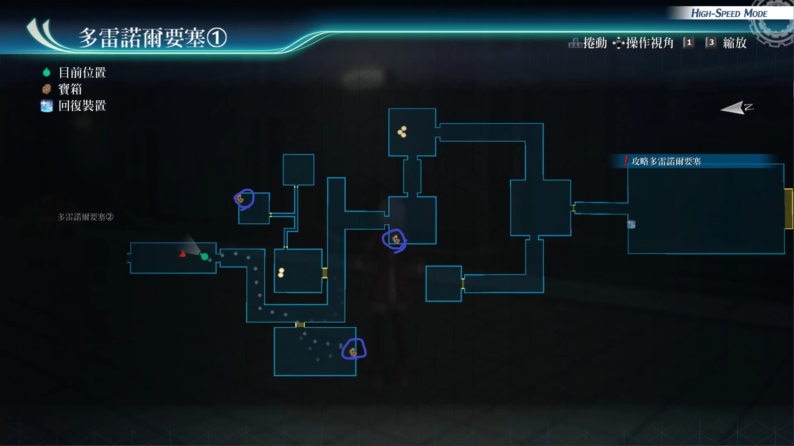
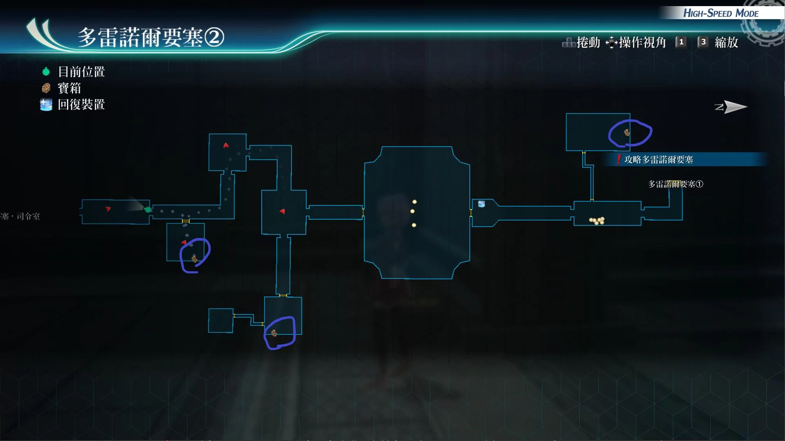

# 多雷诺尔要塞

---

## 多雷诺尔要塞1

- [ ] 七属性耀晶片x100
- [ ] 圣灵药·改
- [ ] 神罚怒雷R

## 多雷诺尔要塞2

- [ ] 橘色胸花
- [ ] EP填充剂IV
- [ ] 全回复药

## 战斗笔记

- [ ] 潜影枪手R
- [ ] 潜影枪手G
- [ ] 潜影枪手M
- [ ] 方阵兵J9
- [ ] 亡命装甲兵Ⅱ
- [ ] 玉簾
- [ ] 第四师团士兵(枪)
- [ ] 第四师团士兵(剑)
- [ ] 奈特哈尔中校
- [ ] 克雷格将军

## 钓鱼笔记

## Boss

*第四师团士兵·剑*x2, *第四师团士兵·枪*, *方阵兵J9*x2, *潜影枪手G*x2

士兵剑攻击手段
- 蓄力使用强烈斩技：单体

士兵枪攻击手段
- 会驱动大回复术。
- 蓄力战技（爆烈射击）：范围带炎伤

J9攻击手段
- 飞弹攻击：范围炎伤

建议打法

先调查情报，然后开个阿加特阵，阿加特暴S之后，另一人也暴S，先把机器人群击败，只剩下士兵就很好对付了，记得上闪耀天启，阿加特卖血，亚尔缇娜负责他的回血，堆新月镜，也可以让，任意一人给，阿加特上振奋之激，这样阿加特卖血1回合就可以使用S技，配合艾略特和他自己的指令简直为所欲为

---

*魔煌机兵佐尔盖·剑*, *魔煌机兵佐尔盖·枪*, *魔煌机兵梅尔基亚·剑*

魔煌机兵佐尔盖·剑弱点
- 普通状态：身体
- 剑拿上驱动（畏惧斩击：单体）：手臂

魔煌机兵佐尔盖·枪弱点
- 普通状态：手臂
- 枪和盾在一起驱动（黑暗射击：范围技能）：头部

魔煌机兵梅尔基亚·剑弱点
- 普通状态：头部
- 链接带链接攻击，和bp技：恐惧斩击，伤害极高
- 剑和盾同一水平位置驱动（号令：全体str上升）：手臂
- 剑拿在后方，盾在前方驱动（黑暗斩击：单体概率带连接攻击，之后他概率会释放必杀，恐惧斩击极高）：头部

建议打法1

我方机甲兵给灰骑喂cp药，灰骑吃到cp药后，自己也吃个cp药，之后残月，带亚尔缇套墙，继续残月，全程只要反击即可，唯一是注意的是枪的黑暗射击，其他攻击都是单体攻击，都打不中灰骑，美中不足的是，机甲兵伙伴会跪，但是不影响4个0

建议打法2：

带库尔特的机甲兵，灰骑必须第1个行动，扔bp药，然后库尔特对着梅尔基亚揍，一定要出失衡，然后用2点bp技降低梅尔基亚的str，这样即使梅尔基亚号令，它的str也提升不了，因为本作，只要有能力下降的debuff，有益的正面能力上升的buff套了没用之后给灰骑扔100cp药，灰骑螺旋击封上梅尔基亚的活动。然后再扔个bp技，防御一会儿协力技即可

---

*克雷格*, *奈特哈尔*

!> 隐藏条件：全员没有战斗不能，活到最后 *AP+2*

克雷格攻击手段
- 战意高涨(任意时刻都有概率使用)：3回合亢奋, str，def , spd提升
- 暴风怒火：范围攻击加延迟
- 毁灭之锤：直线攻击加晕厥
- 所有攻击都概率带链接攻击，连续猛攻
- 半血后会再次使用战意高涨，并且所有break槽，强制恢复到正常状态

奈特哈尔攻击手段
- 桌越之主(失落领主) : 直线def，adf，spd下降
- 泰坦分离:范围加封技
- 70%hp以下，和30%hp以下，会使用战意高涨，同样进入3加buff
- 会驱动魔法：中回复术，闪耀天启，和破邪之印
- 半血后强制break槽恢复正常
- 所有攻击都概率带链接攻击，连续猛攻

建议打法

战前装备防晕厥和封技饰品。由于对方随时都会进入亢奋状态，在他亢奋状态堆新月镜和时间驱动，开艾略特指令

然后等他们的，亢奋状态过去后，开闪耀天启，堆黎恩的攻击，螺旋击加黄龙阵伺候

如果有带亚修，用强音之力和时间驱动上好buff后，开亚修阵，暴击输出即可