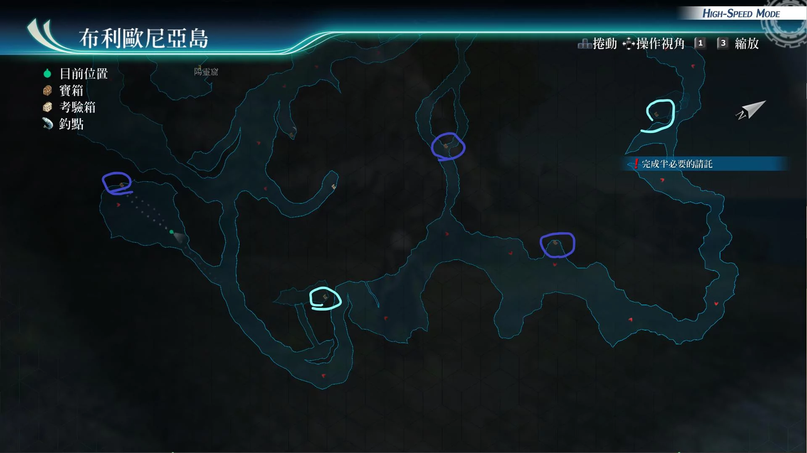

# 布利欧尼亚岛

---

## 布利欧尼亚岛1

- [ ] 修复石, 激发石, 勇气石, 复生石
- [ ] 七属性耀晶片x100
- [ ] 审判龙卷R
- [ ] 冻结之刃II

## 布利欧尼亚岛2

- [ ] 受难之刃R
- [ ] 杜芭莉的假发(多周目:U物质x5)
- [ ] 中回复药, EP填充剂II, 圣灵药

## 考验宝箱

[考验箱009](/game/TheLegendOfHeroes/SenNoKiseki4/ordeal/009.md)
[考验箱010](/game/TheLegendOfHeroes/SenNoKiseki4/ordeal/010.md)
[考验箱011](/game/TheLegendOfHeroes/SenNoKiseki4/ordeal/011.md)
[考验箱012](/game/TheLegendOfHeroes/SenNoKiseki4/ordeal/012.md)

## 战斗笔记

- [ ] 疾风竹叶熊猫
- [ ] 十步蛇
- [ ] 光爆草
- [ ] 钉刺蝼蛄
- [ ] 镰魔
- [ ] 狼虎
- [ ] 斗士暴龙
- [ ] 恐怖翼龙
- [ ] 克洛
- [ ] 远古巨骨猩
- [ ] 神速杜巴莉
- [ ] 魔煌兵雷格斯·死天使

## 钓鱼笔记

海滩边, 船舰后方钓鱼点
- 蓝宝石鱼
- 刺鲀

瀑布前钓鱼点
- 埃雷肯拟态鲨

码头处钓鱼点, 没有新品种

## Boss

*克洛*, *神速杜巴莉*

克洛攻击手段
- 复仇子弹：直线范围，混乱或恶梦
- 快捷爆射：范围圆L，带解驱动和spd下降
- 夺命魔眼：圆M范围，带晕厥，迷魅，既死
- 罪恶之刃：范围加延迟。
- 半血后会亢奋，恢复100cp
- S技（十字反逆）：全体带封技以及连接断裂
- 20%体力到30%体力，又会用一次

神速杜芭莉攻击手段
- 豪炎剑：范围加炎伤
- 刚雷剑：范围加封技
- 神速太刀：直线解驱动加延迟
- 影技·剑帝阵：单体混乱加30%暴击率
- 半血后会亢奋，恢复100cp
- S技（虹彩剑）：全体加spd下降

建议打法1

带莎拉，马奇亚斯和悠娜，因为马奇亚斯和悠娜都有拉人战技，其中马奇亚斯还有回ep的战技，悠娜还有回BP的战技，亚尔缇娜辅助可以群回CP

建议打法2

带菲，莎拉，亚莉莎，可以亚莉莎天堂赠礼后，闪避反击

建议打法3

带亚尔缇娜，亚莉莎，和尤西斯，尤西斯装备时爆，即可实现无限白金盾流派

建议打法4

带盖乌斯，S技延迟之后再卖血又有S技了。然后拉人的把他拉上去，回血的给他回hp即可

---

*苍之骑神奥尔迪涅*

弱点
- 普通状态：手臂
- 单手握着双刃剑放到身后驱动（投掷利刃：单体加封技）：头部
- 双手握着双刃剑驱动（罪恶之刃：全体加str下降）：头部
- 半血后会进入亢奋状态，带spd，str，def上升
- 此状态单手握住双刃剑，剑放在前方驱动（混沌剑：带封技）：手臂

建议打法

一开始任意伙伴都可以，用悠娜拉人或者马奇亚斯拉人，或者劳拉加cp，或者亚莉莎加cp的buff随便打打，存点cp值即可

---

*魔煌兵雷格斯·死天使*

攻击手段
- 普通攻击：范围攻击
- 蓄力战技（剑击突刺）：直线范围，def , adf和spd下降
- 人马之嚎：范围str, ats下降，概率解除驱动
- 兽人俯冲：大范围带晕厥
- 战嚎：回复hp ,并且str，ats，spd上升
- 半血后会使用：神马觉醒，进入亢奋状态，并恢复HP
- 驱动魔法（七圣剑）：全屏带任意随机异常

建议打法

此战要轻松打过，可以带艾玛，亚莉莎，亚尔缇娜，黎恩，妙婕，悠娜。黎恩装备神矛，和运转，以及时间爆发，堆暴击和攻击。链接亚尔缇娜和艾玛可以回复ep。时间爆发开妙婕指令。然后普通攻击，或者螺旋击，暴击了即可恢复bp，无法恢复bp的场合,换成悠娜，悠娜时间爆发，用烈焰之心回复2次bp，之后再时间爆发，替换成黎恩，黎恩继续时间爆发，螺旋击，或者普通攻击即可。没cp了，让亚尔缇娜和艾玛时间爆发，回复他的cp即可