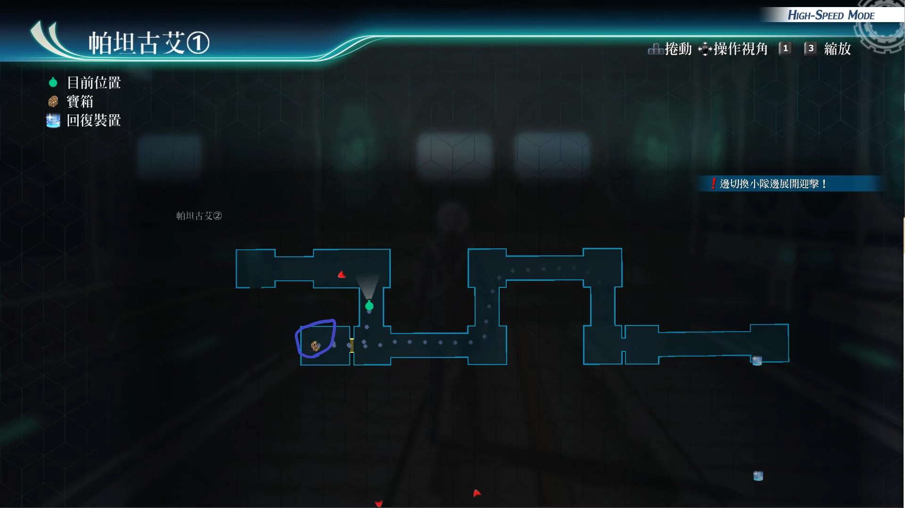

# 帕坦古艾

---

## 帕坦古艾1·A组

- [ ] 勇气种子

## 帕坦古艾1·B组

- [ ] 精灵香

## 战斗笔记

- [ ] 潜影枪手G
- [ ] 潜影枪手R
- [ ] 潜影枪手M
- [ ] 利刃狮犬
- [ ] 强化猎兵(剑)
- [ ] 强化猎兵(枪)
- [ ] 均衡之冠
- [ ] 赤红狮犬
- [ ] 斯雷普尼尔F2X
- [ ] 红色星座(枪)
- [ ] 红色星座(剑)
- [ ] 闪击加雷斯
- [ ] 基尔巴特装甲兵
- [ ] 赛德利克皇太子
- [ ] 死线克鲁格
- [ ] 刚毅艾奈丝
- [ ] 雷克多少校
- [ ] 战鬼谢莉
- [ ] 小丑坎帕尼拉
- [ ] 魔弓恩奈雅
- [ ] 破坏兽雷欧尼达斯
- [ ] 铜之盖欧尔格
- [ ] 陷阱师杰诺
- [ ] 根源玛利亚贝尔
- [ ] 猎兵王路嘉

## 钓鱼笔记

## Boss

*赤色星座·枪*, *赤色星座·剑*, *赤红狮犬*, *闪击加雷斯*

?> 闪击加雷斯无需调查, 他任意行动一次就有情报

本场需要调查赤色星座·枪, 剑和赤红狮犬

赤色星座枪攻击手段
- 混合手榴弹：范围加任意异常状态
- 蓄力战技（炙热炸裂弹）：范围炎伤
- 破坏武器：直线str下降
- 反战车炮：范围攻击
- 驱动大回复术，大治愈术

赤色星座剑攻击手段
- 混合手榴弹：范围任意异常状态
- 蓄力战技（破地强击）：直线spd，mov下降加延迟
- 驱动魔法：大地之愈

狮犬攻击手段
- 蓄力战技（雷刃）：直线带封技直线带延迟
- 蓄力战技（风刃）：直线带延迟

加雷斯攻击手段
- 闪击，单体DEF和ADF下降，以及延迟，必中
- 回复：给所有伙伴回复6000HP
- 支援：给所有伙伴回复2500hp，15cp，并且增加STR
- 有毒手榴弹：范围中毒

建议打法1

此战因为敌方会很多异常状态建议速战速决, 上好强音之力.复后，亚修指令或者库洛指令，爆S即可，留一个角色暂时不行动防止翻车，最后一个角色时爆后，换上后排所有人爆S，轻松过

建议打法2

此战如果要用情怀组，建议把罗伊德放在后方，小约必须用漆黑之牙随时进入隐匿状态，不然赤色星座剑，1个手榴弹，来个即死，你的4个0手册就凉透了。如果想要罗伊德，上前当盾，必须弄好闪耀天启，不然罗伊德只能躲在后排，给自己上振奋之激，然后我方开亚修阵或者黄龙阵即可，然后罗伊德用无耻之心回Bp。小约有80cp就可以使用漆黑之牙，保证可以回复2bp。亚修用10cp，换100cp，爆S先把狮犬秒了

建议打法3

我方一个角色上强音之力.复，然后开兰迪指令，兰迪爆S，亚修爆S，黎恩爆S即可，3招s下来，对面只剩下1个猎兵剑了，还是只有1000hp的

---

*强化猎兵·剑*, *强化猎兵·枪*, *基尔巴特机甲兵*

三个都需要调查

强化猎兵剑攻击手段
- 肮脏手榴弹：范围中毒炎伤黑暗
- 蓄力战技（重度碎击）：直线spd加mov下降以及延迟
- 驱动大地之愈

强化猎兵枪
- 破坏防御：范围带def下降
- 机枪扫射：范围炎伤
- 肮脏手榴弹：范围中毒黑暗炎伤
- 蓄力战技（反战车炮）：范围炎伤
- 驱动魔法：大回复术，大治愈术

基尔巴特装甲兵
- 干扰榴弹：范围带黑暗
- 愤怒空转：范围黑暗封魔以及解除驱动
- 蓄力战技（怒涛铁拳修正）：范围加晕厥
- G攻击：范围加晕厥
- 驱动中回复术
- 半血后，强制回满所有break槽
- 20%hp，会使用：爆击模式，进入亢奋状态
- 蓄力战技（导力巨炮）：直线必中

建议打法1

装备防晕厥炎伤饰品。亚尔缇娜负责回血回cp，开黑色屏障恢复bp，悠娜使用烈焰之心恢复bp，杜芭莉上好闪耀天启，用时间爆发爆S，之后悠娜把她拉上来，上好新月镜和金刚阵就没什么难度。之后女神之吻，全员爆S，使用悠娜拉人或者艾莉，玲指令拉人即可

建议打法2

要用情怀组的话，小艾给自己，以及其他伙伴，上振奋之激和坚韧守护。第1个振奋之激，尽量给艾莉，第2个给自己，艾莉则释放风属性魔法，和闪耀天启，以及使用神圣回复cp。小艾使用樱花无双击，和太极轮集火攻击一个。缇欧使用钻石新星输出后，再爆S。玲负责上好闪耀天启后，驱动魔法攻击。到一定时候，使用拉人指令即可

建议打法3

就用悠娜的时爆，拉人战技即可，法师配置3名，我方能换回来的法师建议装备3种属性的，火，风或者时属性，然后爆完魔法后，各种爆S，悠娜时爆拉人，然后后排依旧爆S即可

---

*破坏兽雷欧尼达斯*, *陷阱师杰诺*, *雷克特*

胜利条件：将所有人HP降低至一定量

雷欧攻击手段
- 所有攻击概率，带链接攻击和连续猛攻
- 破地强击：范围带MOV下降
- 霸王之刺：直线带STR下降
- 强力回旋：范围带晕厥
- S技（霸王之臂）：全体DEF下降

杰诺攻击手段
- 此战依旧不会扔三叉戟
- 所有攻击概率，带链接攻击和连续猛攻
- 暴风屠戮:范围攻击带黑暗
- 杀戮射击:直线带既死
- S技（屠戮之雨）:全体加str下降

雷克特攻击手段
- 轮到他行动,开场就会使用指令（喧闹烈焰）：封锁我方指令，并且4回合我方回合内使用CP和EP加倍
- 蓄力战技（破灭炎剑）：范围炎伤加恶梦
- 咒卡：给我方一名角色强制既死、给我方一名角色陷入全能力下降状态、给敌方一名角色瞬间回满HP、给敌方一名角色提升全部能力
- 驱动魔法（闪焰蝶）：范围炎伤
- S技（绯红骑士）：全体加任意异常状态

建议打法

优先集火打掉雷克特。我方一名辅助成员给小约上振奋之激。剩下3名角色，一人启动闪耀天启。剩下的角色如果是亚修：用10CP神战技，上回CP的BUFF，定期用时爆和战技攻击敌方带马奇亚斯的场合，其他几名开马奇亚斯指令爆s，或者法师时爆铃铛魔法流,马奇亚斯把他们拉上去，小约不要拉上去，因为他默认自带真斗魂皮带，只要拖回合就可以自动回复cp，到80cp-路漆黑之牙即可，而且还可以回复bp带了兰迪或阿加特的场合，卖血爆S,尤西斯的场合则上白金盾,艾略特的场合全程开减伤指令即可,主输出一个约都足够，因为隐匿状态，100%暴击，而且敌方攻击不到他，所以扔战斗探测器的事就留给小约，其他人负责上BUFF即可

---

*死线克鲁格*, *刚毅艾奈斯*, *魔弓恩耐雅*

胜利条件：将所有人HP降低至一定量

死线库鲁格攻击手段
- 所有攻击带链接攻击
- 灾厄十字:范围带延迟和封技
- 缝影:范围带spd和mov下降
- 蓄力战技（告死蝶）：范围加既死和全取消，魔法攻击，新月镜没有用
- S技（冥技死线葬送）:全体即死

刚毅艾奈斯攻击手段
- 秩序之盾：给自己增加绝对防御和5回合回血buff
- 蓄力战技（刚裂斩）：直线带延迟,mov和spd下降
- 蓄力战技（裂盔斩）：小范围晕厥

魔弓恩奈雅攻击手段
- 穿心箭：范围带解除驱动
- 蓄力战技（美杜莎之箭）：范围石化
- 蓄力战技（天使之箭）：范围带混乱
- 加速之箭:加速一个伙伴

建议打法

如果带了杜巴莉,就专心,给我方全员,优先上闪耀天启和强音之力.复和时间驱动。然后时爆扔战斗探测器，之后爆S，然后小艾樱花无双击再加上S，玲也爆S，或者缇欧爆S，优先攻击克鲁格。此时克鲁格血量，只剩下一点就可以撤退了。开启绝对反射指令，然后缇娜驱动水属性攻击魔法,玲可以行动后全程白银狼魔法轰，艾莉的场合驱动风魔法，驱动魔法中的回合，指令的效果还会维持，运用好这点，小艾给我方全员上墙和振奋之激。如果闪耀天启效果没了，记得要补上，之后集火打掉魔弓就很轻松了。魔弓或刚毅蓄力使用战技时，记得艾莉和或者神速打断

---

*根源玛丽亚贝尔*, *小丑肯帕雷拉*, *战鬼谢莉*

> 优先打掉小丑，战鬼再打玛丽亚贝尔即可

?> 胜利条件：将玛丽亚贝尔HP降低至一定量

!> 隐藏条件：将所有人HP降低至一定量*AP+3*

玛丽亚贝尔攻击手段
- 所有战技都带链接攻击
- 驱动魔法（银色荆棘）：范围混乱
- 驱动魔法（永恒风暴）：范围恶梦
- 离子人偶：范围既死
- 蓄力战技（恶梦之棘）：全体恶梦
- 体力减少2万后，会概率使用S技：墨丘利斩剑
- 体力被减少30%后，会概率使用第2次S技

小丑肯帕雷拉攻击手段
- 蓄力战技（七珠连击）：带多种异常状态
- 恶梦置换：我方全员的位置切换，全体延迟
- 特殊变换：攻击他，则会攻击到我方伙伴，效果一次
- 驱动魔法（神罚怒雷）：范围封技
- 驱动魔法（七圣剑）：全体加任意异常状态

战鬼谢莉攻击手段
- 烈焰冲锋：大范围带炎伤
- 杀戮扫射：大范围带既死
- 蓄力战技（致命风暴）：直线小范围带即死
- 蓄力战技（血腥十字）：单体加即死
- S技（大灾祸）：全体炎伤

建议打法

事前悠娜装备真斗魂皮带和时间爆发。另外此战如果带了艾玛，只要开着艾玛指令，小丑就可以先扔一边了(全部魔法攻击)，优先打掉谢莉，然后小丑，最后打掉贝尔即可。首先悠娜上闪耀天启，亚尔缇娜对谢莉使用弱点解析，艾莉驱动风属性最强魔法神罚怒雷，玲的场合则驱动白银狼。艾玛先开自己的指令,然后驱动幻属性的白银狼即可,接下来悠娜用战技烈焰之心,，给自己加str和def的buff，正面去刚谢莉，之后用时爆加拉人战技。亚尔缇娜,驱动时属性魔法,以及给悠娜回cp以及，堆def的buff，也可以使用黑色屏障，来恢复bp。艾莉也可以配合亚尔缇娜的回cp战技做到用基础低cp消耗，战技cp无消耗，之后继续驱动风魔法。玲的话,继续上闪耀天启即可。差不多贝尔掉血2万之后，会概率用S技，9万之后也会概率放S技，记得艾玛爆S来挡。或者坚韧守护来挡。然后集火小丑，记得艾玛指令保持在随时开启的状态，没bp了，让悠娜链接亚尔缇娜之后，时爆用烈焰之心拉人回bp, 艾莉、玲或其他带铃铛的法师一直驱动魔法攻击即可

---

*赛德利克皇太子*, *铜之盖欧尔格*, *猎兵王路嘉*

> 优先打退盖欧尔格，路嘉之后再打皇子即可

?> 胜利条件：将塞德利克HP降低至一定量

!> 隐藏条件：将所有人HP降低至一定量，AP+3

赛德利克攻击手段
- 开场就会使用指令（反转绯红）：封锁我方指令，并且4回合他们受到的伤害降低50%
- 溶解切刀：范围炎伤
- 辟邪剑：范围炎伤
- 驱动魔法（猛毒烈焰）：中毒加炎伤
- S技（炼狱剑）：全体炎伤

铜之盖欧尔格攻击手段
- 此战不会召唤战术壳
- 弱点分析E：我方单体全能力下降和延迟
- 雷电魔枪：范围晕厥
- 蓄力战技（太阳神之枪）直线加DEF和ADF下降
- 驱动魔法（巨岩陨落）：范围def下降

路嘉攻击手段
- 蓄力战技（末日驱动者）：小范围晕眩封技和解除驱动
- 爆击风暴：直线: DEF , ADF , SPD下降
- 蓄力战技（雷神之锤）：范围封技加延迟、封魔
- S技（破坏英雄王）：全体晕厥
- 体力降低30%后，会概率使用s技

建议打法

如果开场被赛德里克用了指令，我方只要扔3个战斗探测器即可。然后其中一人给罗伊德上振奋之激，剩下1人给我方上闪耀天启和坚韧守护。罗伊德用无耻之心,给自己上3红buff，然后开黎恩的玄武阵。全程即可刚正面（赛德里克的攻击,除了魔法以外,伤害都是0）(炎伤可以用无耻之心解除)然后路嘉驱动战技时，我方库尔特、克洛、黎恩记得打断。优先集火打掉盖欧尔格。库尔特给我方上闪耀天启和时间驱动，黎恩装备神矛做主核心，副核心回路运转，以及带上堆攻击、带break槽伤害的饰品，用螺旋击即可。库尔特之后使用暴雨斩即可。如果中途被赛德里克用封锁指令，只要时爆即可解决问题。然后只要记得定时解除路嘉的驱动，注意路嘉的血量，上墙魔法，就没问题了
