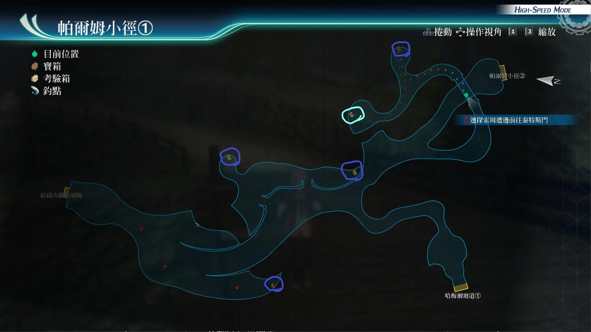
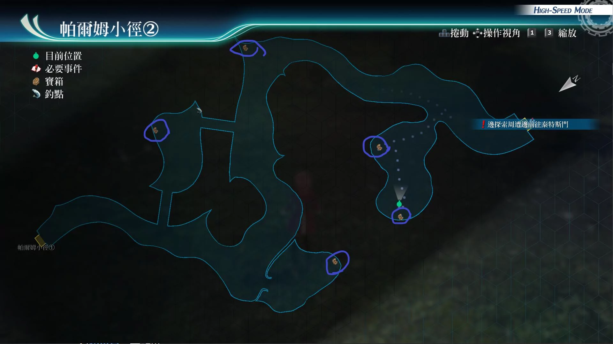

# 帕尔姆小径

---

## 帕尔姆小径1

- [ ] U物质x5
- [ ] 中回复药, EP填充剂II, 圣灵药
- [ ] 高压水块R
- [ ] 七属性耀晶片x50

## 帕尔姆小径2

- [ ] 力量药水, 守护药水, 心灵药水
- [ ] 痊愈之药x3, S-药片x3
- [ ] 神圣圆球
- [ ] 粗碎岩盐x5, 千万五壳x5, 百万精酒x5
- [ ] 黄金球R

## 考验宝箱

[考验箱002](/game/TheLegendOfHeroes/SenNoKiseki4/ordeal/002.md)

## 战斗笔记

- [ ] 森林蚊
- [ ] 鬼霸勾蜓
- [ ] 胡蜂
- [ ] 巨魔田鳖
- [ ] 末日纺织者
- [ ] 胡蜂女王
- [ ] 粉红猿羊
- [ ] 粉红猿羊队
- [ ] 胡蜂
- [ ] 胡蜂女王

## 钓鱼笔记

帕尔姆小径1有钓鱼点, 但没有新品种

帕尔姆小径2有钓鱼点, 但没有新品种

## Boss

*胡蜂女王*, *胡蜂*

胡峰攻击手段：

- 蓄力战技（死亡刺击）：单体即死

胡峰女王攻击手段：

- 冲击震波：全体延迟
- 蓄力战技（危险一刺）：直线即死
- 半血后亢奋
- 蓄力战技（超危险一刺）：直线即死

建议打法：

装备防延迟和防即死。敌方吃混乱和冻结，可以冰晶剑和银色荆棘教做人