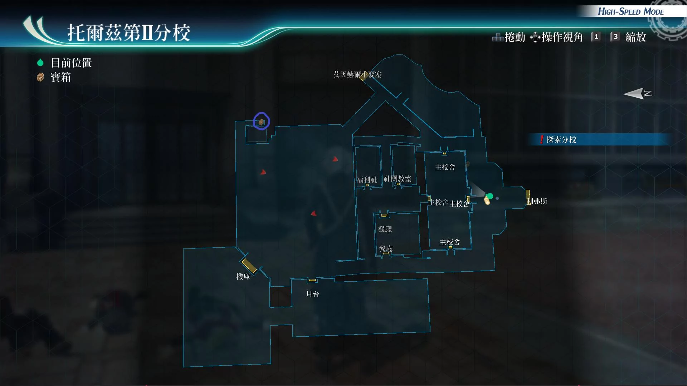
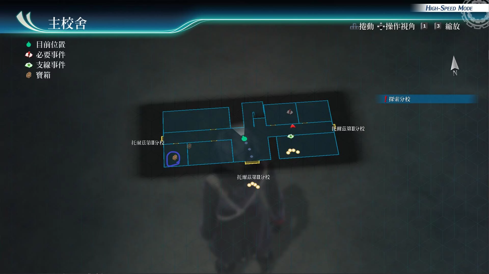
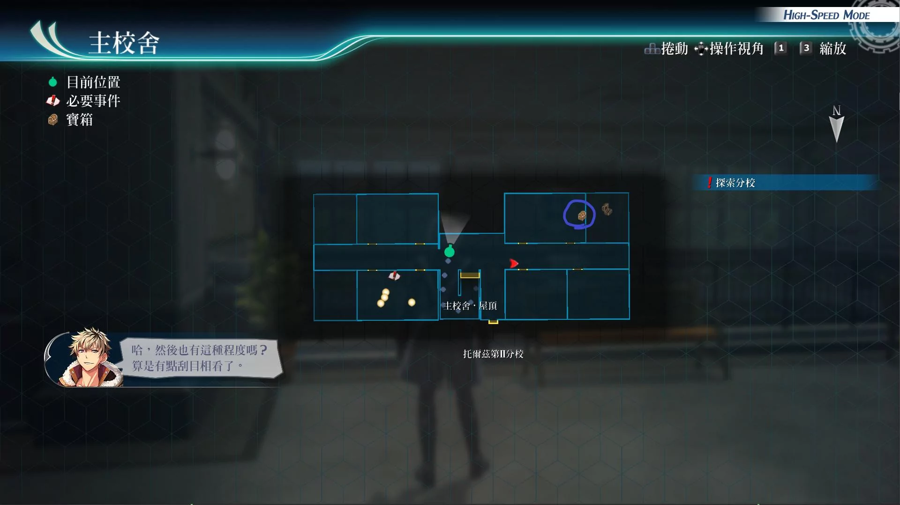
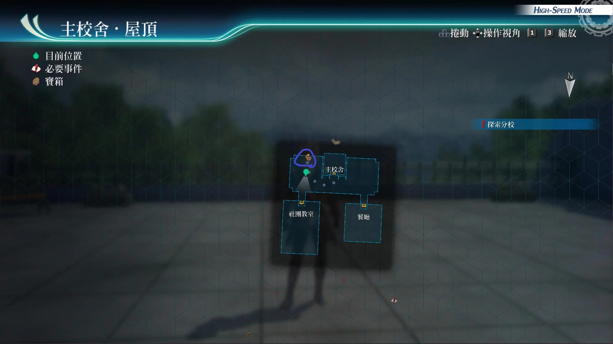
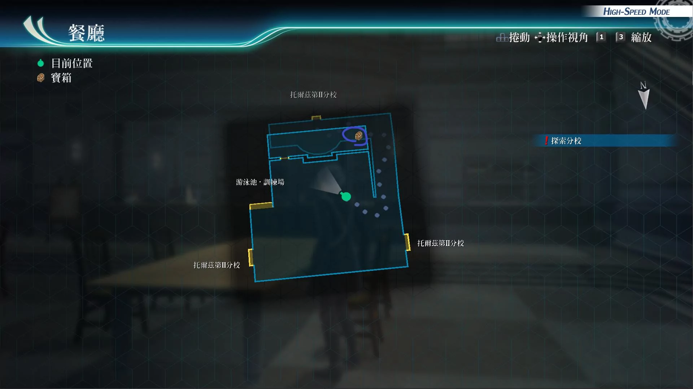
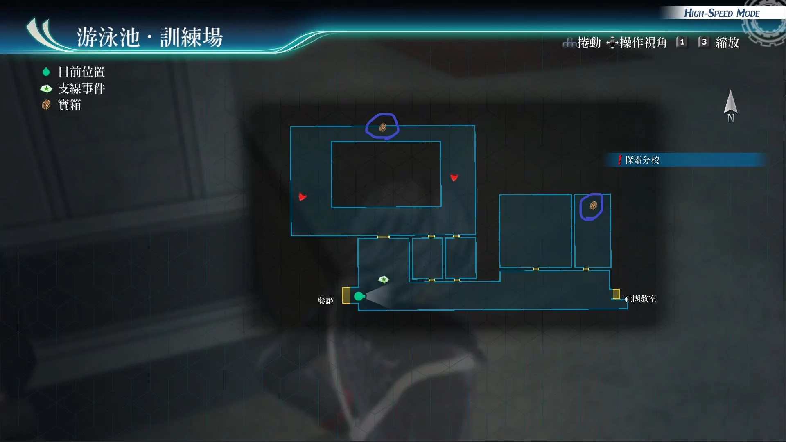
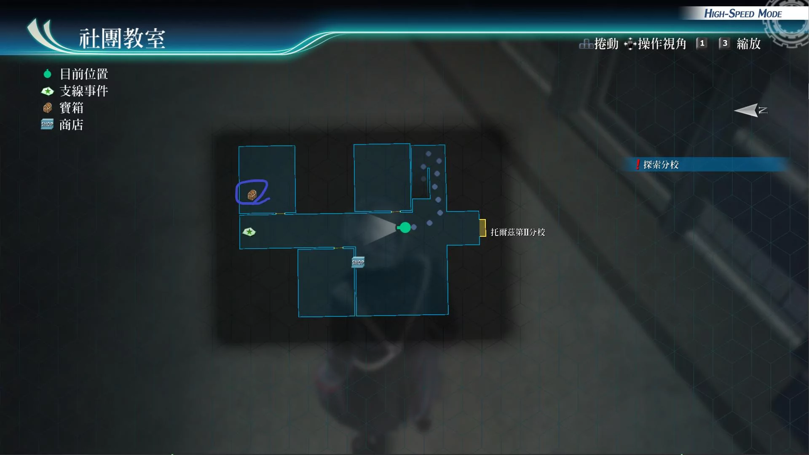
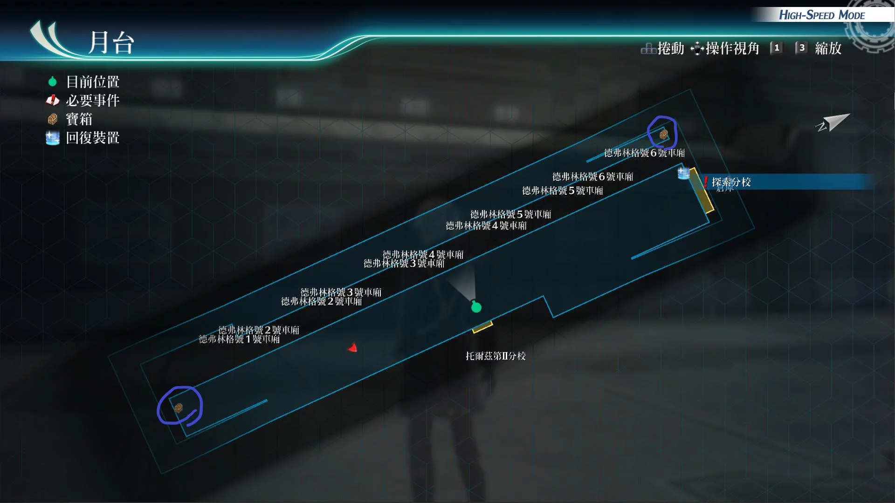
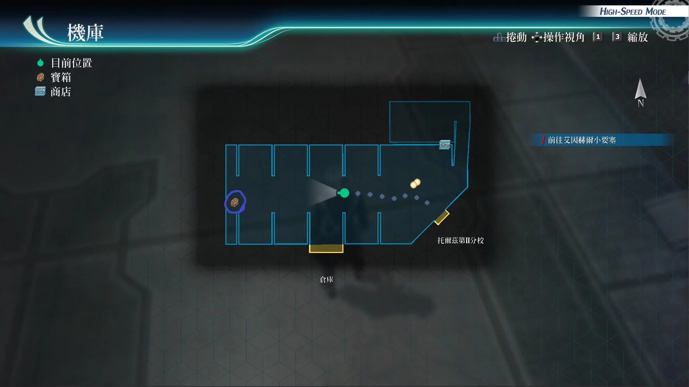

# 托尔兹第II分校

---

## 托尔兹第II分校·操场

- [ ] 钻石新星R

## 托尔兹第II分校·主校舍·1F

- [ ] 圣灵药·改

## 托尔兹第II分校·主校舍·2F

- [ ] 缇妲的假发(多周目: EP填充剂IV)

## 托尔兹第II分校·主校舍·屋顶

- [ ] 全回复药

## 托尔兹第II分校·厨房

- [ ] 星形莓果x10, 苦番茄x10, 蜂蜜糖浆x10

## 托尔兹第II分校·游泳池·训练场

- [ ] [纹章](/game/TheLegendOfHeroes/SenNoKiseki4/quartz/纹章.md#纹章) (多周目: 勇气种子)

## 托尔兹第II分校·社团教室

- [ ] 粗碎岩盐x10, 千万五壳x10, 百万精酒x10

## 托尔兹第II分校·月台

- [ ] 七属性耀晶片x100
- [ ] 睡眠之刃III

## 托尔兹第II分校·机库

- [ ] 机甲师团护目镜

## 战斗笔记

- [ ] 三位一体攻击者HG
- [ ] 三位一体攻击者R2
- [ ] 飞行探查机PRO
- [ ] 方阵兵J9
- [ ] 总校女生
- [ ] 总校男生
- [ ] 总校女生
- [ ] 巨触魔草
- [ ] 形态兵器伽罗德
- [ ] 总校男生
- [ ] 总校男生
- [ ] 潜航机炮EX
- [ ] 玉簾S
- [ ] 须佐之男
- [ ] 战斗潜行者EX
- [ ] 艾妲
- [ ] 弗利兹
- [ ] 米海尔教官
- [ ] 潜影枪手G48C
- [ ] 潜影枪手M48C
- [ ] 潜影枪手R48C

## 钓鱼笔记

## Boss

*魔煌机兵·莫德雷德*, *魔煌机兵佐尔盖·枪*

魔煌机兵·莫德雷德弱点
- 普通状态（带链接攻击，概率带全体终结攻击：共鸣射击）：手臂
- 枪向下，手在胸前驱动（白银光线：单体带DEF和ADF下降）：身体
- 枪向前驱动（银鸟：单体带STR下降：会链接攻击，概率释放共鸣射击）：头部

魔煌机兵.佐尔盖.枪弱点
- 普通状态：手臂
- 蓄力驱动（黑暗射击：全体攻击）：头部

建议打法

此战带亚修，妙婕给全员回hp，悠娜给黎恩套上def和spd上升，以及加速的buff，莫德雷德打谁，谁防御即可，针对佐尔盖的驱动形态的弱点赚bp，之后5点bp后一波协力技，break后，之后随便打

---

*形态兵器伽罗德*

攻击手段
- 麻痹手臂：范围封技
- 烧夷榴弹：范围炎伤
- 炸裂榴弹：范围def下降
- 驱动中回复术
- 蓄力战技（百万高能加农）：直线魔法攻击，必中
- 50%hp，10%hp会进入3回合亢奋状态
- 之后依旧会使用，百万高能加农

建议打法1

装备防炎伤和封技饰品，全程开着新月镜，开着九重阵，带上缇妲和亚尔缇娜回血回cp，你会发现boss就是个

建议打法2

带上4名刚属性成员（亚尔缇娜，兰迪，亚修，缇妲）开场强音之力，时间驱动，闪耀天启，之后亚修指令，兰迪爆S。全程开着亚修阵，之后亚尔缇娜，使用回cp战技，回血回cp，缺bp就用黑色屏障来恢复。兰迪卖血，继续爆S，或者使用赤炎飓风。亚修使用10cp换100cp战技，之后使用60cp战技虚空破坏者。缇妲同样可以用，恢复cp技，使用第3个C技打输出。基本上，每一次都可以打出，链接攻击。打崩了以后太刀风，慢慢刷就是

建议打法3

妙婕带水铃铛，时爆水魔法轰，亚尔缇娜装备火铃铛火魔法轰，带上悠娜拉人即可

---

*魔煌机兵·汉尼拔*, *魔煌机兵佐尔盖·剑*

魔煌机兵·汉尼拔弱点
- 普通状态（概率带链接攻击）：手臂
- 两手握住武器驱动（暴风强击：单体加延迟：概率链接攻击：会使用终结攻击：暴乱狂击：全体攻击）：手臂
- 单手握住武器驱动（疾风突袭）：身体

魔煌机兵佐尔盖·剑弱点
- 普通状态：身体
- 驱动状态：手臂

建议打法

套路跟上次一样，汉尼拔打谁谁防御，集火打佐尔盖，有3bp后，再打汉尼拔，5bp后爆协力技，break后，没难度