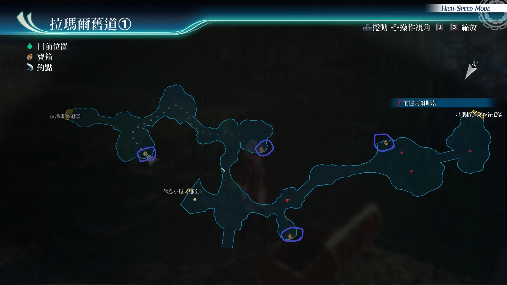

# 拉玛尔旧道

---

## 拉玛尔旧道1

- [ ] U物质x5
- [ ] 时间减速R
- [ ] 勇气种子
- [ ] 冰晶剑R

## 拉玛尔旧道2

- [ ] 星形莓果x5, 苦番茄x5, 蜂蜜糖浆x5
- [ ] 大治愈术R
- [ ] 粗碎岩盐x5, 千万五壳x5, 百万精酒x5

## 战斗笔记

- [ ] 滚动石球
- [ ] 岩浆软体兽
- [ ] 小田地破坏者
- [ ] 长触魔草
- [ ] 岩皮蜘蛛
- [ ] 大田地破坏者
- [ ] 高等骚魂
- [ ] 方阵兵J9
- [ ] 形态兵器伽罗德

## 钓鱼笔记

拉玛尔旧道1有钓鱼点
- 眼镜蛇头鱼

## Boss

*高等骚魂*

攻击手段
- 普通攻击：单体吸收hp加恶梦
- 驱动魔法（受难之刃）：范围吸收hp
- 地狱之声：范围加恶梦
- 附身：必中：附体任意角色，被附体的角色只会用普通攻击攻击我方，只有把被附体的角色打到战斗不能，怪物才会重新出现
- 此战建议速战速决，在boss出附身技能前结束战斗

建议打法1

黎恩鬼气解放带上运转和神矛，开劳拉指令爆S，安洁莉卡装备运转也爆S，缇妲装备运转也爆S，留一个悠娜防翻车，拉人后继续爆S即可

建议打法2

黎恩鬼气解放后，开劳拉指令爆S，艾玛装备宝盒做主核心回路和妙婕的核心回路，装备冥皇，时间爆发后空魔法，之后再来两个人爆S即可结束战斗

建议打法3

黎恩装备女神之吻，鬼气解放后驱动女神之吻，确保黎恩在boss前行动，开烈火阵其他三人先爆S，然后黎恩女神之吻放出，200cp的黑叶教boss做人，关键另外三人又可以爆S……boss就凉了